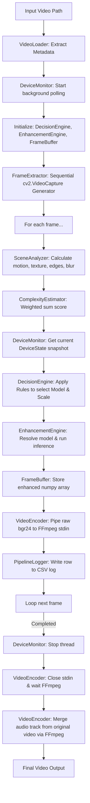
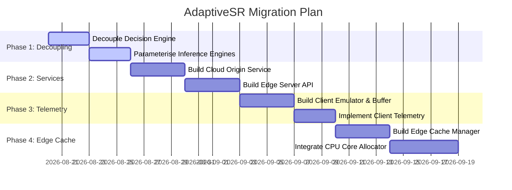

# AdaptiveSR — Previous Implementation Audit

This document presents a comprehensive architectural audit of the existing AdaptiveSR codebase. As we transition to a distributed streaming architecture, this report categorizes all current components, traces the legacy execution path, identifies structural limitations and local coupling, and recommends a strategic migration plan.

---

## 1. Executive Summary

The legacy AdaptiveSR codebase is a **local-only, single-process, frame-by-frame** video processing and super-resolution (SR) utility. It processes a local video file sequentially: extracting frames, estimating content complexity, polling local hardware metrics, deciding on an SR model dynamically, running inference, and encoding the output back to disk via FFmpeg. 

### Key Findings
* **High Reusability of Core Algorithms**: Visual complexity extraction (`scene_analyzer.py`, `complexity_estimator.py`), model inference backends (`fsrcnn_backend.py`, `realesrgan_backend.py`), ONNX quantization scripts, and validation metrics (`compute_quality_metrics.py`) are highly functional and can be reused.
* **Complete Absence of Distributed Architecture**: There are **no network boundaries, chunking mechanisms, caching layers, server-client APIs, or client playback buffers**.
* **Tight Client-Server Coupling**: The decision-making logic is heavily coupled. The `DecisionEngine` uses local playback telemetry (battery level, device temperature) alongside local compute telemetry (CPU, GPU load) in the same thread to select the model and scale. Under the target Rosevin architecture, the client (playback) and the edge server (SR inference) must reside on separate hosts with a network boundary.
* **MMCV Compilation Issues**: The sequence-based model (`basicvsr++`) is currently disabled due to MMCV Windows build dependency mismatch.

---

## 2. Repository Structure

Below is the file tree of the existing workspace:

```text
d:/Full Stack/AdaptiveSR/
├── benchmark/
│   ├── compute_quality_metrics.py  # Computes PSNR, SSIM, and LPIPS compared to ground truth
│   ├── generate_dataset.py         # Generates synthetic video pairs for benchmarking
│   ├── generate_drawio.py          # Script compiling XML diagram for architecture.drawio
│   ├── quantize_tinysr.py          # Exports FSRCNN (tinysr) to ONNX and quantizes to INT8
│   ├── run_baselines.py            # Executes static models and adaptive baselines on test videos
│   ├── summarize_results.py        # Compiles quality and telemetry CSVs into a summary markdown
│   └── test_optimizations.py       # Benchmarks FSRCNN FP32 CPU vs INT8 CPU latency/quality cost
├── benchmark_data/                 # Ground Truth (GT) and Low-Resolution (LR) test videos
├── benchmark_results/              # Outputs of run_baselines.py (videos, csv logs, json metrics)
├── configs/
│   ├── decision_config.yaml        # Decision thresholds and scene complexity weights
│   ├── models.yaml                 # Static model configurations (names, weights paths)
│   ├── system.yaml                 # Poll intervals and logger configuration
│   └── test_switching_config.yaml  # Swapped thresholds for testing
├── logs/                           # System and runtime execution logs
├── models/                         # Local storage for model weights (.pth and .onnx)
│   ├── real_esrgan/
│   └── tinysr/
├── resuult/
│   └── validation_results.md       # Summarizes results of validating the old implementation
├── src/
│   ├── main.py                     # Main orchestrator entry point
│   ├── modules/
│   │   ├── backends/
│   │   │   ├── basicvsr_backend.py # Placeholder for unavailable BasicVSR++
│   │   │   ├── fsrcnn_backend.py  # PyTorch implementation of FSRCNN (FP32)
│   │   │   ├── fsrcnn_backend_int8.py # ONNX Runtime optimized quantized INT8 FSRCNN
│   │   │   └── realesrgan_backend.py # Real-ESRGAN with patches & GPU adaptive tiling
│   │   ├── complexity_estimator.py # Weighted complexity score calculation
│   │   ├── decision_engine.py      # Rule-based model/scale selector
│   │   ├── device_monitor.py       # Local hardware telemetry collector (CPU/GPU/RAM/Battery)
│   │   ├── encoder.py              # FFmpeg pipeline writing raw BGR to output videos
│   │   ├── enhancement_engine.py   # Dynamic resolver and wrapper for VSR inference
│   │   ├── frame_buffer.py         # In-memory dict mapping frame index to image frame
│   │   ├── frame_extractor.py      # OpenCV generator yielding frames sequentially
│   │   ├── model_registry.py       # Model catalog listing parameters and latency estimates
│   │   ├── pipeline_logger.py      # Telemetry CSV log exporter
│   │   └── scene_analyzer.py       # Visual features metrics extractor (motion, edges, texture)
│   └── utils/
│       ├── logging_setup.py        # Logger setup & CSV frame metrics logger
│       └── state_types.py          # Data classes (DeviceState, SceneDescriptor, Decision)
├── tests/
│   ├── Test videos/                # High-res and source video files for tests
│   ├── test_decision_engine.py     # Unit tests verifying engine rules
│   ├── test_pipeline.py            # Integration tests for modules (extract, encode, monitor, run)
│   └── verify_*.py                 # Manual verification scripts for individual modules
├── requirements.txt                # Pinned python dependencies (PyTorch, ONNX Runtime, opencv, psutil)
└── walkthrough.md                  # Project overview documentation
```

---

## 3. Current Execution Pipeline

The current execution flow runs inside a single blocking thread orchestrating frame-by-frame transformations. 

### Data Flow Flowchart


### Key Structural Steps in `src/main.py`
1. **Initialize Logging & CSV**: Configures logging; writes headers to `logs/run_<timestamp>.csv` via `PipelineLogger`.
2. **Video Loader Metadata Check**: Runs `ffprobe` (falling back to OpenCV) to fetch duration, dimensions, FPS, and audio presence.
3. **Start Telemetry Polling**: Launches a background daemon thread (`DeviceMonitor`) using `psutil` (system/process statistics) and `pynvml` (NVIDIA GPU utilization and temperatures).
4. **Frame Extraction**: Iterates through the video using `cv2.VideoCapture`.
5. **Content Analysis & Complexity**: Calculates structural changes relative to the prior frame using Canny edge density and Laplacian variance. Complexity is estimated by a configuration-weighted formula.
6. **Dynamic Routing Decision**: Evaluates rules against `DeviceState` and `SceneDescriptor`. Under heavy load or low battery, it drops the scale factor or defaults to `tinysr` / `skip`.
7. **Super-Resolution Inference**: Resolves the model key to a backend dynamically (either executing via PyTorch on CUDA/CPU or ONNX Runtime).
8. **Subprocess Writing**: Passes raw BGR `numpy` arrays directly to a piped `ffmpeg` subprocess.
9. **Finalization & Post-processing**: Terminates threads, stops the video pipe, and runs an audio-merge FFmpeg command to copy audio from the input video to the output video.

---

## 4. Reuse-As-Is Components

These components are isolated, mathematically focused, and carry no architectural assumptions regarding local file access or physical deployment:

| File Path | Component | Purpose | Reason for Reuse | Future Role |
| :--- | :--- | :--- | :--- | :--- |
| [`src/modules/scene_analyzer.py`](file:///d:/Full%20Stack/AdaptiveSR/src/modules/scene_analyzer.py) | `analyze_frame()` | Measures frame motion, texture, edges, and blur. | Pure function operating on standard BGR numpy arrays. | Video pre-analyzer at the cloud encoder or edge pre-processor. |
| [`src/modules/complexity_estimator.py`](file:///d:/Full%20Stack/AdaptiveSR/src/modules/complexity_estimator.py) | `estimate_complexity()` | Combines visual metrics into a normalized `0-1` score. | Independent mathematical calculation from config weights. | Serves the Edge Decision Engine to predict computing load. |
| [`src/utils/logging_setup.py`](file:///d:/Full%20Stack/AdaptiveSR/src/utils/logging_setup.py) | `setup_logging` & `MetricsLogger` | Sets up terminal/file logs and handles metrics CSV exporting. | Standard logging configuration. | System auditing and local log management. |
| [`benchmark/compute_quality_metrics.py`](file:///d:/Full%20Stack/AdaptiveSR/benchmark/compute_quality_metrics.py) | `compute_metrics_for_videos()` | Computes PSNR, SSIM, and LPIPS between two videos. | Standard quality verification framework. | Offline benchmark pipeline validator. |
| [`benchmark/quantize_tinysr.py`](file:///d:/Full%20Stack/AdaptiveSR/benchmark/quantize_tinysr.py) | Entire script | Exports PyTorch FSRCNN models to ONNX and quantizes to INT8. | Standalone model optimization utility. | Model optimization/deployment step. |
| [`benchmark/generate_dataset.py`](file:///d:/Full%20Stack/AdaptiveSR/benchmark/generate_dataset.py) | Entire script | Creates synthetic test pattern MP4 videos. | Data generator. | CI/CD testing and validation dataset generator. |

---

## 5. Reuse-With-Modification Components

These modules contain high-value domain logic but are currently structured for local invocation, requiring adjustments to run inside distributed services:

### A. Model Backends & Enhancement Engine
* **Files**: [`fsrcnn_backend.py`](file:///d:/Full%20Stack/AdaptiveSR/src/modules/backends/fsrcnn_backend.py), [`fsrcnn_backend_int8.py`](file:///d:/Full%20Stack/AdaptiveSR/src/modules/backends/fsrcnn_backend_int8.py), [`realesrgan_backend.py`](file:///d:/Full%20Stack/AdaptiveSR/src/modules/backends/realesrgan_backend.py), [`enhancement_engine.py`](file:///d:/Full%20Stack/AdaptiveSR/src/modules/enhancement_engine.py).
* **Current Behavior**: Load models locally from files, download weights directly from external URLs, and run inference frame-by-frame on the local GPU/CPU.
* **Modifications Needed**:
  * Decouple weight downloading: Move weight provisioning to initialization or Docker build steps rather than dynamic runtime calls.
  * Serve as a Microservice: Place the `EnhancementEngine` inside an **Edge Service worker**. Instead of consuming frame-by-frame memory matrices directly, it should process video chunks, utilizing batch processing or pipeline parallelism to sustain target frame rates (30, 60, 120 FPS).
  * Decouple `realesrgan` Tiling: The dynamic tiling logic in `realesrgan_backend.py` directly references the local `device_state.gpu` telemetry. This boundary must be parameterised so the Edge Server adjusts tiling parameters based on its local node capacity rather than client-transmitted parameters.

### B. Video Ingestion & Formatting
* **Files**: [`video_loader.py`](file:///d:/Full%20Stack/AdaptiveSR/src/modules/video_loader.py), [`encoder.py`](file:///d:/Full%20Stack/AdaptiveSR/src/modules/encoder.py).
* **Current Behavior**: `VideoLoader` parses a single local file path to extract properties via `ffprobe`. `VideoEncoder` pipes raw frames directly into an `ffmpeg` command, writing to a temp file, then performs a blocking sub-process call to merge audio.
* **Modifications Needed**:
  * **VideoLoader**: Must adapt to work with **video chunks** (e.g. DASH/HLS segments) fetched from the network, extracting chunk-level metadata (sequence ID, scale, resolution) rather than single file properties.
  * **VideoEncoder**: Instead of outputting a full video file with audio merging, the encoder must compress individual enhanced chunks (or frame ranges) and output them to a buffer or network socket for client transmission.

### C. Decision Engine
* **File**: [`decision_engine.py`](file:///d:/Full%20Stack/AdaptiveSR/src/modules/decision_engine.py).
* **Current Behavior**: Single method `decide()` taking both `DeviceState` (battery, temperature) and `SceneDescriptor` (motion, texture) to choose model and scale.
* **Modifications Needed**:
  * Split client and edge responsibilities:
    1. **Client-side adaptation**: Selects the target representation (resolution/bitrate) based on current network bandwidth and playback buffer length.
    2. **Edge-side adaptation**: Decides whether to satisfy the target bitrate via raw transmission or low-resolution base transmission + SR, based on edge cache state and edge CPU-core availability.

---

## 6. Components to Replace

These modules are incompatible with a distributed, network-divided architecture and must be replaced:

* [`src/main.py`](file:///d:/Full%20Stack/AdaptiveSR/src/main.py): The main pipeline orchestrator must be discarded. It will be replaced by three separate service layers: **Cloud/Origin Server**, **Edge Server**, and **Client Player Client**.
* [`src/modules/frame_extractor.py`](file:///d:/Full%20Stack/AdaptiveSR/src/modules/frame_extractor.py): Sequential local file generator. Needs to be replaced with a client-side chunk demuxer/player and edge-side chunk frame extractor.
* [`src/modules/device_monitor.py`](file:///d:/Full%20Stack/AdaptiveSR/src/modules/device_monitor.py): Collects unified local system states. Must be split into a **Client Telemetry Monitor** (network speed, battery level, player buffer state) and an **Edge Resource Monitor** (available CPU cores, edge load).
* [`src/modules/frame_buffer.py`](file:///d:/Full%20Stack/AdaptiveSR/src/modules/frame_buffer.py): Trivial Python dictionary memory buffer. Must be replaced with a structured **Client Playback Buffer** (handling pre-fetching, jitter, play-out rates, and stalling detection).
* [`src/modules/pipeline_logger.py`](file:///d:/Full%20Stack/AdaptiveSR/src/modules/pipeline_logger.py): Local CSV logger. Must be replaced with network-based server logging and telemetry channels.

---

## 7. Components Requiring Testing

* [`src/modules/backends/basicvsr_backend.py`](file:///d:/Full%20Stack/AdaptiveSR/src/modules/backends/basicvsr_backend.py): The temporal-aware sequence backend (BasicVSR++) is unimplemented. It raises `NotImplementedError` due to compilation issues of MMCV on Windows. We must validate this component on a target Linux environment (e.g. Ubuntu Edge Server deployment container) to determine if it is viable.
* [`benchmark/test_optimizations.py`](file:///d:/Full%20Stack/AdaptiveSR/benchmark/test_optimizations.py): Verifies INT8 speedup factors. Needs to be validated on specific target CPU environments (e.g., edge nodes with varying core/instruction counts) to confirm if INT8 performance meets real-time constraints for 30/60 FPS.

### Test Suite Baseline Verification
Running the test suite via `python -m pytest tests/ -v` collected 32 items and returned **2 failures**:
1. **FSRCNN INT8 Backend Collection Failure** (`test_pipeline_int8_backend`):
   * *Error*: `ModuleNotFoundError: No module named 'onnxruntime'`
   * *Reason*: The host Python environment is missing the `onnxruntime` package listed in `requirements.txt`.
2. **Real-ESRGAN Adaptive Tiling Execution Failure** (`test_realesrgan_adaptive_tiling`):
   * *Error*: `AssertionError: Torch not compiled with CUDA enabled`
   * *Reason*: The test forces model invocation on the `"cuda"` device, but the local PyTorch installation is compiled for CPU-only or the host has no compatible CUDA GPU.

These environment configuration gaps should be verified and resolved during Phase 1/2 of deployment preparation on the target edge nodes.

---

## 8. Existing SR/Model Infrastructure

The model registry ([`model_registry.py`](file:///d:/Full%20Stack/AdaptiveSR/src/modules/model_registry.py)) stores parameters and estimated overheads for five model profiles:

1. **TinySR (`tinysr`)**: FSRCNN (FP32) running on PyTorch. Latency estimate is `400ms` (CPU) and `118ms` (GPU). Supports scales ×2, ×3, ×4.
2. **TinySR INT8 (`tinysr_int8`)**: Dynamic INT8 quantized FSRCNN running on ONNX Runtime CPU. Latency estimate is `100ms`. Supported scale: ×2.
3. **Real-ESRGAN (`real_esrgan`)**: RRDBNet model running on PyTorch. Latency estimate is `18s` (CPU) and `8.9s` (GPU). Supports scales ×2, ×4.
4. **BasicVSR++ (`basicvsr++`)**: Not available (`available: False`). Temporal model requiring a sequence window of 5 frames.
5. **Skip (`skip`)**: Passthrough bypass (scale ×1).

### Weights Fetching
The backend wrappers implement an autonomous download system. When weights are missing, they fetch checkpoints from remote GitHub releases:
* FSRCNN: `https://github.com/Nhat-Thanh/FSRCNN-Pytorch`
* Real-ESRGAN: `https://github.com/xinntao/Real-ESRGAN`

---

## 9. Existing Video/Chunk Infrastructure

The current implementation treats video as a **single, continuous local file**. 
* **Missing**: Video chunking utilities, adaptive manifests (like DASH `.mpd` or HLS `.m3u8` structures), chunk-level boundary alignment, and network-based stream segmenters.
* **Reusability**: OpenCV video loaders and FFmpeg piping scripts can be reused to build an offline segmenter that chunks original videos into discrete 2-second or 4-second `.mp4` chunks at different bitrates for storage in the Cloud Origin database.

---

## 10. Existing Metrics/Benchmark Infrastructure

The codebase has a comprehensive benchmark subsystem:
* `generate_dataset.py` generates synthetic videos modeling low/high/mixed complexity levels.
* `run_baselines.py` executes forced-model runs across those categories.
* `compute_quality_metrics.py` compares outputs against source ground truths using PSNR, SSIM, and LPIPS.
* `summarize_results.py` exports these metrics into tables.

This infrastructure is functional for offline validation, but it expects complete video files. We must modify it to execute evaluations over individual chunks.

---

## 11. Existing Network/Cloud Infrastructure

* **None**. The codebase contains no network sockets, HTTP clients/servers, RPC structures, or APIs. It is a local file processor.
* **Required**: A lightweight API framework (such as FastAPI or gRPC) must be introduced to establish Cloud-to-Edge and Edge-to-Client communication paths.

---

## 12. Existing Caching Infrastructure

* **Memory-Level Backend Caching**: The codebase caches PyTorch and ONNX model instances in global variables (`_model_cache`, `_session_cache`) to avoid reloading weights for every frame.
* **Missing**: Caching for video chunks. The Edge layer must cache downloaded base-quality representations and processed super-resolved chunks to optimize delivery.

---

## 13. Existing Resource-Monitoring Infrastructure

The `DeviceMonitor` runs a daemon thread querying system statistics:
* CPU: System-wide utilization percentage (`psutil.cpu_percent`).
* RAM: Process-specific RSS memory usage (`rss`) and system-wide RAM percentage.
* Battery: Level percentage and power source state (`psutil.sensors_battery`).
* GPU: Querying Nvidia GPU index 0 utilization and temperature via `pynvml`.

### Architectural Modification
In the distributed model, these responsibilities must split:
* **Client**: Queries local battery, temperature, and network throughput.
* **Edge Server**: Queries edge CPU core availability, GPU memory, and request queue depth.

---

## 14. Architectural Coupling to Local Execution

The major coupling risks identified are:

1. **Direct Memory Frame Passing**: Frames are represented as raw `numpy.ndarray` objects passed sequentially between functions in local memory.
2. **Synchronous Execution Model**: The pipeline runs in a single loop. If a frame takes 18 seconds to upscale, the entire pipeline blocks. There are no async task queues or buffers.
3. **Conflated Telemetry Decisioning**: The decision engine rules combine client telemetry (battery, temperature) and backend compute constraints (CPU/GPU utilization) inside a single class:
   ```python
   # Example of tight coupling in DecisionEngine:
   if (device.battery < t["low_battery"]) and (device.temperature > t["high_temp"]):
       return Decision(model="tinysr") # Forces lightweight model based on client device power constraints
   ```
4. **Local Subprocess Piping**: The video output relies on opening a local subprocess to `ffmpeg` and writing raw bytes via local stdin, followed by local filesystem audio merging.

---

## 15. Missing Components for AdaptiveSR

To build the distributed, Rosevin-inspired streaming system, the following components must be created:

```text
                                [ CLOUD / ORIGIN ]
                          • Stores Encoded Video Chunks
                          • Exposes Manifests (MPD/M3U8)
                                        │
                                        ▼ (Network Path 1)
                                [ EDGE CLUSTER ]
                     ┌──────────────────┴──────────────────┐
                     ▼                                     ▼
             [ Edge Cache ]                        [ Edge Server ]
         • Caches Base Chunks                 • Extracts raw frames
         • Caches SR Chunks                   • EnhancementEngine (SR)
                                              • Allocates CPU cores/resources
                                                     │
                                                     ▼ (Network Path 2)
                                                 [ CLIENT ]
                                        • Requests Chunks (DASH)
                                        • Playback Engine (Buffer)
                                        • Telemetry Monitor (RTT, Buffer)
```

1. **Cloud/Origin Server**: A simple storage server containing video representations (multiple bitrates/resolutions).
2. **Edge Cache Manager**: In-memory or disk-based cache storing raw chunks and super-resolved chunks.
3. **Edge Service Node**: An API-driven server hosting the `EnhancementEngine` to process requested chunks.
4. **Edge Scheduler/CPU Allocator**: Implements core Rosevin CPU-core allocation rules (distributing core allocations to SR backend instances).
5. **Client Playback Client**: A mock player or video client that consumes DASH-like chunks, maintains a playback buffer, measures network RTT/throughput, and submits requests.
6. **Network Boundaries**: HTTP/REST or gRPC endpoints between:
   * Cloud $\rightarrow$ Edge (fetching representation chunks)
   * Edge $\rightarrow$ Client (streaming segments)
7. **Client-Side Buffer Model**: Logic simulating a media player buffer (adding chunk duration on receipt, depleting buffer over playback time, triggering stalls).

---

## 16. Recommended Migration Path

We suggest a four-step phased migration:



### Phase 1: Decoupling and Parameterisation (Local Refactoring)
* **Goal**: Separate inference backends and configuration parameters from local device measurements.
* **Tasks**:
  * Refactor `DecisionEngine` to separate client request logic from edge processing capabilities.
  * Adjust `realesrgan` and `fsrcnn` backends to accept inference constraints (e.g. thread limits, tile bounds) explicitly as parameter objects.

### Phase 2: Network Boundaries and Service Creation (Cloud & Edge APIs)
* **Goal**: Build API endpoints to replace raw memory passing.
* **Tasks**:
  * Implement the **Cloud Origin Service** (FastAPI) to expose video chunks.
  * Implement the **Edge Server API** (FastAPI) exposing endpoints like `/request-chunk` and `/cache-status`.
  * Adapt `VideoLoader` and `VideoEncoder` to read and write segment-level bytes.

### Phase 3: Client Simulation and Playback Buffer
* **Goal**: Create the client consumer application.
* **Tasks**:
  * Implement the Client Player emulator simulating playback, maintaining a playback buffer (in seconds), and adjusting request rates based on bandwidth.
  * Expose telemetry metrics (RTT, current buffer length, frames dropped).

### Phase 4: Edge Caching & Resource Allocation (Rosevin Core Alignment)
* **Goal**: Integrate caching and CPU resource allocation.
* **Tasks**:
  * Implement the Edge Cache manager (e.g., LRU cache on disk/memory).
  * Implement the core scheduler: allocating CPU cores to running edge processes dynamically.

---

## 17. Risks & Technical Debt

1. **MMCV Compilation Mismatch**: `basicvsr++` requires MMCV. Compiling MMCV on Windows is notoriously error-prone due to CUDA/MSVC version mismatches.
   * *Mitigation*: Restrict VSR execution to FSRCNN (FP32/INT8) and Real-ESRGAN during initial edge development. Deploy the final edge server on a Linux container (Docker) where MMCV is fully compatible.
2. **CPU-Core Limitation Overhead**: The Rosevin paper models CPU allocation as a continuous or discrete variable (e.g. 1 core, 2 cores). Implementing this programmatically in Python requires OS-level process affinity (`psutil.Process().cpu_affinity()`) or Docker container resource constraints.
   * *Mitigation*: Test `psutil` core affinity mechanisms locally during development before scaling to Docker.
3. **Inference Latency Bottlenecks**: Real-ESRGAN CPU inference is extremely slow (~18s). If requested in real-time, it will cause client starvation.
   * *Mitigation*: Ensure the decision engine prioritizes INT8 FSRCNN (`tinysr_int8`) or native bypass (`skip`) when GPU acceleration is unavailable at the edge node.

---

## 18. Suggested Order for Extracting Reusable Code

1. **Step 1: Extract Scene Metrics Analyzer**
   * Move [`scene_analyzer.py`](file:///d:/Full%20Stack/AdaptiveSR/src/modules/scene_analyzer.py) and [`complexity_estimator.py`](file:///d:/Full%20Stack/AdaptiveSR/src/modules/complexity_estimator.py) to a shared utilities path. These are ready for reuse.
2. **Step 2: Package Model Backends**
   * Wrap the folders under `src/modules/backends/` into an isolated package (`edge_vsr_runtime`). Decouple all references to the global config and local file dependencies.
3. **Step 3: Extract Metrics and Quality Verification**
   * Isolate the visual quality testing scripts (`compute_quality_metrics.py`) so they can run as post-processing analysis on output segments downloaded by the client player.
4. **Step 4: Adapt Video Chunk Segmenter**
   * Extract parts of `video_loader.py` and `encoder.py` to create an offline pre-segmentation script. This script will chunk raw input source files (e.g. `futbol.mp4`) into numbered `.mp4` chunks (e.g., `chunk_001_360p.mp4`, `chunk_001_720p.mp4`) to seed the Cloud Origin server.

---

## 19. Architecture Component Summary Table

| Component | Existing? | Classification | Future Role |
| :--- | :--- | :--- | :--- |
| **Video ingestion** | Yes | REUSE WITH MODIFICATION | Used to pre-segment source videos into DASH-like MP4 representation chunks. |
| **Metadata extraction** | Yes | REUSE WITH MODIFICATION | Retained via `VideoLoader` to extract video frame rate and resolution profile per chunk. |
| **Chunking** | No | REPLACE (New implementation) | Offline utility segmenting video representations at predefined intervals. |
| **Frame processing** | Yes | REUSE AS-IS | Extracts and normalizes frames for model ingestion inside the Edge Service. |
| **SR inference** | Yes | REUSE WITH MODIFICATION | Hosted on Edge Server worker processes to upscale base chunks dynamically. |
| **Model benchmarking** | Yes | REUSE AS-IS | Offline verification script to test output quality versus speed performance. |
| **Metrics** | Yes | REUSE AS-IS | Calculates PSNR, SSIM, and LPIPS over client-downloaded segments. |
| **Content analysis** | Yes | REUSE AS-IS | Pre-evaluates visual complexity to inform edge resource allocation. |
| **Networking** | No | REPLACE (New implementation) | Establish HTTP endpoints (e.g. FastAPI) for segment delivery and telemetry. |
| **Cloud/origin** | No | REPLACE (New implementation) | Exposes multi-bitrate segment database and manifest files. |
| **Edge service** | No | REPLACE (New implementation) | REST API worker nodes running the VSR inference engine on cached chunks. |
| **Cache** | No | REPLACE (New implementation) | Disk/Memory cache at the edge node storing raw base chunks and SR upscaled chunks. |
| **Resource monitoring**| Yes | REUSE WITH MODIFICATION | Split: Client tracks battery/temp/speed; Edge tracks CPU affinity & CPU/GPU load. |
| **Client buffer** | No | REPLACE (New implementation) | Mathematical queue tracking buffer replenishment and depletion in playback time. |
| **Scheduler** | No | REPLACE (New implementation) | Joint optimization controller executing core allocation and target bitrate selection. |
| **Telemetry** | No | REPLACE (New implementation) | Telemetry channels reporting client connection speed and buffer state to the Edge. |

---

## Recommended Next Action

Do **NOT** begin Step 0 implementation yet.

### Recommended Next Steps:
1. **Consolidate Target Hardware Specs**: Verify the exact CPU and GPU limits on the Azure VM or local testbed to calibrate our decision thresholds (e.g., checking if dynamic tiling or dynamic INT8 quantization is required).
2. **Resolve BasicVSR++ Linux Compilation**: Compile and test the BasicVSR++ backend on a Linux environment to confirm if sequence-based VSR is viable, or if the initial implementation should focus strictly on single-frame FSRCNN and Real-ESRGAN.
3. **Draft the API Schema (Step 0)**: Design the JSON payloads and endpoints for:
   * Cloud origin segment manifests.
   * Client-to-Edge segment request structure (passing target bitrate and player metrics).
   * Client-to-Edge telemetry heartbeat structure.
