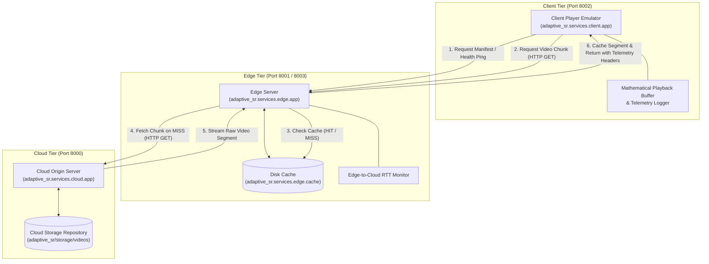
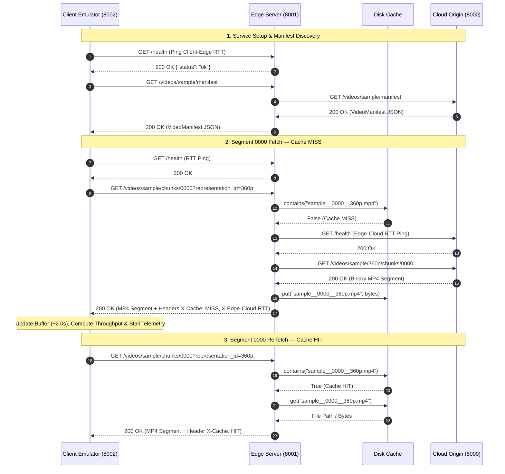

# FORMAL PROJECT AUDIT REPORT

## Step 0 — Distributed Streaming Foundation

**Project Title:** Telemetry-Aware & Scene-Adaptive Video Super-Resolution Framework  
**Document Type:** Technical Milestone Audit Report (Step 0 & Step 0.1)  
**Target Audience:** Faculty Project Guide / Technical Review Committee  
**Status:** Fully Implemented and Verified (13/13 Pytest Suite Passing)  

---

## 1. Step 0 Objective

The primary objective of **Step 0** is to establish an HTTP REST-based, multi-process distributed streaming environment—comprising **Cloud Origin**, **Edge Server**, and **Client Player Emulator**—which serves as the foundational data pathway for the AdaptiveSR research framework.

### Why a Distributed Foundation is Required
Traditional Video Super-Resolution (VSR) research is frequently limited to static, offline frame processing scripts that execute heavy deep learning models locally. However, practical edge video enhancement operates within network-constrained environments where:
1. Video assets originate at a central origin (Cloud Storage).
2. Video segments are fetched over volatile IP networks to edge nodes.
3. Edge nodes cache and process content close to end users.
4. Clients stream content sequentially while maintaining a playout buffer to avoid stalls.

Establishing this 3-tier distributed data pipeline upfront ensures that future research modules—such as scene complexity extraction, telemetry monitoring, fuzzy adaptive decision routing, and super-resolution upscaling—are benchmarked within a realistic distributed streaming architecture.

---

## 2. System Architecture

The Step 0 architecture defines explicit network boundaries between the three independently running services. Services communicate exclusively via standard HTTP REST requests.



### Architectural Principles
* **Network Isolation:** Edge and Cloud services do not share in-memory state or call each other's Python functions directly. All inter-service communication passes over HTTP sockets.
* **Process Independence:** Cloud, Edge, and Client services run as decoupled Python processes listening on separate ports (e.g., Cloud: 8000, Edge 01: 8001, Edge 02: 8003, Client: 8002).
* **Local Distributed Emulation:** For development and baseline benchmarking, all services run on local host ports while preserving the deployment interfaces required for edge/cloud deployment.

---

## 3. Component Responsibilities

| Component | Primary Responsibility | Important Implemented Functionality | Relevant Source Files |
| :--- | :--- | :--- | :--- |
| **Cloud Origin** | Central video asset repository | Manifest generation, chunk directory traversal, static file streaming, health reporting. | [`adaptive_sr/services/cloud/app.py`](file:///e:/AdaptiveSR/adaptive_sr/services/cloud/app.py) |
| **Edge Server** | Proxy request interceptor & edge caching | Cache lookups, cloud chunk forwarding, telemetry header injection, active RTT pinging, multi-instance identity management. | [`adaptive_sr/services/edge/app.py`](file:///e:/AdaptiveSR/adaptive_sr/services/edge/app.py) |
| **Edge Cache** | Disk-backed segment persistence | Key construction (`video__chunk__repr.mp4`), hit/miss lookup, file storage, cache directory isolation. | [`adaptive_sr/services/edge/cache.py`](file:///e:/AdaptiveSR/adaptive_sr/services/edge/cache.py) |
| **Client Emulator** | Stream playout & telemetry logging | Manifest fetching, sequential chunk downloading, mathematical buffer simulation, throughput calculation, stall detection. | [`adaptive_sr/services/client/app.py`](file:///e:/AdaptiveSR/adaptive_sr/services/client/app.py) |
| **Shared Schemas** | Contract data models | Pydantic v2 schemas defining manifests, chunk requests, representations, client telemetry, and edge telemetry. | [`adaptive_sr/shared/schemas.py`](file:///e:/AdaptiveSR/adaptive_sr/shared/schemas.py) |

---

## 4. Cloud Origin Implementation

The Cloud Origin service is implemented as a FastAPI REST server located in [`adaptive_sr/services/cloud/app.py`](file:///e:/AdaptiveSR/adaptive_sr/services/cloud/app.py). It serves raw video segments stored in structured disk directories under `adaptive_sr/storage/videos/{video_id}/{representation_id}/`.

### Implemented REST Endpoints

| Endpoint | Method | Purpose | Input Parameters | Output Format |
| :--- | :---: | :--- | :--- | :--- |
| `/health` | `GET` | Service status ping | None | `{"status": "ok"}` (JSON) |
| `/videos` | `GET` | List available video assets | None | List of video IDs `["sample", ...]` (JSON) |
| `/videos/{video_id}/manifest` | `GET` | Retrieve JSON manifest for a video | `video_id` (path) | `VideoManifest` schema (JSON) |
| `/videos/{video_id}/{representation_id}/chunks/{chunk_id}` | `GET` | Stream binary video segment file | `video_id`, `representation_id`, `chunk_id` (path) | Binary `video/mp4` stream or `404` error |

### Manifest Traversal Logic
When a manifest is requested, the Cloud Origin scans the local storage folder, inspects available resolution subdirectories (e.g., `360p`), counts `.mp4` segment files, and dynamically builds a `VideoManifest` containing available representations and segment sequence lists.

---

## 5. Edge Implementation

The Edge Server is implemented in [`adaptive_sr/services/edge/app.py`](file:///e:/AdaptiveSR/adaptive_sr/services/edge/app.py). It acts as an intelligent HTTP reverse proxy and cache provider between Client and Cloud.

### Cache Lookup & Key Construction
When the Edge receives a request for `/videos/{video_id}/chunks/{chunk_id}?representation_id=...`:
1. It generates a deterministic cache key formatted as:
   $$\text{cache\_key} = \text{video\_id} + "\_\_" + \text{chunk\_id} + "\_\_" + \text{representation\_id} + ".mp4"$$
   *(Example: `sample__0000__360p.mp4`)*
2. It checks existence using `edge_cache.contains(cache_key)`.

### Cache HIT Flow
* The file is retrieved immediately from the local disk cache (`edge_cache.get(cache_key)`).
* `cloud_fetch_time` is recorded as `0.0` seconds.
* Response header `X-Cache: HIT` is injected.

### Cache MISS Flow
* The Edge performs an HTTP `GET` request to the Cloud Origin (`http://localhost:8000/videos/{video_id}/{representation_id}/chunks/{chunk_id}`).
* Measured fetch duration is recorded as `cloud_fetch_time`.
* The received binary segment is saved to disk via `edge_cache.put(cache_key, content)`.
* Response header `X-Cache: MISS` is injected.

### Injected Telemetry Response Headers
Every chunk response returned by the Edge includes diagnostic HTTP response headers:
- `X-Request-ID`: UUIDv4 trace identifier.
- `X-Cache`: `HIT` or `MISS`.
- `X-Cloud-Fetch-Time`: Latency (in seconds) incurred fetching from Cloud Origin.
- `X-Edge-Processing-Time`: Total processing latency at the Edge node.
- `X-Cluster-ID`: Cluster identity tag (default: `"cluster_01"`).
- `X-Edge-ID`: Edge node identity tag (e.g., `"edge_01"`).
- `X-Edge-Cloud-RTT`: Measured RTT latency between Edge and Cloud.

---

## 6. Client / Playback Emulator

The Client Player is implemented in [`adaptive_sr/services/client/app.py`](file:///e:/AdaptiveSR/adaptive_sr/services/client/app.py). It simulates a streaming video player fetching segments sequentially over HTTP.

### Mathematical Playback Buffer & Stall Logic

The client tracks playout continuity using a continuous mathematical buffer model:

**Buffer depletion during download:**
```
buffer_seconds_depleted = max(0.0, buffer_before - download_duration)
```

#### Stall Identification
A stall event occurs when the playback buffer is fully depleted during segment download:

```
stalled = True   if buffer_seconds_depleted == 0.0 AND download_duration > buffer_before
stalled = False  otherwise
```

#### Stall Duration Equation
The exact duration of playout interruption (in seconds) is calculated as:

```
stall_duration_seconds = max(0.0, download_duration - buffer_before)
```

#### Buffer Replenishment
Upon successful segment download, the buffer is updated:

```
buffer_seconds_final = buffer_seconds_depleted + chunk_duration
```

#### Measured Throughput
Segment download throughput is computed using exact byte counts and monotonic clock timing:

```
throughput_mbps = (bytes_received * 8) / (download_duration * 1_000_000)
```

---

## 7. Round-Trip Time (RTT) Measurement

To isolate network propagation delay from large payload payload transfer overheads:
1. **Client-to-Edge RTT:** Immediately prior to issuing a chunk request, the Client issues a lightweight HTTP `GET /health` request to the Edge server. The round-trip elapsed time is measured using `time.monotonic()` and recorded as `client_edge_rtt`.
2. **Edge-to-Cloud RTT:** The Edge server periodically or per-request pings the Cloud Origin's `/health` endpoint. The latency is recorded as `rtt` in `EdgeTelemetry` and exposed to the client in the `X-Edge-Cloud-RTT` header.

This separation prevents high segment download times from distorting latency estimations.

---

## 8. Step 0.1 Hardening Pass

Following baseline Step 0 implementation, the **Step 0.1 Hardening Pass** introduced five stability and metrics verification features:

1. **Independent RTT Measurement:** Verified health ping RTT tracking completely isolated from video payload transfer size.
2. **Stall Duration Telemetry:** Added `stall_duration_seconds` to `ClientTelemetry` to quantify exact buffering stall times.
3. **Multi-Edge Identity Validation:** Parametrized Edge services with configurable `CLUSTER_ID` and `EDGE_ID` environment variables.
4. **Per-Edge Cache Isolation:** Enforced separate cache storage directories (`cache_edge_01`, `cache_edge_02`) preventing cross-node cache leakage during testing.
5. **Target vs. Base Representation Schema:** Extended `ChunkRequest` and telemetry models with `target_representation_id` and `base_representation_id` fields to prepare for future Super-Resolution resolution upscaling.

---

## 9. Multi-Edge Foundation

The architecture natively supports multi-edge deployment topologies. Independent Edge nodes are initialized with distinct ports, identity tags, and isolated storage directories:

| Configuration Variable | Edge Node 01 | Edge Node 02 |
| :--- | :--- | :--- |
| `EDGE_PORT` | `8001` | `8003` |
| `CLUSTER_ID` | `cluster_01` | `cluster_01` |
| `EDGE_ID` | `edge_01` | `edge_02` |
| `EDGE_CACHE_DIR` | `./cache_edge_01` | `./cache_edge_02` |
| Health URL | `http://localhost:8001/health` | `http://localhost:8003/health` |

Tests confirm that requests routed to Edge 02 result in a cache MISS even if Edge 01 already cached the segment, validating complete multi-edge storage boundary isolation.

---

## 10. End-to-End Data Flow



---

## 11. Verification and Testing

Verification was conducted by executing the comprehensive pytest suite located at [`tests/test_foundation.py`](file:///e:/AdaptiveSR/tests/test_foundation.py). 

**Execution Command:**
```powershell
D:\Abishek\venv\Scripts\python.exe -m pytest tests/test_foundation.py -v
```

### Verified Test Suite Results (13 / 13 Passed)

| Test Name | What it Verifies | Result | Source File & Location |
| :--- | :--- | :---: | :--- |
| `test_cloud_health` | Cloud Origin health endpoint status response | **PASS** | [`test_foundation.py:L88`](file:///e:/AdaptiveSR/tests/test_foundation.py#L88) |
| `test_cloud_manifest` | Cloud Origin manifest dynamic JSON building | **PASS** | [`test_foundation.py:L94`](file:///e:/AdaptiveSR/tests/test_foundation.py#L94) |
| `test_cloud_chunk` | Raw segment binary file streaming from Cloud | **PASS** | [`test_foundation.py:L103`](file:///e:/AdaptiveSR/tests/test_foundation.py#L103) |
| `test_missing_chunk_handling` | HTTP 404 error response on non-existent chunks | **PASS** | [`test_foundation.py:L109`](file:///e:/AdaptiveSR/tests/test_foundation.py#L109) |
| `test_edge_manifest_proxy` | Edge server proxying manifest requests to Cloud | **PASS** | [`test_foundation.py:L115`](file:///e:/AdaptiveSR/tests/test_foundation.py#L115) |
| `test_edge_cache_miss_and_hit` | Transition from Cache MISS (cloud fetch) to Cache HIT | **PASS** | [`test_foundation.py:L122`](file:///e:/AdaptiveSR/tests/test_foundation.py#L122) |
| `test_end_to_end_crossing_boundaries` | End-to-end Client → Edge → Cloud chunk delivery | **PASS** | [`test_foundation.py:L143`](file:///e:/AdaptiveSR/tests/test_foundation.py#L143) |
| `test_buffer_math` | Playback buffer depletion, replenishment, and stall tracking | **PASS** | [`test_foundation.py:L237`](file:///e:/AdaptiveSR/tests/test_foundation.py#L237) |
| `test_throughput_calculation` | Client download throughput calculation formula | **PASS** | [`test_foundation.py:L305`](file:///e:/AdaptiveSR/tests/test_foundation.py#L305) |
| `test_rtt_measurement` | Health ping RTT measurement and header injection | **PASS** | [`test_foundation.py:L314`](file:///e:/AdaptiveSR/tests/test_foundation.py#L314) |
| `test_edge_identity_smoke` | Dual Edge server instance identity tagging (`EDGE_ID`) | **PASS** | [`test_foundation.py:L329`](file:///e:/AdaptiveSR/tests/test_foundation.py#L329) |
| `test_zero_buffer_stall` | Exact stall duration calculation on empty buffer start | **PASS** | [`test_foundation.py:L355`](file:///e:/AdaptiveSR/tests/test_foundation.py#L355) |
| `test_per_edge_cache_isolation` | Cache directory isolation between independent Edge nodes | **PASS** | [`test_foundation.py:L362`](file:///e:/AdaptiveSR/tests/test_foundation.py#L362) |

**Test Execution Summary:** `13 passed in 2.13s`

---

## 12. Step 0 Outputs / Deliverables

| Deliverable | Description | Codebase Evidence |
| :--- | :--- | :--- |
| **Cloud Origin Service** | FastAPI video asset server | [`adaptive_sr/services/cloud/app.py`](file:///e:/AdaptiveSR/adaptive_sr/services/cloud/app.py) |
| **Edge Server Service** | FastAPI caching proxy server | [`adaptive_sr/services/edge/app.py`](file:///e:/AdaptiveSR/adaptive_sr/services/edge/app.py) |
| **Edge Disk Cache** | File storage cache manager | [`adaptive_sr/services/edge/cache.py`](file:///e:/AdaptiveSR/adaptive_sr/services/edge/cache.py) |
| **Client Player Emulator** | Streaming simulator with buffer model | [`adaptive_sr/services/client/app.py`](file:///e:/AdaptiveSR/adaptive_sr/services/client/app.py) |
| **Shared Pydantic Schemas** | Schema data contracts | [`adaptive_sr/shared/schemas.py`](file:///e:/AdaptiveSR/adaptive_sr/shared/schemas.py) |
| **Shared System Config** | Port and directory configurations | [`adaptive_sr/shared/config.py`](file:///e:/AdaptiveSR/adaptive_sr/shared/config.py) |
| **Automated Test Suite** | 13 integration and unit tests | [`tests/test_foundation.py`](file:///e:/AdaptiveSR/tests/test_foundation.py) |

---

## 13. Technical Significance

Step 0 is critical to the AdaptiveSR research methodology. It establishes the baseline experimental platform required to evaluate:
1. **Network Impact:** How varying RTT and throughput affect video playout continuity.
2. **Edge Offloading Economics:** Quantifying the latency savings of Edge caching versus Cloud fetches.
3. **Telemetry Ingestion Infrastructure:** Creating standard telemetry payload contracts (`ClientTelemetry`, `EdgeTelemetry`) that feed into downstream decision modules.

> [!IMPORTANT]
> Step 0 explicitly establishes the distributed network pipeline only. Super-Resolution model inference, ML-based routing, scene complexity analysis, and adaptive bitrate/FPS algorithms are intentionally excluded from Step 0 and built in subsequent phases upon this verified foundation.

---

## 14. Scope and Non-Goals

To maintain research rigor and clear milestone boundaries, the following features were **explicitly out of scope** for Step 0:

- **Super-Resolution Inference:** No neural networks (FSRCNN, Real-ESRGAN, BasicVSR++) were executed during segment transfers.
- **Adaptive Bitrate (ABR) Logic:** No dynamic representation switching algorithms were active; representations were requested deterministically.
- **Adaptive FPS Scaling:** No frame-rate manipulation or skip logic was applied.
- **ML Decision Engine / Fuzzy Logic:** Rule trees and fuzzy inference engines were not active.
- **Hardware Thread / GPU Allocation:** No CPU core pinning or CUDA stream scheduling was performed.
- **Cloud Infrastructure Provisioning:** Services were run locally to emulate distributed boundaries before cloud deployment.

---

## 15. Step 0 Completion Summary

- **Established:** A fully functional 3-tier distributed streaming architecture (Cloud → Edge → Client) communicating via HTTP REST.
- **Verified:** 13/13 unit and integration tests passing in 2.13 seconds, proving proxy routing, cache HIT/MISS transitions, buffer math, RTT pinging, and multi-edge cache isolation.
- **Deliverables Produced:** `adaptive_sr/services/{cloud, edge, client}`, `adaptive_sr/shared/schemas.py`, and `tests/test_foundation.py`.
- **Foundation Available for Step 1:** A clean, decoupled streaming pipeline ready for the integration of video analysis, frame extraction, and local Super-Resolution inference.

---

## Verified Implementation Status

- **Implemented:**
  - Cloud Origin FastAPI REST Service
  - Edge Server Caching Proxy Service
  - Disk-backed Edge Cache Manager
  - Client Player Emulator with Mathematical Playout Buffer
  - Shared Pydantic v2 Contract Schemas
  - Active RTT Health Ping Monitoring
  - Multi-Edge Server Identity (`EDGE_ID`, `CLUSTER_ID`) and Cache Directory Isolation
- **Tested:**
  - 13/13 Pytest cases passing (`tests/test_foundation.py`)
  - End-to-end data boundary crossing validated
- **Not yet implemented (Planned in subsequent steps):**
  - Scene complexity analysis (Phase 2)
  - Telemetry monitoring sensors (Phase 3)
  - Super-Resolution model backends (Phase 5)
  - Edge selection & resource allocation (Phase 9)
  - Fuzzy adaptive decision engine (Phase 10)
  - Real-time orchestrator loop (Phase 11)
- **Future Scope:**
  - Multi-cluster cloud orchestration & Azure Edge node deployment.
