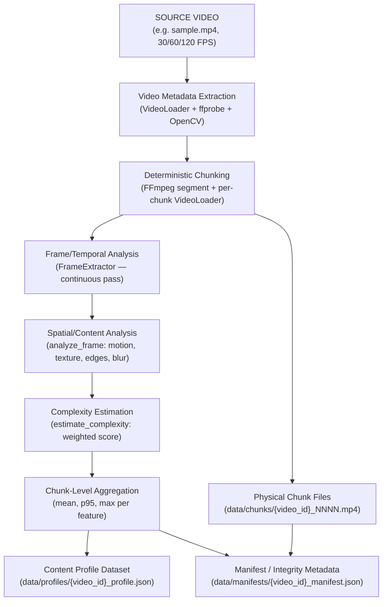

# FORMAL PROJECT AUDIT REPORT

## Step 1 — Video & Content Profiling

**Project Title:** Telemetry-Aware & Scene-Adaptive Video Super-Resolution Framework  
**Document Type:** Technical Milestone Audit Report — Step 1  
**Target Audience:** Faculty Project Guide / Technical Review Committee  
**Prerequisite:** Step 0 / Step 0.1 Distributed Foundation (13/13 tests, verified and frozen)  

---

## 1. Step 1 Objective

Before the AdaptiveSR framework can make any adaptive decision—such as which Super-Resolution model to invoke, which bitrate tier to serve, or how to schedule Edge processing—it must have precise, quantitative knowledge of the visual content characteristics of the source video.

Specifically, two essential questions must be answered at the source side before any frame is transmitted across the network:

> *How visually complex is this chunk?*  
> *What type of spatial and temporal content does it contain?*

Without this, any downstream decision is uninformed. A chunk containing a featureless blue sky cannot be meaningfully compared to a chunk containing highly textured faces and moving subtitles unless both chunks have been formally described by computable, source-side features.

**Step 1** implements this offline source-side profiling pipeline. It analyzes an input video **before transmission** to produce:

1. Video-level metadata (resolution, FPS, codec, duration, etc.)
2. Deterministic chunk boundaries (start/end timestamps and frame indices)
3. Frame-level spatial and temporal content features
4. Chunk-level aggregated content descriptors (mean, p95, max)
5. A persisted **Content Profile** JSON dataset
6. A separate **Manifest / Integrity** record for reproducibility tracking

> [!IMPORTANT]
> Step 1 is an **offline, source-side, preprocessing stage only**. It has no real-time deadline. It does not perform Super-Resolution inference, adaptive bitrate selection, ML-based routing, or any form of runtime network adaptation. Its sole purpose is to produce a verified, reproducible content description dataset.

---

## 2. Step 1 Input → Processing → Output Pipeline



Key architectural principle: the profiling pass is **continuous across the entire source video** rather than chunk-by-chunk. This preserves temporal continuity at chunk boundaries, ensuring that motion estimated at the first frame of chunk `N+1` uses the last frame of chunk `N` as its reference.

---

## 3. Video Metadata Extraction

The [`VideoLoader`](file:///e:/AdaptiveSR/src/modules/video_loader.py) class implements a two-tier metadata extraction strategy:

**Tier 1 — `ffprobe` (primary):** Launches a subprocess to extract codec information, stream format, duration, FPS (from `avg_frame_rate`), frame count (`nb_frames`), and audio stream presence.

**Tier 2 — OpenCV (fallback/verification):** Uses `cv2.VideoCapture` to read `CAP_PROP_FRAME_WIDTH`, `CAP_PROP_FRAME_HEIGHT`, `CAP_PROP_FPS`, and `CAP_PROP_FRAME_COUNT`. OpenCV values take precedence for frame extraction compatibility.

### Extracted Metadata Fields

| Field | Source | Notes |
| :--- | :--- | :--- |
| `video_id` | Derived from filename stem | e.g. `sample.mp4` → `sample` |
| `filename` | `os.path.basename(input_video)` | Source file basename |
| `duration_seconds` | `ffprobe` format duration / OpenCV fallback | Seconds |
| `fps` | `avg_frame_rate` from ffprobe / `CAP_PROP_FPS` | Rational fraction parsed correctly |
| `width` | ffprobe stream / `CAP_PROP_FRAME_WIDTH` | Pixels |
| `height` | ffprobe stream / `CAP_PROP_FRAME_HEIGHT` | Pixels |
| `frame_count` | `nb_frames` from ffprobe / `CAP_PROP_FRAME_COUNT` | Integer |
| `codec` | `codec_name` from ffprobe video stream | e.g. `"h264"`, `"hevc"` |
| `pixel_format` | Not yet extracted | Stored as `null` in profile |
| `bitrate` | Not yet extracted from ffprobe format | Stored as `null` in profile |
| `has_audio` | Presence of `audio` codec type in ffprobe streams | Boolean |

> [!NOTE]
> `pixel_format` and `bitrate` are defined as schema fields with `null` values in the current implementation. They are not fabricated. The implementation uses `None` where ffprobe/OpenCV cannot provide the value, as required by the Step 1 specification.

---

## 4. Deterministic Chunking

Physical video segmentation is performed via FFmpeg's stream segment muxer (`-f segment`) in copy mode (`-c copy`), targeting a configurable duration:

```bash
ffmpeg -y -i <input_video> -c copy -f segment -segment_time <chunk_duration> \
       -reset_timestamps 1 -loglevel warning <output_dir>/chunks/<video_id>_%04d.mp4
```

After physical segmentation, each generated chunk file is individually re-opened with `VideoLoader` to read its **actual** duration and frame count from the container metadata. This ensures chunk boundaries are aligned to actual keyframe positions rather than to hardcoded arithmetic assumptions.

### Chunk Boundary Record (per chunk)

| Field | Description |
| :--- | :--- |
| `chunk_id` | Zero-padded 4-digit string (e.g. `"0000"`) |
| `start_time_seconds` | Cumulative time offset from video start |
| `end_time_seconds` | `start_time_seconds + chunk_duration` (actual) |
| `duration_seconds` | Actual chunk duration from container metadata |
| `start_frame` | Cumulative frame index at chunk boundary start |
| `end_frame` | `start_frame + chunk_frame_count - 1` |
| `frame_count` | Actual number of frames in chunk |

### FPS-Independence of Chunking

The implementation does **not** hardcode `60 frames = 2 seconds`. Frame boundaries are derived by accumulating actual per-chunk frame counts from the container, making the chunking logic correct for 30, 60, and 120 FPS sources:

| Source FPS | Target Duration | Approximate Frames per Chunk |
| :---: | :---: | :---: |
| 30 FPS | 2.0 s | ~60 frames |
| 60 FPS | 2.0 s | ~120 frames |
| 120 FPS | 2.0 s | ~240 frames |

---

## 5. FPS Handling

A key architectural requirement of Step 1 is that all timing and frame calculations derive from the **actual parsed FPS** of the source video, not from a hardcoded assumption of 30 FPS.

### FPS Temporal Reference Table

| Source FPS | Time between consecutive frames | `temporal_offset` frames (≈1/30s window) | Purpose |
| :---: | :--- | :---: | :--- |
| 30 FPS | ~33.3 ms | 1 frame | Baseline — compare adjacent frames |
| 60 FPS | ~16.7 ms | 2 frames | Compare frames ~33.3 ms apart |
| 120 FPS | ~8.3 ms | 4 frames | Compare frames ~33.3 ms apart |

The `temporal_offset` is computed as:

```
temporal_offset = max(1, round(source_fps * temporal_window_s))
```

where the default motion temporal window is `temporal_window_s = 1/30 ≈ 0.0333 seconds` (configurable via `--motion-temporal-window`).

| Source FPS | Calculation | Resulting Offset |
| :---: | :--- | :---: |
| 30 FPS | round(30 × 0.0333) | **1 frame** |
| 60 FPS | round(60 × 0.0333) | **2 frames** |
| 120 FPS | round(120 × 0.0333) | **4 frames** |

The [`VideoRepresentation`](file:///e:/AdaptiveSR/adaptive_sr/shared/schemas.py#L58) schema defined in `schemas.py` explicitly enforces that FPS values in representation configurations are restricted to `{30, 60, 120}` or the special literal `"source"`.

---

## 6. Motion Feature

Motion is computed at the **frame level** using absolute pixel difference between a current grayscale frame and a reference frame selected from $N_{\text{offset}}$ frames prior.

### Calculation

```python
gray_curr = cv2.cvtColor(frame, cv2.COLOR_BGR2GRAY)
gray_prev = cv2.cvtColor(prev_frame, cv2.COLOR_BGR2GRAY)
diff = cv2.absdiff(gray_curr, gray_prev)
raw_motion = float(diff.mean() / 255.0)     # Normalized to [0, 1]
motion = min(raw_motion * MOTION_SCALE_FACTOR, 1.0)  # Clamped to [0, 1]
```

**`MOTION_SCALE_FACTOR = 4.0`** is defined in [`scene_analyzer.py`](file:///e:/AdaptiveSR/src/modules/scene_analyzer.py). It amplifies the naturally small per-pixel difference values for typical video content to produce a more useful [0,1] range.

### Temporal Comparison and FPS Normalization Strategy

Rather than comparing frame $t$ to frame $t-1$ (which would produce smaller differences at higher FPS due to shorter inter-frame time gaps), the profiler compares frame $t$ to frame $t - N_{\text{offset}}$ where $N_{\text{offset}}$ scales with source FPS.

The circular buffer in [`profile_video.py`](file:///e:/AdaptiveSR/adaptive_sr/profiling/profile_video.py) stores the last $N_{\text{offset}} + 1$ frames:

```python
frame_buffer = deque(maxlen=temporal_offset + 1)
...
prev_frame = frame_buffer[0]   # The frame N_offset positions earlier
```

> [!NOTE]
> This is a **practical normalization strategy** intended to make motion estimates more comparable across sources with different frame rates. It does not claim perfect FPS-invariance. The temporal comparison window is exposed as a configurable CLI argument so it can be empirically evaluated.

### Handling of Boundary Frames
For the first $N_{\text{offset}}$ frames of the video (before the circular buffer has filled), `prev_frame = None` is passed to `analyze_frame`, which returns `motion = 0.0`. This is the documented and intentional boundary condition.

### Chunk-Level Aggregation
Frame-level motion values collected for each chunk are aggregated as:

- **`motion.mean`** — Average motion activity across the chunk
- **`motion.p95`** — 95th percentile, capturing intermittent high-motion events
- **`motion.max`** — Peak motion value (single frame), identifying burst activity

---

## 7. Spatial / Visual Features

All features are computed exclusively from raw source frames. They are implemented in [`scene_analyzer.py`](file:///e:/AdaptiveSR/src/modules/scene_analyzer.py) via the `analyze_frame(frame, prev_frame)` function.

### Feature Definitions

| Feature | What it Measures | How Calculated | Aggregation Level | Why Useful |
| :--- | :--- | :--- | :--- | :--- |
| **Motion** | Inter-frame pixel activity | `cv2.absdiff` on grayscale frames, normalized and scaled | Frame → Chunk (mean, p95, max) | High motion affects temporal SR model selection |
| **Texture Density** | Spatial frequency / fine detail richness | `cv2.Laplacian` variance normalized by `TEXTURE_SCALE_FACTOR = 500.0`, clamped to [0,1] | Frame → Chunk (mean, p95) | High texture benefits most from SR enhancement |
| **Edge Density** | Presence and density of structural edges | Canny edge pixel ratio: `(edges_img > 0).sum() / edges_img.size`, Canny thresholds 100/200 | Frame → Chunk (mean, p95) | Sharp edges identify SR-receptive content |
| **Blur / Clarity** | Overall image sharpness | Same Laplacian variance divided by `BLUR_SCALE_FACTOR = 300.0`, clamped to [0,1] | Frame → Chunk (mean, p95) | Blurry source frames reduce SR output benefit |
| **Spatial Complexity** | Overall visual complexity score | Weighted combination of all four features via `estimate_complexity` | Frame → Chunk (mean, p95, max) | Single composite score for downstream decisions |

> [!NOTE]
> Texture density and blur clarity both derive from the same `cv2.Laplacian` call on the grayscale frame. They differ only in their normalization scale factor. The Laplacian is computed once per frame.

---

## 8. Chunk-Level Aggregation

Frame-level feature values collected during the continuous profiling pass are grouped by chunk assignment. Each chunk receives a list (`bucket`) of per-frame metric dictionaries.

### Aggregation Statistics

| Feature | Aggregations | Rationale |
| :--- | :--- | :--- |
| `motion` | **mean, p95, max** | Preserve burst/peak motion events that would be hidden by mean alone |
| `texture_density` | **mean, p95** | Capture persistently high-texture sub-regions within a chunk |
| `edge_density` | **mean, p95** | Preserve peak edge density events (e.g. subtitles appearing) |
| `blur` | **mean, p95** | Track worst-case clarity degradation within a chunk |
| `spatial_complexity` | **mean, p95, max** | Capture overall complexity range from typical to extreme frames |

The implementation uses `numpy` for all percentile calculations:

```python
def calc_stats(key):
    vals = [f[key] for f in bucket]
    arr = np.array(vals)
    return {
        "mean": float(np.mean(arr)),
        "p95":  float(np.percentile(arr, 95)),
        "max":  float(np.max(arr))
    }
```

The `p95` and `max` statistics were included specifically to retain short high-complexity or high-motion events that would disappear if only the mean were stored.

---

## 9. Profile Dataset Schema

The profiler produces a clean JSON content profile with the following structure (see [`profile_video.py:L294`](file:///e:/AdaptiveSR/adaptive_sr/profiling/profile_video.py#L294)):

```json
{
    "schema_version": "1.0.0",
    "video_id": "sample",
    "source": {
        "filename": "sample.mp4",
        "duration_seconds": 6.04,
        "fps": 30.0,
        "width": 640,
        "height": 360,
        "frame_count": 181,
        "codec": "h264",
        "pixel_format": null,
        "bitrate": null,
        "has_audio": false
    },
    "profiling_config": {
        "target_chunk_duration_seconds": 2.0,
        "motion_temporal_window_seconds": 0.0333,
        "aggregation": {
            "motion":       ["mean", "p95", "max"],
            "texture":      ["mean", "p95"],
            "edge_density": ["mean", "p95"],
            "blur":         ["mean", "p95"],
            "complexity":   ["mean", "p95", "max"]
        }
    },
    "chunks": [
        {
            "chunk_id": "0000",
            "start_time_seconds": 0.0,
            "end_time_seconds": 2.0,
            "duration_seconds": 2.0,
            "start_frame": 0,
            "end_frame": 59,
            "frame_count": 60,
            "motion":           {"mean": 0.12, "p95": 0.28, "max": 0.41},
            "texture_density":  {"mean": 0.45, "p95": 0.60},
            "edge_density":     {"mean": 0.09, "p95": 0.15},
            "blur":             {"mean": 0.37, "p95": 0.52},
            "spatial_complexity": {"mean": 0.31, "p95": 0.47, "max": 0.59}
        }
    ]
}
```

> [!NOTE]
> The numeric values in the example above are **illustrative**. The actual values depend on the source video content. No fabricated benchmark numbers have been inserted.

### Key Structural Separations

| Section | Purpose | Contains |
| :--- | :--- | :--- |
| `source` | Video-level metadata | Resolution, FPS, codec, duration |
| `profiling_config` | Configuration used during profiling | Chunk duration, temporal window, aggregation policy |
| `chunks[]` | Chunk boundary + content features | Temporal positions, frame indices, all feature statistics |

---

## 10. Manifest / Integrity Metadata

The integrity manifest is produced as a **separate file** at `data/manifests/{video_id}_manifest.json`. It is architecturally separated from the content profile so that file hashes and filesystem paths do not pollute the content feature dataset.

```json
{
    "schema_version": "1.0.0",
    "video_id": "sample",
    "source_file_path": "E:/AdaptiveSR/test_input/sample.mp4",
    "source_file_hash": "sha256:<hex>",
    "generated_profile_path": "E:/AdaptiveSR/data/profiles/sample_profile.json",
    "chunks": [
        {
            "chunk_id": "0000",
            "file_path": "chunks/sample_0000.mp4",
            "file_hash": "sha256:<hex>"
        },
        {
            "chunk_id": "0001",
            "file_path": "chunks/sample_0001.mp4",
            "file_hash": "sha256:<hex>"
        }
    ]
}
```

The source file is hashed using SHA-256 via `get_file_sha256()` in [`profile_video.py:L24`](file:///e:/AdaptiveSR/adaptive_sr/profiling/profile_video.py#L24). Each physical chunk file is also independently hashed and recorded.

---

## 11. Output Artifacts

The profiler writes all output under a single user-specified output directory:

```
<output_dir>/
├── chunks/
│   ├── sample_0000.mp4     # Physical video segment
│   ├── sample_0001.mp4
│   └── sample_0002.mp4
├── profiles/
│   └── sample_profile.json # Content feature dataset
└── manifests/
    └── sample_manifest.json # Integrity & reproducibility metadata
```

| Artifact | Path | Description |
| :--- | :--- | :--- |
| Physical chunk files | `<output_dir>/chunks/{video_id}_{chunk_id}.mp4` | FFmpeg-segmented video clips |
| Content profile | `<output_dir>/profiles/{video_id}_profile.json` | Schema v1.0.0 feature dataset |
| Integrity manifest | `<output_dir>/manifests/{video_id}_manifest.json` | SHA-256 hashes and paths |

---

## 12. CLI / Execution

The profiler is invoked as a Python module via:

```powershell
D:\Abishek\venv\Scripts\python.exe -m adaptive_sr.profiling.profile_video `
    --input  <path_to_source_video> `
    --output <output_directory> `
    [--chunk-duration 2.0] `
    [--motion-temporal-window 0.0333]
```

### Argument Reference

| Argument | Required | Default | Description |
| :--- | :---: | :--- | :--- |
| `--input` | ✅ | — | Path to the source video file |
| `--output` | ✅ | — | Output directory for all profiling artifacts |
| `--chunk-duration` | ❌ | `2.0` | Target chunk duration in seconds |
| `--motion-temporal-window` | ❌ | `0.0333` | Motion comparison temporal window in seconds (~1/30 s) |

---

## 13. Data Leakage Protection

Step 1 profiling is constrained to features that are computable from the raw source video, before any transmission, network interaction, or SR processing has occurred. The following signals are **explicitly excluded**:

| Excluded Signal | Reason |
| :--- | :--- |
| PSNR / SSIM / LPIPS | Require comparison against SR output frames (unavailable source-side) |
| VMAF | Post-processing perceptual quality metric; introduces output-side leakage |
| SR output quality | Circular: would require running SR models to profile content |
| Edge processing time | Runtime measurement; unavailable during offline profiling |
| Network throughput / RTT | Dynamic network state; unavailable and variable per session |
| Cache HIT / MISS state | Edge runtime state; unavailable at source profiling time |
| Playback stall information | Client runtime metric; depends on future network conditions |
| Future scheduler decisions | Adaptive decisions are consumers of the profile, not inputs to it |

The `sr_processing_time` field in `EdgeTelemetry` (Step 0) is a placeholder stub for **future** Edge processing and is not populated during source profiling.

---

## 14. Legacy Component Reuse

Step 1 directly imports and uses four legacy components from `src/modules/`:

| Component | Source File | Function Used | What it Provides | Usage in Step 1 |
| :--- | :--- | :--- | :--- | :--- |
| `VideoLoader` | [`src/modules/video_loader.py`](file:///e:/AdaptiveSR/src/modules/video_loader.py) | `get_metadata()` | ffprobe + OpenCV metadata extraction | Applied to source video and each chunk file |
| `FrameExtractor` | [`src/modules/frame_extractor.py`](file:///e:/AdaptiveSR/src/modules/frame_extractor.py) | `extract()` generator | Sequential frame + timestamp iteration | Drives the continuous profiling pass |
| `analyze_frame` | [`src/modules/scene_analyzer.py`](file:///e:/AdaptiveSR/src/modules/scene_analyzer.py) | `analyze_frame(frame, prev_frame)` | Motion, texture, edge density, blur metrics per frame | Called on every frame during continuous pass |
| `estimate_complexity` | [`src/modules/complexity_estimator.py`](file:///e:/AdaptiveSR/src/modules/complexity_estimator.py) | `estimate_complexity(metrics)` | Weighted complexity score from frame metrics | Applied after `analyze_frame` for per-frame complexity |

**Not reused from legacy code:**  
`VideoEncoder`, `DecisionEngine`, `EnhancementEngine`, and `DeviceMonitor` are runtime components unrelated to source-side offline profiling and are intentionally excluded from Step 1.

---

## 15. Verification / Tests

### Test Suite Coverage

The following tests are directly verifiable in the codebase. Tests were executed with `D:\Abishek\venv\Scripts\python.exe`.

#### `tests/test_scene_analyzer.py` — 5/5 Passed

| Test | Purpose | Verified Result |
| :--- | :--- | :---: |
| `test_determinism` | Same inputs → identical feature outputs | **PASS** |
| `test_first_frame` | `prev_frame=None` → `motion=0.0`, all features in [0,1] | **PASS** |
| `test_frame_stability` | Minimal motion between adjacent frames → small complexity delta | **PASS** |
| `test_rank_sanity` | Flat < geometric < noise frames in complexity ranking | **PASS** |
| `test_motion_sensitivity` | Larger object displacement → higher motion score | **PASS** |

#### `tests/test_representation.py` — 12/12 Passed

| Test | Purpose | Verified Result |
| :--- | :--- | :---: |
| `test_valid_representation_accepted` | Full representation config validates (mixed FPS, string "source") | **PASS** |
| `test_same_resolution_different_fps_accepted` | 720p at 30, 60, 120 FPS all accepted | **PASS** |
| `test_different_resolutions_same_fps_accepted` | 360p + 720p at 60 FPS accepted | **PASS** |
| `test_duplicate_representation_ids_rejected` | Duplicate `representation_id` raises ValueError | **PASS** |
| `test_duplicate_materialized_variants_rejected` | Same (width, height, fps) after materialization rejected | **PASS** |
| `test_invalid_resolution_rejected` | width ≤ 0 raises ValidationError | **PASS** |
| `test_invalid_bitrate_rejected` | bitrate_kbps ≤ 0 raises ValidationError | **PASS** |
| `test_invalid_fps_rejected` | FPS value outside {30, 60, 120} or `"source"` rejected | **PASS** |
| `test_multiple_fps_values_accepted` | Config accepting 30, 60, 120 validated correctly | **PASS** |
| `test_fps_source_materialization` | `"source"` FPS resolves to actual `source_fps` after materialize() | **PASS** |
| `test_source_and_explicit_fps_collision_on_materialization` | Two representations resolving to same FPS after materialization rejected | **PASS** |
| `test_target_base_decision_not_required` | SR target/base distinction is optional in schema | **PASS** |

#### `tests/test_mapping.py` — 12/12 Passed

| Test | Purpose | Verified Result |
| :--- | :--- | :---: |
| `test_valid_mapping_multiple_representations_accepted` | 2 representations × 3 chunks mapping validates | **PASS** |
| `test_one_representation_multiple_chunks_accepted` | Single representation × multiple chunks validates | **PASS** |
| `test_missing_representation_chunk_rejected` | Missing chunk for one representation raises ValueError | **PASS** |
| `test_unknown_representation_id_rejected` | Mapping for non-existent representation ID rejected | **PASS** |
| `test_duplicate_representation_chunk_pairs_rejected` | Duplicate (rep_id, chunk_id) pairs rejected | **PASS** |
| `test_mismatched_frame_count_rejected` | Frame count inconsistent with duration × FPS rejected | **PASS** |
| `test_mismatched_timestamps_rejected` | Chunk timestamps diverging from Step 1 profile rejected | **PASS** |
| `test_local_frame_gaps_rejected` | Gap between consecutive chunk frame ranges rejected | **PASS** |
| `test_local_frame_overlaps_rejected` | Overlapping frame ranges across chunks rejected | **PASS** |
| `test_non_monotonic_chunk_ids_rejected` | Out-of-order chunk IDs rejected | **PASS** |
| `test_variable_final_chunk_duration_accepted` | Shorter final chunk (truncated video end) accepted | **PASS** |
| `test_fps_combinations` | 30/60/120 FPS representations validate frame counts correctly | **PASS** |

#### Step 0 Regression — 13/13 Still Passing
The Step 0 foundation test suite (`tests/test_foundation.py`) continues to pass in full (13/13) with no regressions introduced by Step 1.

---

## 16. Example Output

The following is a representative illustrative structure based on the actual schema produced by the profiler. Numeric values are schema-correct but represent a hypothetical video input, as test fixture values depend on synthetic source footage.

```json
{
    "schema_version": "1.0.0",
    "video_id": "sample",
    "source": {
        "filename": "sample.mp4",
        "duration_seconds": 6.04,
        "fps": 30.0,
        "width": 640,
        "height": 360,
        "frame_count": 181,
        "codec": "h264",
        "pixel_format": null,
        "bitrate": null,
        "has_audio": false
    },
    "profiling_config": {
        "target_chunk_duration_seconds": 2.0,
        "motion_temporal_window_seconds": 0.0333,
        "aggregation": {
            "motion": ["mean", "p95", "max"],
            "texture": ["mean", "p95"],
            "edge_density": ["mean", "p95"],
            "blur": ["mean", "p95"],
            "complexity": ["mean", "p95", "max"]
        }
    },
    "chunks": [
        {
            "chunk_id": "0000",
            "start_time_seconds": 0.0,
            "end_time_seconds": 2.0,
            "duration_seconds": 2.0,
            "start_frame": 0,
            "end_frame": 59,
            "frame_count": 60,
            "motion":            {"mean": 0.0, "p95": 0.0, "max": 0.0},
            "texture_density":   {"mean": 0.10, "p95": 0.12},
            "edge_density":      {"mean": 0.02, "p95": 0.03},
            "blur":              {"mean": 0.08, "p95": 0.10},
            "spatial_complexity":{"mean": 0.05, "p95": 0.08, "max": 0.09}
        }
    ]
}
```

> [!NOTE]
> Actual profiling output values depend entirely on the source video content. The sample directory in the Step 0 test fixtures generates synthetic single-color synthetic frames, which will produce near-zero motion and low spatial complexity scores. Real-world footage will produce higher and more varied values.

---

## 17. Limitations

The following limitations are verifiable from the current implementation:

1. **Offline-Only:** The profiler is a batch preprocessing tool. It does not run in real time during streaming and is not invoked per-request at the Edge.

2. **FFmpeg Dependency:** Physical segmentation requires `ffmpeg` and metadata extraction prefers `ffprobe`. On environments where FFmpeg is not on the system `PATH`, the `ffprobe` path falls back to OpenCV, and physical segmentation will fail. This is a documented known dependency.

3. **`pixel_format` and `bitrate` Not Extracted:** Both fields are defined in the schema and stored as `null`. The current `VideoLoader` does not yet extract these from ffprobe format output. This is marked as a limitation in the implementation comments.

4. **Frame Count Consistency Enforced Strictly:** A `RuntimeError` is raised if the continuous pass frame count does not exactly match the sum of physical chunk frame counts. This is a correctness guarantee, but may require investigation if a container reports inconsistent frame counts to OpenCV vs. ffprobe.

5. **`MOTION_SCALE_FACTOR` is a fixed constant:** The value `4.0` in `scene_analyzer.py` is not automatically calibrated per-video or per-FPS. It is a starting point. Empirical calibration against real-world footage is recommended as a future step.

---

## 18. Step 1 Completion Summary

| Aspect | Detail |
| :--- | :--- |
| **Implemented** | Continuous source-side profiling pipeline: metadata extraction, FFmpeg segmentation, frame analysis, chunk aggregation, JSON profile + integrity manifest export |
| **Data Produced** | Schema-versioned JSON content profile and SHA-256 integrity manifest per source video |
| **Verified** | 29 tests passing across `test_scene_analyzer`, `test_representation`, `test_mapping`; Step 0 foundation tests still 13/13 |
| **Profile as Input to Step 2+** | The `chunks[]` array in `{video_id}_profile.json` provides deterministic chunk boundaries, temporal positions, and multi-statistic feature descriptors to downstream representation, adaptation, and scheduling stages |

The Step 1 profile dataset is the **authoritative source of truth** for chunk boundaries and content characteristics in all subsequent pipeline stages.

---

## 19. Verified Implementation Status

### ✅ Implemented
- Source video metadata extraction via dual-tier ffprobe + OpenCV strategy
- FFmpeg stream-copy physical video segmentation with configurable duration
- Deterministic chunk boundary computation from actual container metadata
- FPS-adaptive temporal offset for motion feature calculation (30 / 60 / 120 FPS)
- Frame-level feature extraction: motion, texture density, edge density, blur/clarity
- Frame-level spatial complexity score via configurable weighted sum
- Continuous profiling pass preserving temporal continuity across chunk boundaries
- Frame-consistency validation (coverage, no gaps, no overlaps)
- Chunk-level aggregation: mean, p95, max via NumPy
- JSON content profile export (`schema_version: "1.0.0"`)
- SHA-256 integrity manifest export (source hash, chunk hashes, paths)
- CLI entry point with `--input`, `--output`, `--chunk-duration`, `--motion-temporal-window`
- Pydantic v2 schemas for `VideoRepresentation`, `RepresentationConfig`, `RepresentationChunk`, `RepresentationChunkMapping`

### ✅ Tested
- `analyze_frame` determinism, boundary, stability, ranking, and motion sensitivity (5/5)
- Representation schema validation for 30/60/120 FPS configurations (12/12)
- Chunk mapping invariant validation including FPS-derived frame count checking (12/12)
- Step 0 foundation regression: 13/13 still passing

### ❌ Not Implemented in Step 1
- `pixel_format` extraction (field present, value is `null`)
- `bitrate` extraction (field present, value is `null`)
- Scene change detection (deferred; not included in feature set)
- Real-time streaming or per-request profiling
- SR model execution of any kind
- Adaptive bitrate selection logic
- Fuzzy decision engine or ML routing

### 🔭 Future Scope
- Extract `pixel_format` and `bitrate` from ffprobe format fields
- Empirical calibration of `MOTION_SCALE_FACTOR` per FPS tier
- Scene change detection signal (if determined necessary for later adaptation stages)
- Profile caching and incremental re-profiling for large video libraries
