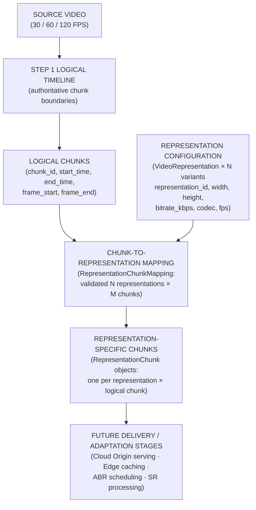

# FORMAL PROJECT AUDIT REPORT

## Step 2 — Video Representation and Chunk Mapping

**Project Title:** Telemetry-Aware & Scene-Adaptive Video Super-Resolution Framework  
**Document Type:** Technical Milestone Audit Report — Step 2  
**Sub-phases:** Step 2.1 (Representation Schema) · Step 2.2 (Chunk-to-Representation Mapping)  
**Target Audience:** Faculty Project Guide / Technical Review Committee  
**Prerequisites:** Step 0/0.1 Distributed Foundation (13 tests) · Step 1 Video & Content Profiling (29 tests)

---

## 1. Step 2 Overview

Step 1 produced a verified, reproducible **content profile** of the source video: an ordered sequence of logical temporal chunks, each annotated with spatial and temporal visual feature statistics. That profiling stage answered the question:

> *What does each temporal interval of the source video contain?*

Step 2 addresses the next required question before any delivery or adaptation system can be built:

> *What video representations are available for delivery, and which representation-specific chunk object corresponds to each logical source interval?*

To answer this, Step 2 introduces the **delivery data contract** — the formal schema and mapping layer that connects the source-side logical timeline to the set of pre-encoded video representations that the Cloud Origin will eventually serve and the Edge Server will cache.

### Conceptual Progression

```
STEP 1 OUTPUTS:
  Source video
    → logical temporal chunks (with authoritative frame/time boundaries)
    → source-side content profile (motion, texture, complexity features)

STEP 2 OUTPUTS:
  Logical chunks
    → available video representations (resolution, bitrate, codec, FPS)
    → representation-specific chunk mapping (one mapping entry per representation × chunk pair)
    → delivery data contract (consumed by later scheduling, network, and SR stages)
```

### Why This Layer Is Necessary

Without Step 2, downstream stages would have no formal way to express:

- Which encoded quality tiers exist for this video
- How a chunk in one representation corresponds to the same temporal interval in another
- What spatial resolution and bitrate metadata applies to each delivery object
- Whether a given representation-chunk combination has been fully accounted for

Step 2 establishes these contracts formally so that later adaptive and SR scheduling stages receive structured, validated input — not ad-hoc assumptions about what representations may exist.

> [!IMPORTANT]
> Step 2 defines **what representations exist** and **which chunk belongs to which representation**. It does NOT implement adaptive bitrate selection, FPS conversion, SR model routing, or any real-time scheduling logic. Those belong to later project phases.

---

## 2. Step 2 Architecture / Data Flow



### Stage Descriptions

| Stage | Description |
| :--- | :--- |
| **Source Video** | The original video input at 30, 60, or 120 FPS |
| **Step 1 Logical Timeline** | Authoritative chunk sequence produced by offline profiling; defines frame and time boundaries |
| **Logical Chunks** | Abstract temporal units identified by `chunk_id`; each carries a canonical time interval |
| **Representation Configuration** | The formally defined set of encoded variants — the delivery quality ladder |
| **Representation-Specific Chunks** | One `RepresentationChunk` object for every (representation × logical chunk) pair |
| **Mapping** | The validated, complete cross-product: `N representations × M chunks = N×M entries` |
| **Future Stages** | Network measurement, Edge scheduling, adaptive decision logic, SR processing |

**Central architectural principle:**
- A **logical chunk** is the authoritative temporal unit — shared across all representations
- A **representation chunk** is a representation-specific object corresponding to that shared logical interval

---

## 3. Step 2.1 — Representation Schema

Step 2.1 establishes the data model for multiple encoded video representations using Pydantic v2. Two classes are implemented in [`adaptive_sr/shared/schemas.py`](file:///e:/AdaptiveSR/adaptive_sr/shared/schemas.py):

| Class | Purpose | Location |
| :--- | :--- | :--- |
| [`VideoRepresentation`](file:///e:/AdaptiveSR/adaptive_sr/shared/schemas.py#L58) | Models a single encoded variant | `schemas.py:L58` |
| [`RepresentationConfig`](file:///e:/AdaptiveSR/adaptive_sr/shared/schemas.py#L101) | Groups multiple `VideoRepresentation` instances | `schemas.py:L101` |

Both are verified present and correct in the current codebase.

---

## 4. VideoRepresentation Model

Every video representation is described by the following fields:

| Field | Type | Meaning | Validation | Example Values |
| :--- | :--- | :--- | :--- | :--- |
| `representation_id` | `str` | Unique identifier for this representation | Must be unique within a config | `"360p"`, `"720p_h265"` |
| `width` | `int` | Encoded frame width in pixels | Must be `> 0` (Pydantic `gt=0`) | `640`, `1280`, `1920` |
| `height` | `int` | Encoded frame height in pixels | Must be `> 0` (Pydantic `gt=0`) | `360`, `720`, `1080` |
| `resolution_label` | `str` | Human-readable resolution name | No format constraint | `"360p"`, `"1080p"` |
| `bitrate_kbps` | `int` | Target encoded bitrate in kilobits per second | Must be `> 0` (Pydantic `gt=0`) | `800`, `2500`, `6000` |
| `codec` | `str` | Video compression format identifier | Must be one of `{"h264", "h265", "hevc", "vp9", "av1"}` | `"h264"`, `"vp9"` |
| `fps` | `Union[int, Literal["source"]]` | Frame rate for this representation | Must be `30`, `60`, `120`, or `"source"` | `30`, `60`, `"source"` |

### Design Decisions

- The schema is **not hardcoded** to specific resolution tiers (e.g. only 360p/480p/720p). Any `representation_id`, `width`, and `height` combination is accepted as long as it passes validation.
- The schema does **not enforce monotonic bitrate ordering** (e.g. it does not require that higher resolution always has a higher bitrate). As documented in the Step 2.1 specification: *"That is normally expected but is not a schema requirement."*
- Audio representation fields are **explicitly deferred** from this model — the current contract covers only the video streaming path.

### Materialization Method

`VideoRepresentation.materialize(source_fps: int)` resolves the `"source"` FPS literal to the actual source FPS value, returning a new `VideoRepresentation` with an explicit integer FPS:

```python
def materialize(self, source_fps: int) -> 'VideoRepresentation':
    resolved_fps = source_fps if self.fps == "source" else self.fps
    return VideoRepresentation(..., fps=resolved_fps)
```

---

## 5. RepresentationConfig

`RepresentationConfig` holds a `List[VideoRepresentation]` and applies group-level validation across all representations collectively.

### Schema Example

The following illustrates a representative three-tier configuration (this is a schema example; no static YAML configuration file was found in the repository):

```python
config = RepresentationConfig(representations=[
    VideoRepresentation(
        representation_id="360p",
        width=640, height=360,
        resolution_label="360p",
        bitrate_kbps=800,
        codec="h264",
        fps="source"
    ),
    VideoRepresentation(
        representation_id="720p",
        width=1280, height=720,
        resolution_label="720p",
        bitrate_kbps=2500,
        codec="h264",
        fps="source"
    ),
    VideoRepresentation(
        representation_id="1080p_60",
        width=1920, height=1080,
        resolution_label="1080p",
        bitrate_kbps=6000,
        codec="h264",
        fps=60
    )
])
```

The `materialize(source_fps)` method on `RepresentationConfig` applies `VideoRepresentation.materialize()` to every member and then re-validates uniqueness of the fully resolved `(width, height, fps)` tuples.

---

## 6. FPS Contract

### Supported FPS Values

| FPS Value | Type | Meaning |
| :--- | :--- | :--- |
| `30` | Integer | Explicit 30 FPS representation |
| `60` | Integer | Explicit 60 FPS representation |
| `120` | Integer | Explicit 120 FPS representation |
| `"source"` | String literal | Inherit actual source video FPS at materialization time |

### FPS Semantics in Step 2

- FPS is **metadata** at this stage. Step 2 does not perform FPS conversion or adaptation of any kind.
- A 60 FPS source is **not** silently downconverted to 30 FPS.
- A 120 FPS source is **not** silently downconverted to 30 FPS.
- The `fps` field describes what the representation's encoding target is, not a runtime instruction to alter the video.
- The schema validator ([`schemas.py:L75`](file:///e:/AdaptiveSR/adaptive_sr/shared/schemas.py#L75)) rejects any integer FPS value outside `{30, 60, 120}` and any string value other than `"source"`.

### `fps: "source"` Resolution

When `fps="source"` is used in a configuration:
1. The representation is stored as-is during schema construction.
2. When `RepresentationConfig.materialize(source_fps)` is called with the actual source FPS, each `"source"` representation resolves to that integer.
3. A post-materialization uniqueness check runs again to catch collisions. For example, if `"source"` at `source_fps=60` would produce a `(1280, 720, 60)` variant that already exists explicitly, validation raises a `ValueError`.

---

## 7. Representation Validation Rules

All validators are implemented via Pydantic v2 `@field_validator` and `@model_validator` decorators.

| Validation Rule | Purpose | Implemented? | Test Coverage |
| :--- | :--- | :---: | :--- |
| Unique `representation_id` | Prevent ambiguous identification within a config | ✅ | `test_duplicate_representation_ids_rejected` |
| `width > 0` | Prevent invalid spatial dimensions | ✅ | `test_invalid_resolution_rejected` |
| `height > 0` | Prevent invalid spatial dimensions | ✅ | `test_invalid_resolution_rejected` |
| `bitrate_kbps > 0` | Prevent invalid bitrate metadata | ✅ | `test_invalid_bitrate_rejected` |
| Supported codec identifier | Restrict to `{h264, h265, hevc, vp9, av1}` | ✅ | `test_valid_representation_accepted` |
| Valid FPS: `{30, 60, 120}` or `"source"` | Prevent unsupported FPS values | ✅ | `test_invalid_fps_rejected`, `test_multiple_fps_values_accepted` |
| No duplicate `(width, height, fps)` variants | Prevent ambiguous materialized representations | ✅ | `test_duplicate_materialized_variants_rejected` |
| `"source"` FPS collision after materialization | Detect post-resolution duplicate variants | ✅ | `test_source_and_explicit_fps_collision_on_materialization` |
| No monotonic bitrate ordering enforced | Bitrate does not need to grow with resolution | ✅ (deliberately absent) | Verified by schema inspection |

---

## 8. Target vs. Base Representation

An important architectural distinction in Step 2.1 is the **deliberate exclusion** of target/base representation selection from the representation schema.

`target_representation_id` and `base_representation_id` already exist as **telemetry groundwork** fields in `ChunkRequest` and `EdgeTelemetry` (established in Step 0.1) for future SR scheduling. However:

- `VideoRepresentation` does **not** contain `target_representation_id` or `base_representation_id` fields.
- `RepresentationConfig` does **not** encode any selection logic.
- Step 2.1 defines only **which representations exist**, not which one should be served to which client.

This separation is verified by test `test_target_base_decision_not_required` ([`test_representation.py:L302`](file:///e:/AdaptiveSR/tests/test_representation.py#L302)):

```python
def test_target_base_decision_not_required():
    fields = VideoRepresentation.model_fields
    assert "target_representation_id" not in fields
    assert "base_representation_id" not in fields
```

The future adaptive scheduler (a later project phase) will determine which representation to request for a given client context using the content profile from Step 1 and the network measurements from Step 3 onwards.

---

## 9. Step 2.2 — Chunk-to-Representation Mapping

Step 2.2 establishes the formal relationship between the authoritative logical timeline produced by Step 1 and the set of representations defined in Step 2.1.

### Core Principle

For every logical chunk, there must be **exactly one** corresponding object in every configured representation. All representation-specific objects for the same `chunk_id` must refer to the **same logical temporal interval** (same `start_time_seconds`, `end_time_seconds`, `duration_seconds`).

**Example with 3 representations and 10 logical chunks:**

```
3 representations × 10 logical chunks = 30 representation-chunk entries required
```

No missing combinations. No duplicate combinations.

---

## 10. Logical Chunk vs. Representation Chunk

This is the central architectural concept of Step 2.2.

```
                 LOGICAL CHUNK
                 chunk_007
                 14s → 16s (authoritative, from Step 1 profile)
                      |
          ┌───────────┼───────────┐
          ↓           ↓           ↓
       360p        720p        1080p
     chunk_007    chunk_007    chunk_007
    (14s→16s)    (14s→16s)    (14s→16s)
    ~60 frames   ~60 frames   ~120 frames
    @ 30 FPS     @ 30 FPS     @ 60 FPS
```

| Concept | Identity | Frame Indices | Time Interval |
| :--- | :--- | :--- | :--- |
| **Logical Chunk** | `chunk_007` | Source-global (from Step 1) | Authoritative: `14s → 16s` |
| **360p Chunk** | `360p/chunk_007` | Representation-local (~60 frames @ 30 FPS) | Inherited: `14s → 16s` |
| **1080p @ 60 FPS Chunk** | `1080p/chunk_007` | Representation-local (~120 frames @ 60 FPS) | Inherited: `14s → 16s` |

The **time interval is shared**; the **frame counts can differ** because representations may encode at different FPS values. This is not a contradiction — it is a direct consequence of different representation frame rates encoding the same real-world duration.

---

## 11. RepresentationChunk and RepresentationChunkMapping Models

Both classes are implemented in [`adaptive_sr/shared/schemas.py`](file:///e:/AdaptiveSR/adaptive_sr/shared/schemas.py) and are verified in the current codebase.

### `RepresentationChunk` (schemas.py:L140)

| Field | Type | Constraint | Meaning |
| :--- | :--- | :--- | :--- |
| `chunk_id` | `str` | — | Logical chunk identifier (matches Step 1 `chunk_id`) |
| `representation_id` | `str` | — | Which representation this object belongs to |
| `frame_start` | `int` | `>= 0` | First frame index in the representation's local stream |
| `frame_end` | `int` | `>= 0` | Last frame index in the representation's local stream |
| `start_time_seconds` | `float` | `>= 0.0` | Logical interval start — must match Step 1 authoritative value |
| `end_time_seconds` | `float` | `>= 0.0` | Logical interval end — must match Step 1 authoritative value |
| `duration_seconds` | `float` | `> 0.0` | Chunk duration — must match Step 1 authoritative value |
| `file_path` | `str` | — | Path to the representation-specific encoded file |
| `size_bytes` | `int` | `>= 0` | Size of the encoded file in bytes |

A `@model_validator` at field level enforces `frame_start <= frame_end` and `start_time_seconds <= end_time_seconds`.

### `RepresentationChunkMapping` (schemas.py:L160)

`RepresentationChunkMapping` holds a `List[RepresentationChunk]` and exposes a single validation method:

```python
def validate_invariants(
    self,
    config: RepresentationConfig,
    source_metadata: dict,
    profile_chunks: List[dict]
) -> None:
```

This method accepts the Step 2.1 representation configuration, the source video metadata (with `fps` and `frame_count`), and the authoritative Step 1 chunk list as inputs. It enforces all 11 invariants described in Section 14.

---

## 12. Representation-Local Frame Ranges

This is one of the most technically important aspects of Step 2.2.

Because representations can encode at different frame rates, the **number of frames per chunk differs between representations** — even when both representations cover the identical logical time interval.

### Example

| Context | Value |
| :--- | :--- |
| Logical interval | `14.0s → 16.0s` (duration = 2.0s) |
| `720p @ 30 FPS` local frame count | `round(2.0 × 30) = 60 frames` |
| `720p @ 60 FPS` local frame count | `round(2.0 × 60) = 120 frames` |
| `1080p @ 120 FPS` local frame count | `round(2.0 × 120) = 240 frames` |

All three representations cover the **same real-world 2-second interval**. The frame counts differ because each representation's encoded stream runs at a different rate.

### Frame Index Contract

Frame indices in `RepresentationChunk` are **representation-local** — they refer to frame positions within that representation's encoded file, not to the global source frame index. The mapping validator enforces:

```
expected_local_frame_count = round(duration_seconds × rep_fps)
actual_local_frame_count   = frame_end - frame_start + 1

|actual - expected| must be <= 1  (rounding tolerance)
```

The logical timeline (global source frame indices from Step 1) is preserved separately in the Step 1 content profile and is referenced by the validator when checking coverage and ordering.

---

## 13. Mapping Generation

The mapping is generated by creating one `RepresentationChunk` entry for every `(representation_id, chunk_id)` pair in the Cartesian product of representations × logical chunks.

### Coverage Formula

```
N representations × M logical chunks = N × M total mapping entries

Example:
  3 representations × 10 logical chunks = 30 entries (no test fixture with this exact setup exists;
  the tests use 2 representations × 2-3 chunks as synthetic fixtures)
```

The `validate_invariants` method checks both directions:
1. **Missing entries:** `set(logical_chunk_ids) - set(mapped_chunk_ids)` per representation must be empty
2. **Extra entries:** `set(mapped_chunk_ids) - set(logical_chunk_ids)` per representation must be empty

This bidirectional check ensures the mapping is a perfect cover of the Step 1 timeline for every configured representation.

---

## 14. Mapping Validation Invariants

All 11 invariants are implemented in [`RepresentationChunkMapping.validate_invariants()`](file:///e:/AdaptiveSR/adaptive_sr/shared/schemas.py#L163) and tested in [`tests/test_mapping.py`](file:///e:/AdaptiveSR/tests/test_mapping.py).

| # | Invariant | Meaning | Why It Matters | Implementation | Test |
| :---: | :--- | :--- | :--- | :---: | :--- |
| 1 | **Full Coverage** | Every logical chunk maps to every representation | Prevents missing delivery objects | ✅ | `test_missing_representation_chunk_rejected` |
| 2 | **No Duplicate Pairs** | No duplicate `(representation_id, chunk_id)` | Prevents ambiguous chunk identity | ✅ | `test_duplicate_representation_chunk_pairs_rejected` |
| 3 | **Logical Temporal Boundaries** | `start_time`, `end_time`, `duration` identical across all representations for same `chunk_id` | Ensures all representations are synchronised to the same timeline | ✅ | `test_mismatched_timestamps_rejected` |
| 4 | **Representation-Local Frame Count** | Local frame count = `round(duration × rep_fps)` ±1 | Prevents FPS mismatch from producing incorrect frame ranges | ✅ | `test_mismatched_frame_count_rejected` |
| 5 | **Ordered Local Ranges** | First chunk starts at local frame 0; consecutive chunks are contiguous | Ensures complete and ordered frame coverage per representation | ✅ | `test_local_frame_gaps_rejected` |
| 6 | **Sanity Ranges** | `frame_start <= frame_end` and `start_time <= end_time` | Basic range validity | ✅ | Field-level `@model_validator` |
| 7 | **Positive Duration** | `duration_seconds > 0.0` | Prevents zero-length or inverted chunks | ✅ | Pydantic `gt=0.0` field constraint |
| 8 | **No Temporal Gaps** | Consecutive chunk start times must follow each other with no gap | Prevents unrepresented video intervals | ✅ | `test_non_monotonic_chunk_ids_rejected` |
| 9 | **No Temporal Overlaps** | `next.start_time >= current.end_time` | Prevents double-counted video intervals | ✅ | `test_local_frame_overlaps_rejected` |
| 10 | **First Chunk at Timeline Start** | First chunk starts at `0.0s` and `frame_start = 0` | Anchors the mapping to the video beginning | ✅ | `test_valid_mapping_multiple_representations_accepted` |
| 11 | **Config Existence** | All `representation_id` values must exist in the provided `RepresentationConfig` | Prevents dangling references to undefined representations | ✅ | `test_unknown_representation_id_rejected` |

> [!NOTE]
> Invariant 10 also includes validation that the **final chunk ends at the source timeline end** (`source_frame_count / source_fps`), with a floating-point tolerance of `0.01` seconds to accommodate container rounding.

---

## 15. Timestamp Contract

The logical timestamps from Step 1 are **authoritative** for all representations. This means:

| Property | Authoritative Source | What Representation Chunks Must Do |
| :--- | :--- | :--- |
| `start_time_seconds` | Step 1 profile `chunks[].start_time_seconds` | Must be identical for the same `chunk_id` across all representations |
| `end_time_seconds` | Step 1 profile `chunks[].end_time_seconds` | Must be identical for the same `chunk_id` across all representations |
| `duration_seconds` | Step 1 profile `chunks[].duration_seconds` | Must be identical for the same `chunk_id` across all representations |

**The final chunk is not assumed to be exactly 2.0 seconds.** It may be shorter if the source video duration is not a perfect multiple of the target chunk duration. The validator test `test_variable_final_chunk_duration_accepted` explicitly confirms this: a final chunk of `0.75s` (instead of the nominal `2.0s`) is accepted by the validator.

This matters for synchronisation: if one representation declared a different duration for the same chunk, a downstream player would encounter a timeline desynchronisation between representations.

---

## 16. Chunk Order and Coverage Enforcement

The validator prevents four categories of structural errors:

### Temporal Gaps

```
Correct:   0.0 → 2.0, 2.0 → 4.0, 4.0 → 6.0
Incorrect: 0.0 → 2.0, 2.5 → 4.5, 4.5 → 6.0  ← gap at 2.0–2.5
```

### Temporal Overlaps

```
Correct:   0.0 → 2.0, 2.0 → 4.0
Incorrect: 0.0 → 2.0, 1.8 → 3.8  ← overlap at 1.8–2.0
```

### Duplicate Mappings

```
Correct:   (360p, chunk_007) appears once
Incorrect: (360p, chunk_007) appears twice
```

### Missing Coverage

```
Correct:   360p has chunks 0000..0009 (all 10)
Incorrect: 360p has chunks 0000..0008 (missing chunk_009)
```

Frame-level equivalents of gaps and overlaps are also enforced per-representation (see Invariant 5 in Section 14).

---

## 17. File and Physical Representation Handling

Step 2.2 operates at the **metadata and mapping layer**. The `file_path` and `size_bytes` fields in `RepresentationChunk` are data fields that accept any path and non-negative byte count — they are not validated for physical file existence.

| Aspect | Current Status |
| :--- | :--- |
| Physical file existence validation | **Not implemented** — `file_path` is stored as metadata only |
| FFmpeg encoding ladder | **Not implemented** — encoding pipeline is out of Step 2 scope |
| Manifest generation | **Not implemented** — deferred to later phases |
| Bitrate/size sanity check | **Deferred** — documented as a Step 2.3 TODO in `STEP2_IMPLEMENTATION.md` |

The Step 2.2 specification explicitly states: *"At this stage, the implementation may operate on representation metadata/mapping without performing full video encoding."*

The logical mapping layer is therefore intentionally decoupled from any physical encoding pipeline. This decoupling is an architectural design choice, not an omission.

---

## 18. Audio Scope

Audio representation fields are **explicitly deferred** from the Step 2 representation schema. The current `VideoRepresentation` and `RepresentationChunkMapping` models cover only the video streaming path.

- The Step 0 `has_audio` field in source video metadata remains untouched.
- No audio-specific representation object was introduced in Step 2.
- This is documented in [`STEP2_IMPLEMENTATION.md`](file:///e:/AdaptiveSR/Markdowns/Results/STEP2_IMPLEMENTATION.md): *"Audio representation fields are explicitly deferred from the representation schema."*

---

## 19. Testing — Step 2.1 (test_representation.py)

All tests were executed and verified. File: [`tests/test_representation.py`](file:///e:/AdaptiveSR/tests/test_representation.py)

| Test | Purpose | Result |
| :--- | :--- | :---: |
| `test_valid_representation_accepted` | Full config with mixed FPS (`"source"`, `60`) accepted | **PASS** |
| `test_same_resolution_different_fps_accepted` | 720p at 30, 60, and 120 FPS all accepted as distinct variants | **PASS** |
| `test_different_resolutions_same_fps_accepted` | 360p and 720p both at 60 FPS accepted | **PASS** |
| `test_duplicate_representation_ids_rejected` | Two entries sharing `representation_id="360p"` raises `ValidationError` | **PASS** |
| `test_duplicate_materialized_variants_rejected` | Same `(width, height, fps)` tuple rejected even with different `representation_id` | **PASS** |
| `test_invalid_resolution_rejected` | `width=0` and `height=-10` both raise `ValidationError` | **PASS** |
| `test_invalid_bitrate_rejected` | `bitrate_kbps=0` raises `ValidationError` | **PASS** |
| `test_invalid_fps_rejected` | `fps=24`, `fps=-30`, and `fps="adaptive"` all raise `ValidationError` | **PASS** |
| `test_multiple_fps_values_accepted` | `fps=30`, `fps=60`, `fps=120` all accepted | **PASS** |
| `test_fps_source_materialization` | `fps="source"` with `source_fps=120` materializes to `fps=120` | **PASS** |
| `test_source_and_explicit_fps_collision_on_materialization` | `"source"` + explicit `60` at same resolution raises `ValueError` at `source_fps=60`; passes at `source_fps=30` | **PASS** |
| `test_target_base_decision_not_required` | `VideoRepresentation.model_fields` does not contain `target_representation_id` or `base_representation_id` | **PASS** |

**Step 2.1 result: 12/12 passed**

---

## 20. Testing — Step 2.2 (test_mapping.py)

All tests were executed and verified. File: [`tests/test_mapping.py`](file:///e:/AdaptiveSR/tests/test_mapping.py)

| Test | Purpose | Result |
| :--- | :--- | :---: |
| `test_valid_mapping_multiple_representations_accepted` | 2 representations × 3 chunks passes full invariant validation | **PASS** |
| `test_one_representation_multiple_chunks_accepted` | 1 representation × 3 chunks passes full invariant validation | **PASS** |
| `test_missing_representation_chunk_rejected` | Missing chunk for one representation raises `ValueError` with message `"Missing chunks for representation '720p'"` | **PASS** |
| `test_unknown_representation_id_rejected` | Mapping references `"1080p"` not in config → `ValueError` `"does not exist in representation config"` | **PASS** |
| `test_duplicate_representation_chunk_pairs_rejected` | Duplicate `(360p, chunk_0001)` entry raises `ValueError` | **PASS** |
| `test_mismatched_frame_count_rejected` | Frame count deviating by 5 from `duration × FPS` for chunk `0001` raises `ValueError` | **PASS** |
| `test_mismatched_timestamps_rejected` | `end_time_seconds` shifted by +0.5s for chunk `0001` in 720p raises `ValueError` | **PASS** |
| `test_local_frame_gaps_rejected` | Frame gap in 360p local frame sequence raises `ValueError` `"Local frame gap detected"` | **PASS** |
| `test_local_frame_overlaps_rejected` | Overlapping frame ranges raises `ValueError` `"Local frame overlap detected"` | **PASS** |
| `test_non_monotonic_chunk_ids_rejected` | Temporal gap/overlap in chunk ordering raises `ValueError` | **PASS** |
| `test_variable_final_chunk_duration_accepted` | Final chunk of 0.75s accepted; no hardcoded 2.0s assumption | **PASS** |
| `test_fps_combinations` | 7 FPS scenarios (30/60/120 source × 30/60/120 rep) all validate correctly with correct per-rep frame counts | **PASS** |

**Step 2.2 result: 12/12 passed**

### FPS Scenarios Verified in `test_fps_combinations`

| Source FPS | Representation FPS | Expected frames in 2.0s chunk | Verified? |
| :---: | :---: | :---: | :---: |
| 60 FPS | 60 FPS | 120 | ✅ |
| 60 FPS | 30 FPS | 60 | ✅ |
| 60 FPS | 120 FPS | 240 | ✅ |
| 120 FPS | 30 FPS | 60 | ✅ |
| 120 FPS | 60 FPS | 120 | ✅ |
| 120 FPS | 120 FPS | 240 | ✅ |
| 30 FPS | 30 FPS | 60 | ✅ |

---

## 21. Regression Testing

The full test suite across all completed steps was executed:

```powershell
D:\Abishek\venv\Scripts\python.exe -m pytest tests/test_representation.py tests/test_mapping.py tests/test_foundation.py tests/test_scene_analyzer.py -v
```

### Full Suite Results — 42/42 Passed

| Test File | Tests | Result | Coverage |
| :--- | :---: | :---: | :--- |
| `test_representation.py` | 12 | ✅ **PASS** | Step 2.1 representation schema |
| `test_mapping.py` | 12 | ✅ **PASS** | Step 2.2 mapping invariants |
| `test_foundation.py` | 13 | ✅ **PASS** | Step 0/0.1 distributed foundation |
| `test_scene_analyzer.py` | 5 | ✅ **PASS** | Step 1 feature extraction |
| **Total** | **42** | ✅ **42 passed** | **No regressions** |

**Execution time:** `2.29s`  
**Environment:** Python 3.13.15, pytest 9.1.1, Windows

---

## 22. Output Artifacts

| Artifact | Location | Purpose | Status |
| :--- | :--- | :--- | :---: |
| `VideoRepresentation` class | [`adaptive_sr/shared/schemas.py:L58`](file:///e:/AdaptiveSR/adaptive_sr/shared/schemas.py#L58) | Single representation data model with Pydantic validation | ✅ Implemented |
| `RepresentationConfig` class | [`adaptive_sr/shared/schemas.py:L101`](file:///e:/AdaptiveSR/adaptive_sr/shared/schemas.py#L101) | Multi-representation grouping and uniqueness validation | ✅ Implemented |
| `RepresentationChunk` class | [`adaptive_sr/shared/schemas.py:L140`](file:///e:/AdaptiveSR/adaptive_sr/shared/schemas.py#L140) | Representation-specific chunk metadata model | ✅ Implemented |
| `RepresentationChunkMapping` class | [`adaptive_sr/shared/schemas.py:L160`](file:///e:/AdaptiveSR/adaptive_sr/shared/schemas.py#L160) | Full mapping container with 11-invariant validator | ✅ Implemented |
| Step 2.1 test suite | [`tests/test_representation.py`](file:///e:/AdaptiveSR/tests/test_representation.py) | 12 representation schema tests | ✅ Passing |
| Step 2.2 test suite | [`tests/test_mapping.py`](file:///e:/AdaptiveSR/tests/test_mapping.py) | 12 mapping invariant tests | ✅ Passing |
| Step 2 implementation documentation | [`Markdowns/Results/STEP2_IMPLEMENTATION.md`](file:///e:/AdaptiveSR/Markdowns/Results/STEP2_IMPLEMENTATION.md) | Internal implementation record | ✅ Present |
| Step 2.1 specification | [`Markdowns/Phase 2/step2.1.md`](file:///e:/AdaptiveSR/Markdowns/Phase%202/step2.1.md) | Original phase specification | ✅ Present |
| Step 2.2 specification | [`Markdowns/Phase 2/step2.2.md`](file:///e:/AdaptiveSR/Markdowns/Phase%202/step2.2.md) | Original phase specification | ✅ Present |

---

## 23. Implementation File Map

| Area | File | Class / Function | Purpose |
| :--- | :--- | :--- | :--- |
| Step 2.1 — Representation Model | [`adaptive_sr/shared/schemas.py`](file:///e:/AdaptiveSR/adaptive_sr/shared/schemas.py) | `VideoRepresentation` | Single encoded variant definition |
| Step 2.1 — Representation Config | [`adaptive_sr/shared/schemas.py`](file:///e:/AdaptiveSR/adaptive_sr/shared/schemas.py) | `RepresentationConfig` | Multi-representation container with group validation |
| Step 2.1 — FPS Materialization | [`adaptive_sr/shared/schemas.py`](file:///e:/AdaptiveSR/adaptive_sr/shared/schemas.py) | `VideoRepresentation.materialize()` | Resolves `"source"` FPS to actual integer FPS |
| Step 2.1 — Config Materialization | [`adaptive_sr/shared/schemas.py`](file:///e:/AdaptiveSR/adaptive_sr/shared/schemas.py) | `RepresentationConfig.materialize()` | Materializes all representations and re-validates |
| Step 2.2 — Chunk Model | [`adaptive_sr/shared/schemas.py`](file:///e:/AdaptiveSR/adaptive_sr/shared/schemas.py) | `RepresentationChunk` | Representation-specific chunk metadata |
| Step 2.2 — Mapping Container | [`adaptive_sr/shared/schemas.py`](file:///e:/AdaptiveSR/adaptive_sr/shared/schemas.py) | `RepresentationChunkMapping` | Holds list of `RepresentationChunk` entries |
| Step 2.2 — Invariant Validator | [`adaptive_sr/shared/schemas.py`](file:///e:/AdaptiveSR/adaptive_sr/shared/schemas.py) | `RepresentationChunkMapping.validate_invariants()` | Enforces all 11 mapping invariants |
| Step 2.1 Tests | [`tests/test_representation.py`](file:///e:/AdaptiveSR/tests/test_representation.py) | 12 test functions | Schema validation, FPS scenarios, collision detection |
| Step 2.2 Tests | [`tests/test_mapping.py`](file:///e:/AdaptiveSR/tests/test_mapping.py) | 12 test functions | Mapping invariant enforcement across FPS combinations |

All files in this table are verified present in the current repository.

---

## 24. Technical Significance

Step 2 is the structural bridge between source content analysis and delivery infrastructure. Without it, no later stage can be precisely specified.

| Stage | Question Answered |
| :--- | :--- |
| **Step 1** | *"What does each temporal interval of the source video contain?"* — content features |
| **Step 2** | *"What delivery representations exist, and which chunk object corresponds to each logical interval per representation?"* |
| **Later Steps** | *"Which representation should be served under current network conditions?"* · *"Should SR upscaling be applied to this chunk?"* |

The delivery data contract established in Step 2 creates the structured input required for:

- **Network measurement (Step 3):** Knowing which chunks and representations to measure throughput for
- **Edge resource monitoring (Step 4):** Understanding the spatial dimensions and FPS of what is being processed
- **Adaptive decision logic (later):** Selecting from a formally defined representation set rather than ad-hoc strings
- **SR processing (later):** Knowing source and target resolutions for upscaling

> [!IMPORTANT]
> Step 2 establishes the **data contract** for these later stages. It does not implement them. Adaptive selection, SR routing, and network-aware scheduling are explicitly deferred to later phases.

---

## 25. Scope and Non-Goals

Step 2 deliberately excludes the following capabilities:

| Non-Goal | Reason Excluded |
| :--- | :--- |
| FFmpeg encoding ladder generation | Encoding pipeline belongs to a later dedicated phase |
| Manifest generation | Delivery manifest format is out of Step 2 scope |
| Adaptive bitrate (ABR) logic | ABR is a runtime scheduling decision, not a schema definition |
| Super-resolution model execution | SR belongs to Edge processing stages |
| ML-based routing or scheduling | Deferred to adaptive decision phases |
| Network emulation or measurement | Covered in later phases (e.g. Step 3) |
| GPU or CPU resource allocation | Runtime concern for Edge processing phases |
| FPS adaptation or conversion | FPS is metadata only in Step 2 |
| Cloud / Azure deployment | Infrastructure out of scope for this phase |
| Physical file existence validation | `file_path` is stored as metadata; existence checks are deferred |
| Bitrate/size sanity checking | Documented as Step 2.3 TODO pending actual encoded files |
| Audio representation fields | Explicitly deferred; video-path only |

**The distinction Step 2 establishes:**

```
DEFINED DATA CONTRACT  ←── Step 2 implements this
      ≠
ACTUAL ADAPTIVE DECISION  ←── Later phases implement this
```

---

## 26. Step 2 Completion Summary

| Question | Answer |
| :--- | :--- |
| **1. Objective** | Establish the formal delivery data contract linking logical chunks (Step 1) to configured video representations |
| **2. Step 2.1 Implemented** | `VideoRepresentation` and `RepresentationConfig` Pydantic v2 models with full field and group-level validation |
| **3. Step 2.2 Implemented** | `RepresentationChunk` and `RepresentationChunkMapping` models with an 11-invariant validator enforcing complete, non-overlapping, timestamp-consistent coverage |
| **4. Data Models Created** | 4 Pydantic classes: `VideoRepresentation`, `RepresentationConfig`, `RepresentationChunk`, `RepresentationChunkMapping` |
| **5. Invariants Enforced** | 11 mapping invariants covering coverage, uniqueness, temporal consistency, frame-count consistency, gap/overlap prevention, and boundary anchoring |
| **6. Verification** | 42/42 tests passing across Step 2.1 (12), Step 2.2 (12), Step 0/0.1 (13), and Step 1 (5) |
| **7. Artifacts Produced** | 4 schema classes in `schemas.py`, 2 test files, 2 specification documents, 1 implementation record |
| **8. Deferred Functionality** | Physical encoding, ABR, SR, manifest generation, audio representations, file existence validation, bitrate sanity checks |
| **9. Enables Next Phase** | Later steps receive a formally typed, validated mapping of representations to chunks — enabling unambiguous chunk requests, network measurements, and future adaptive decisions |

---

## 27. Verified Implementation Status

### ✅ Implemented

- `VideoRepresentation` Pydantic v2 model with field validators for `codec`, `fps`, `width`, `height`, `bitrate_kbps`
- `RepresentationConfig` with `@model_validator` enforcing unique `representation_id` and unique `(width, height, fps)` tuples
- `VideoRepresentation.materialize(source_fps)` — resolves `"source"` FPS to integer
- `RepresentationConfig.materialize(source_fps)` — applies materialization across all representations with post-materialization uniqueness re-check
- `RepresentationChunk` Pydantic v2 model with field-level frame range and timestamp sanity validation
- `RepresentationChunkMapping` container class with `validate_invariants()` enforcing all 11 mapping invariants
- FPS semantics: supported values `{30, 60, 120, "source"}` enforced by validator; no FPS conversion logic introduced
- Representation-local frame count computation: `round(duration_seconds × rep_fps)` ±1 tolerance

### ✅ Tested (42/42 Passing)

- Valid representation configurations accepted (multi-FPS, mixed codec, multi-resolution)
- Invalid field values rejected (`width=0`, `bitrate=0`, `fps=24`, `fps="adaptive"`)
- Duplicate `representation_id` rejected
- Duplicate `(width, height, fps)` variants rejected
- `"source"` FPS materialization and post-materialization collision detection
- Target/base decision fields confirmed absent from `VideoRepresentation`
- Mapping coverage: missing chunks rejected, unknown IDs rejected
- Duplicate mapping entries rejected
- Timestamp and frame-count mismatches rejected
- Frame gaps and overlaps rejected
- Non-monotonic chunk ordering rejected
- Variable final chunk duration accepted
- All 7 FPS combination scenarios (30/60/120 source × 30/60/120 representation) validated correctly
- Step 0/0.1 and Step 1 regressions: no failures

### 📄 Documented But Not Implemented

- **Bitrate/size sanity check** (`size_bytes ≈ bitrate_kbps × 1000 × duration / 8`) — documented as a Step 2.3 TODO; deferred until physical encoded files exist
- **Physical file existence validation** — `file_path` stored as metadata only; filesystem checks not yet implemented

### 🔭 Future Scope

- Step 2.3: Encoding ladder integration — validating that `file_path` points to an actual FFmpeg-generated encoded file and that `size_bytes` approximately matches the declared bitrate
- Audio representation schema extension
- Manifest generation from the completed representation mapping
- ABR scheduling consuming the representation set as its decision space
- SR scheduler consuming `(source_representation_id, target_representation_id)` pairs derived from this mapping
