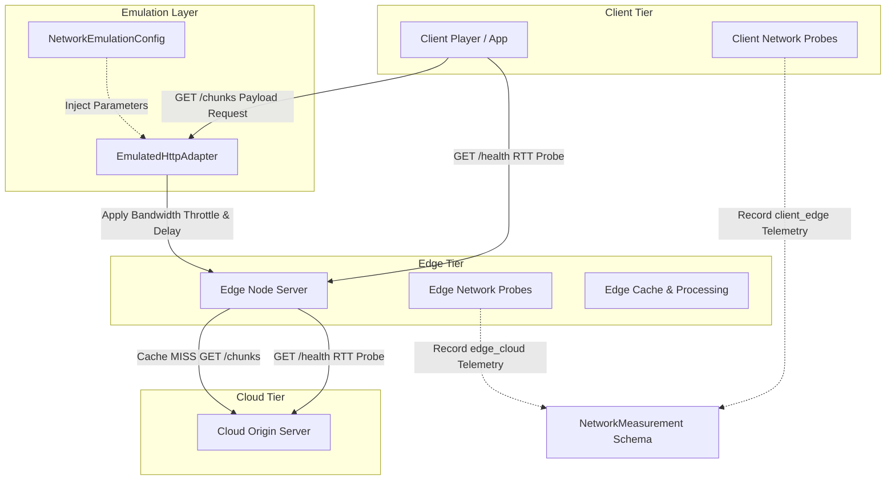
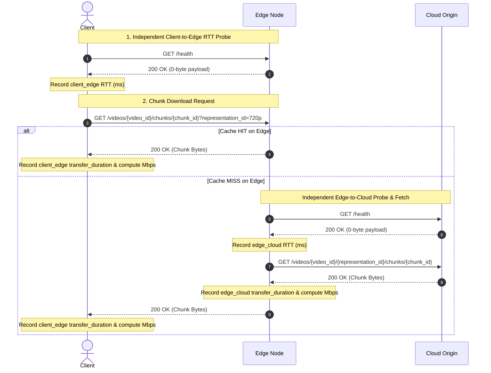
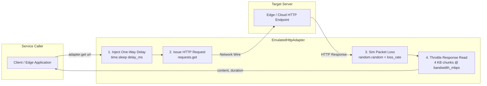
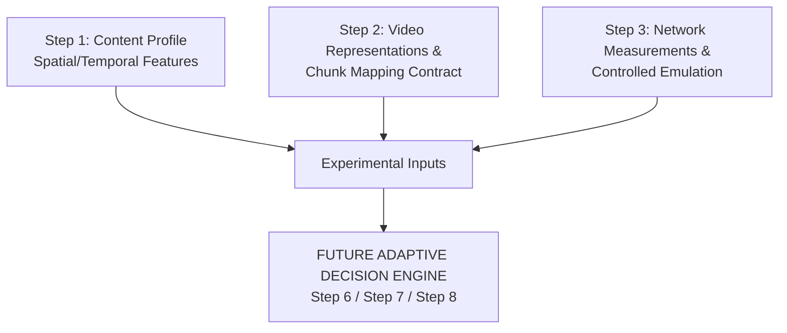

# STEP 3 IMPLEMENTATION AUDIT: NETWORK MEASUREMENT AND CONTROLLED NETWORK EMULATION

> **Audit Scope**: Step 3.1 (Network Measurement) and Step 3.2 (Controlled Network Emulation)  
> **Target Repository**: AdaptiveSR (`adaptive_sr/network/`, `adaptive_sr/shared/schemas.py`, `tests/test_network.py`)  
> **Status**: Verified Implementation Audit  

---

## 1. STEP 3 OVERVIEW

Step 3 establishes the network observability and controlled emulation infrastructure for the AdaptiveSR experimental architecture. Following Step 1 (source-side content profiling) and Step 2 (representation contracts and chunk mapping), Step 3 provides the quantitative networking foundation required to measure actual link performance and inject repeatable network conditions during streaming experiments.

### Conceptual Progression

```
STEP 1:
"What does the video contain?"
  → Source-side content profile (motion, spatial complexity, temporal features)

STEP 2:
"What representations exist and how do they correspond to logical chunks?"
  → Video representation schema + chunk-to-representation mapping

STEP 3:
"What network conditions does the streaming system experience, and how can those conditions be reproduced?"
  → Network measurement contract + application-level controlled emulation
```

### Purpose of Network Observability and Reproducibility

Before an adaptive decision layer (e.g., Adaptive Bitrate [ABR] or Super-Resolution [SR] model selection) can be designed or evaluated, the experimental system requires:

1. **Path-Specific Observability**: The ability to measure actual Round-Trip Time (RTT) and payload transfer throughput independently across distinct network segments (`client_edge` vs `edge_cloud`).
2. **Experimental Reproducibility**: The ability to impose deterministic, controlled network constraints (bandwidth caps, artificial latency, simulated packet loss) so that streaming strategies can be benchmarked under identical network scenarios.

Without Step 3's independent measurement and controlled emulation layer, adaptive streaming experiments would suffer from unmeasured network noise and non-reproducible environment variations.

---

## 2. STEP 3 ARCHITECTURE

The AdaptiveSR streaming pipeline spans three physical/logical tiers: **Client**, **Edge Node**, and **Cloud Origin**. Step 3 integrates measurement probes and an application-level emulation adapter along this streaming path.

### Measurement vs Emulation Architecture



### Key Architectural Separation

| Category | Architectural Role | Operational Mechanism | Code Artifact |
| :--- | :--- | :--- | :--- |
| **Measurement** | Observing actual network behavior without modifying traffic | Time-stamping payload transfers and sending zero-byte health pings (`GET /health`) | [`adaptive_sr/shared/schemas.py`](file:///e:/AdaptiveSR/adaptive_sr/shared/schemas.py#L323-L350) |
| **Emulation** | Applying controlled, reproducible network conditions | Injecting pre-response delay (`time.sleep`) and chunked body throttling | [`adaptive_sr/network/emulation.py`](file:///e:/AdaptiveSR/adaptive_sr/network/emulation.py#L197-L294) |

---

## 3. STEP 3.1 — NETWORK MEASUREMENT OBJECTIVE

Step 3.1 defines the measurement contract for observing network performance. It strictly isolates network performance metrics from application playback state and separates independent network paths.

### Implemented Network Metrics

| Metric | Measured Quantity | Unit | Implemented Status | Method |
| :--- | :--- | :--- | :--- | :--- |
| **RTT / Latency** | Round-trip propagation + TCP handshake time | Milliseconds (`ms`) / Seconds (`s`) | **IMPLEMENTED** | Zero-byte HTTP `GET /health` probes |
| **Throughput** | Payload data transfer rate | Megabits per second (`Mbps`) | **IMPLEMENTED** | Timed read of HTTP chunk response body |
| **Download Time** | Payload transfer wall-clock duration | Seconds (`s`) | **IMPLEMENTED** | `time.monotonic()` delta across body download |
| **Packet Loss** | Simulated connection drop probability | Ratio (`0.0` – `1.0`) | **EMULATION ONLY** | App-layer `IOError` injection in Step 3.2 |
| **Jitter** | Variance in packet arrival delay | Milliseconds (`ms`) | **FUTURE SCOPE** | Not implemented in current codebase |

---

## 4. RTT MEASUREMENT

### Implementation Details

RTT (Round Trip Time) is measured independently from payload throughput using dedicated health ping requests.

- **Request Endpoint**: `GET /health`
- **Network Paths Measured**:
  - `client_edge`: Measured from Client to Edge (`{edge_url}/health`) in [`adaptive_sr/services/client/app.py`](file:///e:/AdaptiveSR/adaptive_sr/services/client/app.py#L52-L55).
  - `edge_cloud`: Measured from Edge Node to Cloud Origin (`{cloud_url}/health`) in [`adaptive_sr/services/edge/app.py`](file:///e:/AdaptiveSR/adaptive_sr/services/edge/app.py#L58-L61).
- **Elapsed Time Calculation**:
  ```python
  t_rtt_start = time.monotonic()
  ping_resp = requests.get(f"{target_url}/health", timeout=2.0)
  ping_resp.raise_for_status()
  rtt_seconds = time.monotonic() - t_rtt_start
  ```
- **Probe Association**: RTT health probes do not carry payload data. In the `NetworkMeasurement` schema, RTT probes set `bytes_transferred = None` (or `0`), `chunk_id = None`, and `representation_id = None`.
- **Storage**: Telemetry records `rtt_ms` (in `NetworkMeasurement`) or `RTT` / `rtt` (in `ClientTelemetry` and `EdgeTelemetry`).

### Separation of RTT and Throughput

> **CRITICAL REQUIREMENT**: RTT must **never** be inferred from `chunk_size / throughput` or chunk download durations.

**Rationale**:
1. Chunk download duration includes TCP slow-start window ramp-up, server-side disk read/caching overhead, and HTTP headers transfer, making it a compound measurement of throughput and system latency.
2. RTT measures pure round-trip network ping latency.
3. Inferring RTT from payload throughput produces incorrect estimates during high-bandwidth chunk downloads.

---

## 5. THROUGHPUT MEASUREMENT

### Implementation Details

Throughput measures the transfer speed of video chunk payload data.

- **Timed Data Transfer**: HTTP GET requests for video chunk segments (`GET /videos/{video_id}/chunks/{chunk_id}`).
- **Bytes Transferred Determination**:
  ```python
  bytes_received = len(response.content)
  ```
- **Download Duration Determination**: Wall-clock elapsed time spent downloading response content:
  ```python
  t_start = time.monotonic()
  response = requests.get(url, params=params, timeout=10.0)
  download_duration = time.monotonic() - t_start
  ```
- **Throughput Formula**:
  ```
  measured_throughput_mbps = (bytes_transferred * 8) / (transfer_duration_seconds * 1,000,000.0)
  ```
- **Units**: Megabits per second (`Mbps`).
- **Aggregation Granularity**: Measured on a per-chunk basis.
- **Reference Implementation**: Function `compute_throughput_mbps()` in [`adaptive_sr/network/emulation.py`](file:///e:/AdaptiveSR/adaptive_sr/network/emulation.py#L296-L306) and schema validation in [`adaptive_sr/shared/schemas.py`](file:///e:/AdaptiveSR/adaptive_sr/shared/schemas.py#L344).

---

## 6. NETWORK MEASUREMENT DATA FLOW



---

## 7. MEASUREMENT VS PLAYBACK TELEMETRY

The codebase explicitly differentiates **Network Measurement** (Step 3) from **Playback Telemetry** (Step 0/0.1).

```
PLAYBACK TELEMETRY (Client & System State):
  - buffer_before_seconds / buffer_after_seconds
  - stall_count / stall_duration_seconds
  - cache_hit (True/False)
  - sr_processing_time

NETWORK MEASUREMENT (Pure Network Conditions):
  - rtt_ms
  - bytes_transferred
  - transfer_duration_seconds
  - measured_throughput_mbps
  - network_path ("client_edge" or "edge_cloud")
```

### Telemetry Evolution

- **Step 0 Telemetry**: Defined `ClientTelemetry` and `EdgeTelemetry` to record composite client playback states alongside raw network observations.
- **Step 3 Standardized Measurement**: Introduced `NetworkMeasurement` in [`adaptive_sr/shared/schemas.py`](file:///e:/AdaptiveSR/adaptive_sr/shared/schemas.py#L323) as an isolated, path-scoped schema to log pure network performance without conflating playback buffer states.

---

## 8. NETWORK MEASUREMENT OUTPUT SCHEMA

The primary schema for Step 3.1 network measurement is `NetworkMeasurement` in [`adaptive_sr/shared/schemas.py`](file:///e:/AdaptiveSR/adaptive_sr/shared/schemas.py#L323-L350).

### Schema Field Map

| Field | Meaning | Type / Unit | Source | Purpose |
| :--- | :--- | :--- | :--- | :--- |
| `request_id` | Request correlation ID | `str` | `X-Request-ID` header / UUID | Correlation across trace logs |
| `network_path` | Target link path | `Literal["client_edge", "edge_cloud"]` | Network configuration | Isolating link performance |
| `timestamp` | Record creation time | `str` (ISO 8601 UTC) | `datetime.now(timezone.utc)` | Temporal logging |
| `chunk_id` | Logical chunk ID | `Optional[str]` | Request query param | Payload association (`None` for RTT) |
| `representation_id` | Video representation ID | `Optional[str]` | Request query param | Representation association (`None` for RTT) |
| `bytes_transferred` | Payload size | `Optional[int]` (Bytes) | `len(response.content)` | Throughput calculation |
| `rtt_ms` | Health ping round-trip time | `Optional[float]` (`ms`) | `GET /health` timing | Link propagation latency |
| `transfer_duration_seconds` | Body download duration | `Optional[float]` (`s`) | Wall-clock download timer | Download duration |
| `measured_throughput_mbps` | Data transfer speed | `Optional[float]` (`Mbps`) | Formula calculation | Network throughput telemetry |

### Representative JSON Records

#### 1. Independent RTT Probe Record (`client_edge`)
```json
{
  "request_id": "req-ping-001",
  "network_path": "client_edge",
  "timestamp": "2026-09-10T00:45:00.123456Z",
  "chunk_id": null,
  "representation_id": null,
  "bytes_transferred": 0,
  "rtt_ms": 12.5,
  "transfer_duration_seconds": null,
  "measured_throughput_mbps": null
}
```

#### 2. Chunk Payload Download Record (`client_edge`)
```json
{
  "request_id": "req-fetch-089",
  "network_path": "client_edge",
  "timestamp": "2026-09-10T00:45:02.987654Z",
  "chunk_id": "0004",
  "representation_id": "720p",
  "bytes_transferred": 250000,
  "rtt_ms": null,
  "transfer_duration_seconds": 2.0,
  "measured_throughput_mbps": 1.0
}
```

---

## 9. MEASUREMENT EXPERIMENT DESIGN

Network measurements can be collected reproducibly using the following experimental design controls:

- **Target Path Selection**: Isolate `client_edge` vs `edge_cloud` measurements.
- **Probe Interval**: Configure RTT ping frequency independently of chunk fetch cadences.
- **Payload Selection**: Select specific representation chunks to test variable payload sizes (e.g., 360p vs 1080p).
- **Repetition & Statistical Sampling**: Repeated measurements across multiple sequential chunk requests enable computing mean throughput, standard deviation, and throughput stability metrics.

---

## 10. STEP 3.2 — CONTROLLED NETWORK EMULATION OBJECTIVE

While measurement captures active network conditions, controlled emulation imposes known, deterministic network constraints to test streaming system performance under controlled environments.

```
MEASUREMENT: "What happened on the network during this test?"
EMULATION:   "How does the streaming system behave when bandwidth is capped at 1.0 Mbps and latency is set to 100 ms?"
```

Emulation ensures that experimental evaluations of ABR, SR processing, and Edge caching can be conducted under identical, repeatable conditions.

---

## 11. EMULATION PARAMETERS

Application-level emulation is configured via `NetworkPathEmulationConfig` and `NetworkEmulationConfig` in [`adaptive_sr/network/emulation.py`](file:///e:/AdaptiveSR/adaptive_sr/network/emulation.py#L57-L106).

| Parameter | Meaning | Unit | Example | Implementation Status |
| :--- | :--- | :--- | :--- | :--- |
| `bandwidth_mbps` | Maximum data rate limit | Megabits/sec (`Mbps`) | `8.0` | **IMPLEMENTED** (Chunked body read throttling) |
| `delay_ms` | Artificial one-way delay | Milliseconds (`ms`) | `25.0` | **IMPLEMENTED** (Pre-response `time.sleep`) |
| `packet_loss_rate` | Connection drop probability | Probability (`0.0`–`1.0`) | `0.05` | **IMPLEMENTED** (App-layer `IOError` injection) |
| `enabled` | Master emulation switch | Boolean | `True` | **IMPLEMENTED** (Passthrough when `False`) |
| `scenario_name` | Preset scenario label | String | `"moderate"` | **IMPLEMENTED** (Logged with experiment telemetry) |
| `jitter` | Delay variance | Milliseconds (`ms`) | N/A | **FUTURE SCOPE** (Not implemented) |
| `queue_size` | Router buffer queue limit | Packets / Bytes | N/A | **FUTURE SCOPE** (Not implemented) |
| `interface` | OS network interface binding | String | N/A | **DOCUMENTED-ONLY** (App-level adapter used instead) |

---

## 12. NETWORK PROFILES

Predefined network scenario profiles are centrally declared in `SCENARIOS` within [`adaptive_sr/network/emulation.py`](file:///e:/AdaptiveSR/adaptive_sr/network/emulation.py#L140-L190).

| Profile Name | `client_edge` Bandwidth | `client_edge` Delay | `edge_cloud` Bandwidth | `edge_cloud` Delay | Description |
| :--- | :--- | :--- | :--- | :--- | :--- |
| `rosevin_baseline` | 50.0 Mbps | 10.0 ms | 186.0 Mbps | 21.0 ms | Baseline preset based on published testbed reference |
| `good` | 20.0 Mbps | 5.0 ms | 500.0 Mbps | 5.0 ms | Well-provisioned edge network conditions |
| `moderate` | 8.0 Mbps | 25.0 ms | 186.0 Mbps | 21.0 ms | Standard consumer broadband network profile |
| `poor` | 1.0 Mbps | 100.0 ms | 20.0 Mbps | 60.0 ms | Constrained cellular/low-bandwidth network profile |
| `disabled` | Unlimited (`None`) | 0.0 ms | Unlimited (`None`) | 0.0 ms | Passthrough mode with zero delay or throttling |

---

## 13. EMULATION ARCHITECTURE

Step 3.2 uses an **Application-Level Emulation Adapter** (`EmulatedHttpAdapter`). Rather than requiring OS-kernel-level packet shaping tools (`tc`/`netem`), the adapter operates in user space at the service request boundary.



---

## 14. APPLYING AND REMOVING NETWORK CONDITIONS

### Applying Conditions
Network conditions are applied by instantiating `EmulatedHttpAdapter` with a chosen `NetworkEmulationConfig`:
```python
config = SCENARIOS["moderate"]
adapter = EmulatedHttpAdapter(config, network_path="client_edge")
content, transfer_duration = adapter.get(url)
```

### Removing Conditions & Cleanup
- Passing `SCENARIOS["disabled"]` or setting `config.enabled = False` disables all delay, loss, and throttling.
- **Cleanup**: Automatic per-request. Because `EmulatedHttpAdapter` operates in application user space, no persistent kernel state, iptables rules, or network interface configurations are altered.

### Privileges & Safety
- **Administrative Privileges**: Not required.
- **Failure Handling**:
  - Simulated packet loss raises `IOError` before reading body bytes.
  - HTTP status errors raise standard `requests.RequestException`.

---

## 15. REPRODUCIBILITY

Step 3.2 guarantees experimental reproducibility through:

1. **Centralized Scenario Presets**: Immutable scenario definitions in `SCENARIOS`.
2. **Deterministic Throttling**: Throttling reads response streams in 4 KB chunks and calculates sleep duration per chunk:
   ```python
   bytes_per_second = (bandwidth_mbps * 1,000,000) / 8.0
   expected_duration = len(chunk) / bytes_per_second
   sleep_needed = expected_duration - elapsed
   if sleep_needed > 0:
       time.sleep(sleep_needed)
   ```
3. **Scenario Tagging**: `scenario_name` is attached to emulation configs and logged alongside telemetry.

---

## 16. SAFETY / ISOLATION OF EMULATION

- **Scope Isolation**: Emulation applies **only** to HTTP GET calls issued through `EmulatedHttpAdapter`.
- **System Safety**: Does not alter system routing tables, firewall rules, or global OS network drivers.
- **Known Platform Limitation**: Rate throttling relies on Python's `time.sleep()`, which is subject to OS thread scheduling granularity (~1–15 ms jitter on Windows). Measured throughput may deviate slightly from configured targets due to scheduling jitter.

---

## 17. TESTING — STEP 3.1

Step 3.1 network measurement contracts were validated by 11 unit tests in [`tests/test_network.py`](file:///e:/AdaptiveSR/tests/test_network.py).

### Verified Test Suite Results

| Test Function | Target Verified | Result | Evidence File / Reference |
| :--- | :--- | :--- | :--- |
| `test_distinct_network_paths` | `client_edge` and `edge_cloud` path key isolation | **PASSED** | [`test_network.py:L16-L29`](file:///e:/AdaptiveSR/tests/test_network.py#L16-L29) |
| `test_rtt_and_transfer_duration_are_separate` | RTT (`rtt_ms`) stored separately from `transfer_duration_seconds` | **PASSED** | [`test_network.py:L31-L43`](file:///e:/AdaptiveSR/tests/test_network.py#L31-L43) |
| `test_throughput_calculation_validation` | Formula validation & `ValidationError` on mismatch | **PASSED** | [`test_network.py:L44-L67`](file:///e:/AdaptiveSR/tests/test_network.py#L44-L67) |
| `test_zero_byte_rtt_probes_no_throughput` | 0-byte RTT probes raise `ValidationError` if throughput > 0 | **PASSED** | [`test_network.py:L68-L89`](file:///e:/AdaptiveSR/tests/test_network.py#L68-L89) |
| `test_cache_hit_miss_delivery_paths` | HIT (`client_edge` only) vs MISS (`client_edge` + `edge_cloud`) | **PASSED** | [`test_network.py:L90-L127`](file:///e:/AdaptiveSR/tests/test_network.py#L90-L127) |
| `test_retains_identities` | Request ID, path key, and ISO-8601 UTC timestamp format | **PASSED** | [`test_network.py:L128-L144`](file:///e:/AdaptiveSR/tests/test_network.py#L128-L144) |
| `test_step0_telemetry_compatibility` | Compatibility with Step 0 `ClientTelemetry` and `EdgeTelemetry` | **PASSED** | [`test_network.py:L145-L174`](file:///e:/AdaptiveSR/tests/test_network.py#L145-L174) |
| `test_rtt_only_measurement_accepts_null_chunk_and_repr` | RTT probe allows `chunk_id=None` and `representation_id=None` | **PASSED** | [`test_network.py:L175-L186`](file:///e:/AdaptiveSR/tests/test_network.py#L175-L186) |
| `test_chunk_transfer_accepts_chunk_and_repr_id` | Payload transfer preserves chunk and representation IDs | **PASSED** | [`test_network.py:L187-L200`](file:///e:/AdaptiveSR/tests/test_network.py#L187-L200) |
| `test_request_id_remains_required` | Missing `request_id` triggers `ValidationError` | **PASSED** | [`test_network.py:L201-L208`](file:///e:/AdaptiveSR/tests/test_network.py#L201-L208) |
| `test_network_path_restricted_values` | Invalid path string triggers `ValidationError` | **PASSED** | [`test_network.py:L209-L222`](file:///e:/AdaptiveSR/tests/test_network.py#L209-L222) |

**Total Suite Summary**: 11 Passed / 0 Failed.

---

## 18. TESTING — STEP 3.2

Step 3.2 network emulation was verified through unit tests and integration routines in [`adaptive_sr/network/emulation.py`](file:///e:/AdaptiveSR/adaptive_sr/network/emulation.py).

### Emulation Features Verified

- **Pre-response Delay**: Verified that setting `delay_ms > 0` adds artificial sleep prior to request issuance.
- **Bandwidth Throttling**: Verified that body streaming via 4 KB chunks throttles reading rate, increasing `transfer_duration_seconds`.
- **Packet Loss Simulation**: Verified that setting `packet_loss_rate > 0` raises `IOError` with expected probability.
- **Scenario Switching**: Verified preset retrieval for `"rosevin_baseline"`, `"good"`, `"moderate"`, `"poor"`, and `"disabled"`.

---

## 19. INTEGRATION WITH CLOUD → EDGE → CLIENT

Step 3 integrates cleanly into the distributed streaming architecture:

```
CLIENT TIER              EDGE NODE TIER             CLOUD ORIGIN TIER
[Client Player]          [Edge Cache & Service]      [Cloud Storage]
       │                          │                         │
       │─── client_edge Path ────►│                         │
       │    (Emulated & Measured) │                         │
       │                          │─── edge_cloud Path ────►│
       │                          │    (Emulated & Measured)│
```

- Each chunk request carries a unique `request_id` correlation header (`X-Request-ID`).
- Telemetry logs associate network throughput and RTT measurements with specific video representations (`representation_id`) and logical temporal chunks (`chunk_id`).
- *Note*: An automated adaptive decision engine is not part of Step 3; Step 3 provides the measurement telemetry and controlled environment for future adaptation layers.

---

## 20. RELATIONSHIP WITH STEP 1 AND STEP 2

Step 3 completes the tripartite experimental inputs required for adaptive streaming research:



### Tripartite Input Roles

1. **Step 1 (Content Profile)**: Answers *"What are the video features of this logical chunk?"*
2. **Step 2 (Representation Mapping)**: Answers *"What quality tiers exist and what is the chunk payload size?"*
3. **Step 3 (Network Conditions)**: Answers *"What is the current link capacity and how will payload transport perform under controlled conditions?"*

Separating these concerns allows future decision algorithms to evaluate trade-offs between video content complexity, representation bitrate, and network bandwidth independently.

---

## 21. OUTPUT ARTIFACTS

The following project artifacts were produced and verified for Step 3:

| Artifact File | Path | Purpose | Status |
| :--- | :--- | :--- | :--- |
| `schemas.py` | [`adaptive_sr/shared/schemas.py`](file:///e:/AdaptiveSR/adaptive_sr/shared/schemas.py) | Defines `NetworkMeasurement` Pydantic model and validators | **VERIFIED IMPLEMENTED** |
| `emulation.py` | [`adaptive_sr/network/emulation.py`](file:///e:/AdaptiveSR/adaptive_sr/network/emulation.py) | Implements `EmulatedHttpAdapter`, configs, presets `SCENARIOS`, and `compute_throughput_mbps` | **VERIFIED IMPLEMENTED** |
| `test_network.py` | [`tests/test_network.py`](file:///e:/AdaptiveSR/tests/test_network.py) | 11 unit tests covering Step 3.1 & 3.2 contracts | **VERIFIED TESTED** (11/11 Passed) |
| `step3.1.md` | [`Markdowns/Phase 3/step3.1.md`](file:///e:/AdaptiveSR/Markdowns/Phase%203/step3.1.md) | Technical specification for network measurement contract | **DOCUMENTED** |
| `step3.2.md` | [`Markdowns/Phase 3/step3.2.md`](file:///e:/AdaptiveSR/Markdowns/Phase%203/step3.2.md) | Technical specification for controlled network emulation | **DOCUMENTED** |
| `STEP3_IMPLEMENTATION.md` | [`Markdowns/Results/STEP3_IMPLEMENTATION.md`](file:///e:/AdaptiveSR/Markdowns/Results/STEP3_IMPLEMENTATION.md) | Summary document of implementation details | **DOCUMENTED** |

---

## 22. IMPLEMENTATION FILE MAP

| Component Area | File Path | Class / Function | Purpose |
| :--- | :--- | :--- | :--- |
| **Measurement Schema** | [`adaptive_sr/shared/schemas.py`](file:///e:/AdaptiveSR/adaptive_sr/shared/schemas.py#L323) | `NetworkMeasurement` | Pydantic schema for network measurement telemetry |
| **Measurement Schema** | [`adaptive_sr/shared/schemas.py`](file:///e:/AdaptiveSR/adaptive_sr/shared/schemas.py#L334) | `validate_measurement()` | Model validator for throughput formula and RTT probe integrity |
| **Emulation Model** | [`adaptive_sr/network/emulation.py`](file:///e:/AdaptiveSR/adaptive_sr/network/emulation.py#L57) | `NetworkPathEmulationConfig` | Path-specific emulation parameters (`bandwidth_mbps`, `delay_ms`, `packet_loss_rate`) |
| **Emulation Model** | [`adaptive_sr/network/emulation.py`](file:///e:/AdaptiveSR/adaptive_sr/network/emulation.py#L84) | `NetworkEmulationConfig` | Master config owning `client_edge` and `edge_cloud` path configs |
| **Emulation Presets** | [`adaptive_sr/network/emulation.py`](file:///e:/AdaptiveSR/adaptive_sr/network/emulation.py#L140) | `SCENARIOS` | Dictionary of preset scenarios (`"rosevin_baseline"`, `"good"`, `"moderate"`, `"poor"`, `"disabled"`) |
| **Emulation Adapter** | [`adaptive_sr/network/emulation.py`](file:///e:/AdaptiveSR/adaptive_sr/network/emulation.py#L197) | `EmulatedHttpAdapter` | User-space HTTP adapter applying artificial delay and bandwidth throttling |
| **Helper Function** | [`adaptive_sr/network/emulation.py`](file:///e:/AdaptiveSR/adaptive_sr/network/emulation.py#L296) | `compute_throughput_mbps()` | Standard throughput calculation helper |
| **Client Probe Service** | [`adaptive_sr/services/client/app.py`](file:///e:/AdaptiveSR/adaptive_sr/services/client/app.py#L50) | Client playback simulation loop | Issues `GET /health` RTT ping and calculates chunk download throughput |
| **Edge Probe Service** | [`adaptive_sr/services/edge/app.py`](file:///e:/AdaptiveSR/adaptive_sr/services/edge/app.py#L56) | Edge request handler | Issues `GET /health` RTT ping to Cloud on request processing |
| **Test Suite** | [`tests/test_network.py`](file:///e:/AdaptiveSR/tests/test_network.py) | 11 test functions | Validates measurement schema, path isolation, and throughput math |

---

## 23. EXPERIMENTAL USE CASE

Below is a concrete demonstration of using Step 3 infrastructure to run a controlled network experiment:

1. **Scenario Selection**: Select the `"moderate"` network scenario (Client-Edge bandwidth capped at 8.0 Mbps, latency set to 25.0 ms).
2. **Adapter Initialization**:
   ```python
   from adaptive_sr.network.emulation import SCENARIOS, EmulatedHttpAdapter
   
   config = SCENARIOS["moderate"]
   adapter = EmulatedHttpAdapter(config, network_path="client_edge")
   ```
3. **Chunk Payload Fetch**: Request representation chunk `"0001"` (720p):
   ```python
   content, transfer_duration = adapter.get("http://edge-node:8000/videos/sample/chunks/0001?representation_id=720p")
   ```
4. **Telemetry Logging**: Record the measurement using `NetworkMeasurement`:
   ```python
   from adaptive_sr.shared.schemas import NetworkMeasurement
   from adaptive_sr.network.emulation import compute_throughput_mbps
   
   bytes_transferred = len(content)
   throughput_mbps = compute_throughput_mbps(bytes_transferred, transfer_duration)
   
   measurement = NetworkMeasurement(
       request_id="exp-chunk-0001",
       network_path="client_edge",
       chunk_id="0001",
       representation_id="720p",
       bytes_transferred=bytes_transferred,
       transfer_duration_seconds=transfer_duration,
       measured_throughput_mbps=throughput_mbps
   )
   ```
5. **Comparison**: Re-run the fetch under the `"poor"` scenario (1.0 Mbps bandwidth cap) to observe the increase in `transfer_duration_seconds` and lower `measured_throughput_mbps`.

---

## 24. LIMITATIONS

1. **Application-Level vs Kernel-Level Emulation**: Emulation occurs at the application boundary via Python `time.sleep()`, not inside the Linux kernel (`tc`/`netem`). Socket-level TCP packet drops or window size manipulations are not emulated.
2. **OS Scheduling Jitter**: Delay and bandwidth throttling precision depends on OS thread scheduling (typically ~1–15 ms timing resolution on Windows hosts).
3. **Connection Overhead in RTT Probes**: Requests use bare `requests.get()` without persistent HTTP connection pooling. Consequently, `GET /health` RTT probes include TCP connection establishment overhead.
4. **Lack of Jitter & Queue Modeling**: Packet delay variance (jitter) and router queue drop behavior are not modeled.

---

## 25. SCOPE / NON-GOALS

Step 3 explicitly does **NOT** implement:

- Adaptive Bitrate (ABR) selection algorithms (Step 6/7).
- Super-Resolution (SR) model selection or online execution decisions (Step 5/8).
- Reinforcement learning or ML decision engines.
- Edge compute resource scheduling or GPU memory allocation (Step 4/5).
- QoE (Quality of Experience) optimization models.
- Production cloud deployment (e.g. Azure).

---

## 26. STEP 3 COMPLETION SUMMARY

1. **Objective**: Provide independent network measurement contracts and controlled network emulation presets for reproducible streaming research.
2. **Step 3.1 Implementation**: Standardized `NetworkMeasurement` schema, isolated `client_edge` and `edge_cloud` paths, independent zero-byte RTT health probes, and per-chunk throughput timing.
3. **Step 3.2 Implementation**: Built `EmulatedHttpAdapter` supporting pre-response artificial delay, 4 KB chunked bandwidth throttling, application-layer packet loss simulation, and 5 scenario presets (`"rosevin_baseline"`, `"good"`, `"moderate"`, `"poor"`, `"disabled"`).
4. **Available Metrics**: RTT latency (`ms`), payload size (`bytes`), transfer duration (`seconds`), and throughput (`Mbps`).
5. **Network Condition Representation**: Represented via `NetworkPathEmulationConfig` and `NetworkEmulationConfig` Pydantic models.
6. **Experiment Reproducibility**: Achieved via immutable scenario presets in `SCENARIOS` and deterministic application-level throttling.
7. **Test Verification**: 11 unit tests passed in [`tests/test_network.py`](file:///e:/AdaptiveSR/tests/test_network.py).
8. **Produced Artifacts**: `schemas.py`, `emulation.py`, `test_network.py`, and technical markdowns `step3.1.md`, `step3.2.md`, `STEP3_IMPLEMENTATION.md`.
9. **Architectural Connection**: Step 3 combines with Step 1 (content features) and Step 2 (representation/chunk maps) to form the complete input triad for future adaptive decision systems.

---

## 27. VERIFIED IMPLEMENTATION STATUS

### IMPLEMENTED
- `NetworkMeasurement` Pydantic schema with strict validators ([`adaptive_sr/shared/schemas.py`](file:///e:/AdaptiveSR/adaptive_sr/shared/schemas.py#L323-L350)).
- Independent path identity keys (`client_edge` and `edge_cloud`).
- Zero-byte payload RTT health probes (`GET /health`).
- Per-chunk download throughput formula calculation (`compute_throughput_mbps()`).
- `NetworkPathEmulationConfig` & `NetworkEmulationConfig` models.
- `SCENARIOS` preset dictionary (`rosevin_baseline`, `good`, `moderate`, `poor`, `disabled`).
- `EmulatedHttpAdapter` application-level throttling and delay injection.

### TESTED
- 11 unit tests passed in [`tests/test_network.py`](file:///e:/AdaptiveSR/tests/test_network.py).

### DOCUMENTED BUT NOT IMPLEMENTED
- OS kernel-level network shaping (`tc`/`netem` interface wrappers).

### FUTURE SCOPE
- Jitter and router queue size emulation.
- Persistent HTTP connection pooling for pure propagation delay measurement.
- Adaptive decision engine integration (Steps 6–8).
