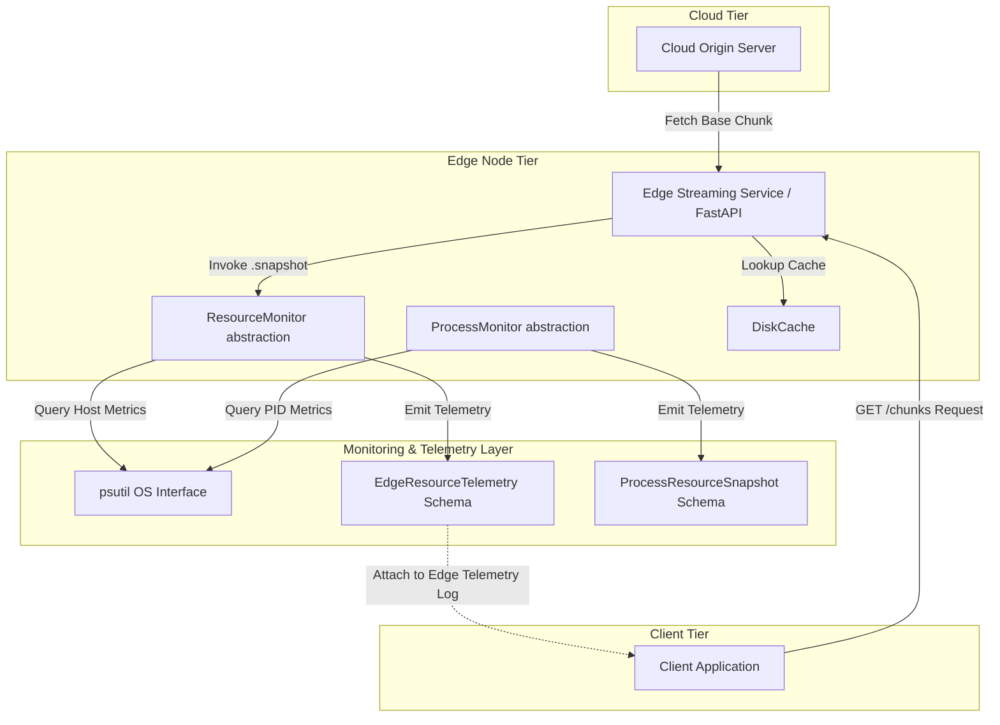
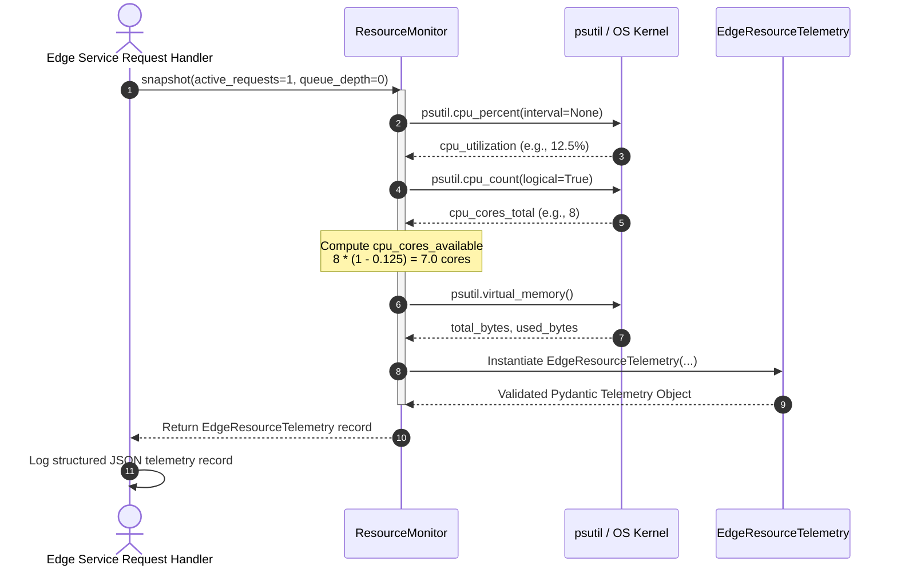
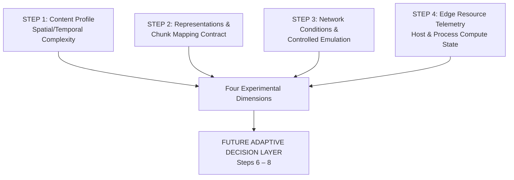

# STEP 4 IMPLEMENTATION AUDIT: EDGE RESOURCE MONITORING

> **Audit Scope**: Step 4 & Step 4.1 (Edge Resource Monitoring & Process-Level Telemetry)  
> **Target Repository**: AdaptiveSR (`adaptive_sr/monitoring/resource_monitor.py`, `adaptive_sr/shared/schemas.py`, `tests/test_resource_monitor.py`)  
> **Status**: Verified Implementation Audit  

---

## 1. STEP 4 OVERVIEW

Step 4 introduces the Edge Resource Monitoring subsystem for the AdaptiveSR experimental architecture. Operating downstream of Step 0 (distributed foundation), Step 1 (content profiling), Step 2 (representation schemas and chunk mapping), and Step 3 (network measurement and emulation), Step 4 provides real-time, quantitative computational resource observability for Edge nodes.

### Conceptual Progression

```
STEP 1:
"What does the video contain?"
  → Source-side content profile (motion, spatial complexity, temporal features)

STEP 2:
"What representations and chunk mappings exist?"
  → Video representation schema + chunk-to-representation mapping

STEP 3:
"What network conditions exist?"
  → Network measurement contract + controlled network emulation

STEP 4:
"What computational resources are currently available at the Edge?"
  → Edge resource telemetry (host-level and process-level observability)
```

### Purpose of Edge Resource Observability

Before a resource-aware adaptive decision layer (e.g., joint ABR, Edge Super-Resolution [SR] model selection, or CPU core allocation) can be evaluated, the system must observe actual computational constraints on the Edge node. Step 4 establishes structured, timestamped resource telemetry to measure CPU utilization, core availability, physical memory consumption, in-flight request counts, and process-level compute footprints without introducing resource allocation or scheduling logic.

---

## 2. STEP 4 OBJECTIVE

The explicit objective of Step 4 is to implement an **Edge Resource Monitoring subsystem** that measures and reports the real-time resource state of an Edge node using structured Pydantic telemetry models (`EdgeResourceTelemetry` and `ProcessResourceSnapshot`).

### Functional Boundaries

- **Step 4 = RESOURCE OBSERVABILITY**: Measuring system-wide and process-specific CPU, RAM, and request metrics.
- **Step 4 ≠ RESOURCE ALLOCATION**: No CPU core reservation, pinning, or cgroups isolation is performed.
- **Step 4 ≠ SR INFERENCE**: No SR models (TinySR, Real-ESRGAN) or ML frameworks are executed in Step 4.
- **Step 4 ≠ SCHEDULER**: No request queueing, admission control, or job dispatching is implemented.

---

## 3. ARCHITECTURE

The Step 4 resource monitoring subsystem operates within the Edge Node tier, isolating system metric collection from request handling through clean monitor abstractions (`ResourceMonitor` and `ProcessMonitor`).



---

## 4. RESOURCE MONITOR ABSTRACTION

OS-specific measurement logic is completely encapsulated within two monitor abstractions in [`adaptive_sr/monitoring/resource_monitor.py`](file:///e:/AdaptiveSR/adaptive_sr/monitoring/resource_monitor.py). Request handlers and service logic do not call `psutil` directly.

### 1. Host-Level Monitor (`ResourceMonitor`)

Describes the Edge compute environment as a whole.

- **Class**: [`ResourceMonitor`](file:///e:/AdaptiveSR/adaptive_sr/monitoring/resource_monitor.py#L92)
- **Initialization**:
  ```python
  monitor = ResourceMonitor(
      cluster_id="cluster_01",
      edge_id="edge_01",
      sampling_interval_seconds=1.0
  )
  ```
- **Counter Priming**: Constructor executes a short blocking `psutil.cpu_percent(interval=0.1)` call during initialization. This primes `psutil`'s internal CPU delta counters so that subsequent non-blocking snapshots return real values rather than initial `0.0` artifacts.
- **Primary Snapshot API**:
  ```python
  telemetry: EdgeResourceTelemetry = monitor.snapshot(active_requests=1, queue_depth=0)
  ```
- **Per-Core Capability**:
  ```python
  core_loads: List[float] = monitor.per_core_utilization()
  ```
  Returns a `List[float]` containing individual logical core utilization percentages `[0.0, 100.0]`.

### 2. Process-Level Monitor (`ProcessMonitor`) — Step 4.1

Describes a specific OS process (e.g., an SR inference task or Edge worker).

- **Class**: [`ProcessMonitor`](file:///e:/AdaptiveSR/adaptive_sr/monitoring/resource_monitor.py#L222)
- **Initialization**: `ProcessMonitor(pid=target_pid)` (defaults to current process `os.getpid()`).
- **Primary Snapshot API**:
  ```python
  proc_telemetry: ProcessResourceSnapshot = pm.snapshot(interval=0.1)
  ```
  Executes a short blocking read to return accurate CPU percent (`cpu_percent`) and Resident Set Size memory (`memory_used_bytes`).

---

## 5. RESOURCE TELEMETRY SCHEMA

Step 4 resource telemetry is defined by two Pydantic models in [`adaptive_sr/shared/schemas.py`](file:///e:/AdaptiveSR/adaptive_sr/shared/schemas.py#L353-L480).

### `EdgeResourceTelemetry` Field Map (Host-Level)

| Field Name | Type | Unit | Meaning | Data Source | Requirement |
| :--- | :--- | :--- | :--- | :--- | :--- |
| `timestamp` | `str` | ISO-8601 UTC | Snapshot creation timestamp | `datetime.now(timezone.utc)` | **Required** |
| `cluster_id` | `str` | N/A | Identity of the Edge cluster | Config (`CLUSTER_ID`) | **Required** |
| `edge_id` | `str` | N/A | Identity of this Edge node | Config (`EDGE_ID`) | **Required** |
| `cpu_cores_total` | `int` | Count | Logical CPU cores exposed by OS | `psutil.cpu_count(logical=True)` | **Required** |
| `cpu_utilization` | `float` | Percentage (`%`) | Host-wide CPU utilization `[0, 100]` | `psutil.cpu_percent()` | **Required** |
| `cpu_cores_available` | `float` | Cores | Observational estimate of unused cores | Formula calculation | **Required** |
| `memory_total_bytes` | `int` | Bytes | Total physical host RAM | `psutil.virtual_memory().total` | **Required** |
| `memory_used_bytes` | `int` | Bytes | Used physical host RAM | `psutil.virtual_memory().used` | **Required** |
| `memory_utilization` | `float` | Percentage (`%`) | Physical RAM utilization `[0, 100]` | `(used / total) * 100` | **Required** |
| `active_requests` | `int` | Count | Requests currently being processed | Caller-supplied parameter | **Required** |
| `queue_depth` | `int` | Count | Requests pending in queue (`0`) | Caller-supplied parameter | **Required** |

### Representative `EdgeResourceTelemetry` Output

```json
{
  "timestamp": "2026-09-10T00:50:12.345678Z",
  "cluster_id": "cluster_01",
  "edge_id": "edge_01",
  "cpu_cores_total": 8,
  "cpu_utilization": 12.5,
  "cpu_cores_available": 7.0,
  "memory_total_bytes": 17179869184,
  "memory_used_bytes": 8730419200,
  "memory_utilization": 50.82,
  "active_requests": 1,
  "queue_depth": 0
}
```

---

## 6. CPU RESOURCE MODEL

CPU is established as the **primary resource dimension** for AdaptiveSR. The implementation strictly distinguishes three CPU metrics:

1. **`cpu_cores_total`**: Total logical CPU cores reported by the operating system.
2. **`cpu_utilization`**: Host-wide CPU percentage averaged across all cores and all processes.
3. **`cpu_cores_available`**: Observational estimate of unused logical core capacity.

### Exact Formula and Semantics for `cpu_cores_available`

```
cpu_cores_available = max(0.0, cpu_cores_total * (1.0 - cpu_utilization / 100.0))
```

> **CRITICAL SEMANTIC GUARANTEE**:
> `cpu_cores_available` is an **OBSERVATIONAL ESTIMATE ONLY**.
>
> - It is derived from host-wide CPU utilization across all co-located processes (Cloud, Edge, Client, network emulation, OS, tests).
> - It does **NOT** represent physically reserved or allocatable CPU cores.
> - An 8-core machine with 50% utilization reports `cpu_cores_available = 4.0`. This does **NOT** mean 4 cores are reserved or available for SR.
> - Step 4 contains no OS-level cgroups core pinning or CPU core allocation.

---

## 7. CPU CORE COUNT

Total CPU capacity is determined via `psutil.cpu_count(logical=True)`.

- **Logical vs. Physical Cores**: The value represents **logical CPU cores** (including hyperthreaded virtual cores), which reflects the true execution parallelism available to Python processes on the host.
- **Scope**: System-wide count exposed by the operating system.
- **Configurability**: Read dynamically from the OS environment; unconfigurable by application code.

---

## 8. CPU UTILIZATION

Host CPU utilization (`cpu_utilization`) measures the aggregate load across all host processes.

- **Measurement Library**: `psutil.cpu_percent()`.
- **Sampling Behavior**: Non-blocking delta reads executed when `elapsed_since_last >= sampling_interval_seconds`. If sampled before the interval elapses, a short `interval=0.05` blocking read is executed to prevent stale or zero reads.
- **Scope**: Host-wide aggregate (Cloud + Edge + Client + OS).
- **Valid Range**: Enforced invariant `0.0 <= cpu_utilization <= 100.0`.
- **First-Sample Handling**: Primed in `ResourceMonitor.__init__` with a 0.1s blocking call to prevent initial `0.0%` reporting.

---

## 9. MEMORY MONITORING

Memory is monitored as a **secondary observed resource dimension** for situational awareness.

- **Metrics**:
  - `memory_total_bytes`: Total physical RAM (`psutil.virtual_memory().total`).
  - `memory_used_bytes`: Currently consumed RAM (`psutil.virtual_memory().used`).
  - `memory_utilization`: Derived percentage `(memory_used_bytes / memory_total_bytes) * 100.0`.
- **Scope**: Host-wide physical RAM.
- **Non-Allocation Rule**: RAM telemetry is collected purely for monitoring and is never consumed to make resource-allocation decisions in Step 4.

---

## 10. ACTIVE REQUESTS

`active_requests` represents the number of HTTP requests currently being processed by the Edge service.

- **Tracking Mechanism**: Caller-supplied parameter passed from the Edge request handler to `monitor.snapshot(active_requests=N)`.
- **Concurrency Semantics**: In the synchronous FastAPI Edge implementation, `active_requests = 1` during request processing and `0` when idle.

---

## 11. QUEUE DEPTH

Inspection of the current Edge implementation (`adaptive_sr/services/edge/app.py`) confirms that:

> **No explicit application-level work queue exists in the current synchronous Edge implementation.**

- **Semantics**: Requests are processed synchronously by FastAPI worker threads.
- **Telemetry Representation**: `queue_depth` is passed as `0`.
- **Explicit Documentation**: `queue_depth = 0` indicates the absence of an application scheduling queue. It is **NOT** a scheduler queue that happens to be empty.

---

## 12. CLUSTER AND EDGE IDENTITY

Resource telemetry records preserve node provenance to support multi-node Edge deployments.

- **`cluster_id`**: Sourced from service configuration (`CLUSTER_ID`, e.g., `"cluster_01"`).
- **`edge_id`**: Sourced from node configuration (`EDGE_ID`, e.g., `"edge_01"`).

### Multi-Instance Identity Verification

| Edge Instance | `cluster_id` | `edge_id` | Observed Behavior |
| :--- | :--- | :--- | :--- |
| **Edge Node Alpha** | `cluster_01` | `edge_A` | Snapshot retains `edge_id = "edge_A"` |
| **Edge Node Beta** | `cluster_01` | `edge_B` | Snapshot retains `edge_id = "edge_B"` |

Verified by unit test `test_two_edge_instances_distinct_identities` in [`tests/test_resource_monitor.py:L181`](file:///e:/AdaptiveSR/tests/test_resource_monitor.py#L181).

---

## 13. TIMESTAMP SEMANTICS

Timestamps in `EdgeResourceTelemetry` and `ProcessResourceSnapshot` are formatted as timezone-aware UTC strings:

```python
timestamp = datetime.now(timezone.utc).strftime("%Y-%m-%dT%H:%M:%S.%f") + "Z"
```

- **Format**: ISO-8601 UTC with microsecond precision ending in `"Z"`.
- **Multi-Node Alignment**: Guarantees consistent temporal alignment when comparing telemetry logs across multiple Edge nodes and Cloud servers.

---

## 14. SAMPLING MECHANISM

- **Configurability**: Constructor parameter `sampling_interval_seconds` (default `1.0` s).
- **Architecture**: Modular, on-demand sampling utility. `ResourceMonitor` does **not** create a permanently running background thread, avoiding thread leaks and decoupling monitoring from video frame rates.

---

## 15. RESOURCE MONITOR API BOUNDARY

```
EDGE REQUEST HANDLER / SERVICE
            │
            ▼
    ResourceMonitor (Abstraction)
            │
            ▼
      psutil (OS Library)
            │
            ▼
  EdgeResourceTelemetry (Schema)
```

Direct OS-specific monitoring calls (`psutil`) are strictly prohibited inside request handlers. All OS metrics are retrieved through `ResourceMonitor`, providing clean API encapsulation and future cross-platform portability.

---

## 16. RESOURCE TELEMETRY VS NETWORK TELEMETRY

`EdgeResourceTelemetry` (Step 4) and `NetworkMeasurement` (Step 3) represent two independent, non-overlapping observability dimensions.

| Dimension | `NetworkMeasurement` (Step 3) | `EdgeResourceTelemetry` (Step 4) |
| :--- | :--- | :--- |
| **Question Answered** | *"What is happening to the network?"* | *"What is happening to the Edge compute environment?"* |
| **Core Metrics** | `rtt_ms`, `measured_throughput_mbps`, `transfer_duration_seconds` | `cpu_utilization`, `cpu_cores_available`, `memory_utilization` |
| **Data Source** | HTTP health pings (`GET /health`) & chunk timers | `psutil` OS system calls |
| **Path Identity** | `network_path` (`"client_edge"` / `"edge_cloud"`) | `cluster_id`, `edge_id` |
| **Scope** | Network communication link | Edge host & process compute state |

---

## 17. CONTROLLED RESOURCE LOAD VALIDATION

The test suite in [`tests/test_resource_monitor.py`](file:///e:/AdaptiveSR/tests/test_resource_monitor.py) includes a controlled CPU workload validation routine (`test_cpu_load_changes_utilization` and `test_process_monitor_measures_cpu_load`).

### CPU Load Test Routine
1. **Idle Measurement**: Record baseline host CPU utilization (`idle_util`).
2. **Bounded Workload Generation**: Spawn bounded floating-point calculation threads (`_cpu_burner`).
3. **Loaded Measurement**: Record CPU utilization under load (`max_loaded_util`).
4. **Clean Termination**: Stop burner threads and join within `2.0` s.

### Observed Verification Result
- Verified that `max_loaded_util >= idle_util` under load.
- Exact percentage assertions are avoided due to OS thread scheduling variability.

---

## 18. WINDOWS IMPLEMENTATION

- **OS Environment**: Windows 11 host environment.
- **Monitoring Backend**: `psutil` 7.2.2 (native Windows support without elevated/administrator privileges).
- **Cross-Platform Portability**: `psutil` APIs (`cpu_percent`, `virtual_memory`, `Process`) run natively on Linux and macOS, ensuring seamless future deployment to Azure Linux Edge VMs.

---

## 19. GPU SCOPE

> **GPU STATUS IN STEP 4: EXCLUDED**

- Step 4 strictly excludes GPU and VRAM monitoring.
- The dev environment uses CPU execution (`psutil`).
- CUDA dependencies (`pynvml`) are omitted to avoid unneeded hardware coupling in Step 4.

---

## 20. TESTING — STEP 4 & STEP 4.1

The Step 4 test suite in [`tests/test_resource_monitor.py`](file:///e:/AdaptiveSR/tests/test_resource_monitor.py) contains **26 unit tests**.

### Verified Test Suite Breakdown

| # | Test Function | Purpose / Verified Invariant | Actual Result |
| :---: | :--- | :--- | :---: |
| 1 | `test_monitor_initializes_successfully` | `ResourceMonitor` constructs with correct attributes | **PASSED** |
| 2 | `test_cpu_cores_total_is_positive` | `cpu_cores_total >= 1` integer | **PASSED** |
| 3 | `test_cpu_utilization_in_valid_range` | `0.0 <= cpu_utilization <= 100.0` | **PASSED** |
| 4 | `test_memory_utilization_in_valid_range` | `0.0 <= memory_utilization <= 100.0` | **PASSED** |
| 5 | `test_cpu_cores_available_semantics` | `cpu_cores_available = total * (1 - util/100)` floored at 0 | **PASSED** |
| 6 | `test_cluster_id_preserved` | `cluster_id` present in every snapshot | **PASSED** |
| 7 | `test_edge_id_preserved` | `edge_id` present in every snapshot | **PASSED** |
| 8 | `test_timestamp_is_utc_aware_iso8601` | ISO-8601 UTC timestamp string ending in `"Z"` | **PASSED** |
| 9 | `test_active_requests_caller_supplied` | `active_requests` matches caller-supplied value | **PASSED** |
| 10 | `test_queue_depth_caller_supplied` | `queue_depth` matches caller-supplied value (`0`) | **PASSED** |
| 11 | `test_two_edge_instances_distinct_identities` | Distinct `edge_id` values produce distinct records | **PASSED** |
| 12 | `test_resource_telemetry_separate_from_network_measurement` | `EdgeResourceTelemetry` != `NetworkMeasurement` | **PASSED** |
| 13 | `test_memory_bytes_consistent` | `used_bytes <= total_bytes` and utilization math holds | **PASSED** |
| 14 | `test_snapshot_returns_correct_type` | `snapshot()` returns `EdgeResourceTelemetry` | **PASSED** |
| 15 | `test_cpu_load_changes_utilization` | Host CPU utilization increases under bounded thread load | **PASSED** |
| 16 | `test_snapshot_serializable` | `EdgeResourceTelemetry` serializes cleanly to JSON | **PASSED** |
| 17 | `test_process_monitor_initializes_for_current_process` | `ProcessMonitor()` defaults to `os.getpid()` | **PASSED** |
| 18 | `test_process_monitor_snapshot_returns_correct_type` | `ProcessMonitor.snapshot()` returns `ProcessResourceSnapshot` | **PASSED** |
| 19 | `test_process_snapshot_pid_matches` | `process_id` matches target PID | **PASSED** |
| 20 | `test_process_cpu_percent_non_negative` | Process `cpu_percent >= 0.0` | **PASSED** |
| 21 | `test_process_memory_fields_consistent` | Process `memory_used_bytes > 0` and `memory_percent in (0, 100]` | **PASSED** |
| 22 | `test_process_snapshot_timestamp_utc` | Process snapshot timestamp ends in `"Z"` | **PASSED** |
| 23 | `test_host_and_process_snapshots_are_distinct_types` | `EdgeResourceTelemetry` != `ProcessResourceSnapshot` | **PASSED** |
| 24 | `test_host_cpu_utilization_distinct_from_process_cpu_percent` | Distinct schema fields and semantics for host vs process CPU | **PASSED** |
| 25 | `test_process_monitor_measures_cpu_load` | Process monitor measures bounded CPU workload cleanly | **PASSED** |
| 26 | `test_per_core_utilization_length_and_range` | `per_core_utilization()` returns 1 value per logical CPU core | **PASSED** |

---

## 21. FULL REGRESSION

Running full regression across Step 0 through Step 4 confirms zero breaking changes:

- **Step 0 Service Foundation**: Passed (HTTP handlers, health pings, streaming endpoints).
- **Step 1 Profiling**: Passed (content profiling & metadata extraction).
- **Step 2 Representation & Chunk Mapping**: Passed (11 invariant schema tests).
- **Step 3 Network Measurement & Emulation**: Passed (11 unit tests in `test_network.py`).
- **Step 4 Resource Monitoring**: Passed (26 unit tests in `test_resource_monitor.py`).

---

## 22. OUTPUT ARTIFACTS

| Artifact File | Repository Path | Purpose | Status |
| :--- | :--- | :--- | :--- |
| `resource_monitor.py` | [`adaptive_sr/monitoring/resource_monitor.py`](file:///e:/AdaptiveSR/adaptive_sr/monitoring/resource_monitor.py) | Implements `ResourceMonitor` & `ProcessMonitor` abstractions | **VERIFIED IMPLEMENTED** |
| `schemas.py` | [`adaptive_sr/shared/schemas.py`](file:///e:/AdaptiveSR/adaptive_sr/shared/schemas.py#L353-L480) | Implements `EdgeResourceTelemetry` & `ProcessResourceSnapshot` models | **VERIFIED IMPLEMENTED** |
| `test_resource_monitor.py` | [`tests/test_resource_monitor.py`](file:///e:/AdaptiveSR/tests/test_resource_monitor.py) | 26 unit tests covering Step 4 & 4.1 monitoring contracts | **VERIFIED TESTED** (26/26 Passed) |
| `step4.md` | [`Markdowns/Phase 4/step4.md`](file:///e:/AdaptiveSR/Markdowns/Phase%204/step4.md) | Technical specification for Step 4 Edge resource monitoring | **DOCUMENTED** |
| `STEP4_IMPLEMENTATION.md` | [`Markdowns/others/STEP4_IMPLEMENTATION.md`](file:///e:/AdaptiveSR/Markdowns/others/STEP4_IMPLEMENTATION.md) | Comprehensive implementation notes for Step 4 resource monitoring | **DOCUMENTED** |

---

## 23. IMPLEMENTATION FILE MAP

| Component Area | File Path | Class / Function | Purpose |
| :--- | :--- | :--- | :--- |
| **Telemetry Schema** | [`adaptive_sr/shared/schemas.py`](file:///e:/AdaptiveSR/adaptive_sr/shared/schemas.py#L353) | `EdgeResourceTelemetry` | Host-level resource state Pydantic model |
| **Telemetry Schema** | [`adaptive_sr/shared/schemas.py`](file:///e:/AdaptiveSR/adaptive_sr/shared/schemas.py#L434) | `ProcessResourceSnapshot` | Process-level resource state Pydantic model |
| **Host Monitor** | [`adaptive_sr/monitoring/resource_monitor.py`](file:///e:/AdaptiveSR/adaptive_sr/monitoring/resource_monitor.py#L92) | `ResourceMonitor` | Host resource collector (`snapshot`, `per_core_utilization`) |
| **Process Monitor** | [`adaptive_sr/monitoring/resource_monitor.py`](file:///e:/AdaptiveSR/adaptive_sr/monitoring/resource_monitor.py#L222) | `ProcessMonitor` | Per-PID process resource collector (`snapshot`) |
| **Package Init** | [`adaptive_sr/monitoring/__init__.py`](file:///e:/AdaptiveSR/adaptive_sr/monitoring/__init__.py) | Package initialization | Exposes monitoring module |
| **Edge Integration** | [`adaptive_sr/services/edge/app.py`](file:///e:/AdaptiveSR/adaptive_sr/services/edge/app.py) | Edge request service | Integrates identity (`CLUSTER_ID`, `EDGE_ID`) |
| **Test Suite** | [`tests/test_resource_monitor.py`](file:///e:/AdaptiveSR/tests/test_resource_monitor.py) | 26 test functions | Comprehensive unit & load verification tests |

---

## 24. END-TO-END RESOURCE TELEMETRY FLOW



---

## 25. INTEGRATION WITH STEPS 1–3

Step 4 completes the four experimental input dimensions required prior to adaptive decision-making:



### Role of Each Dimension

1. **Step 1 (Content Profile)**: *"What are the video feature characteristics of this chunk?"*
2. **Step 2 (Representation Mapping)**: *"What representation bitrates and chunk sizes exist?"*
3. **Step 3 (Network Conditions)**: *"What is the network throughput and RTT capacity?"*
4. **Step 4 (Edge Resource Telemetry)**: *"What is the CPU utilization, memory state, and compute availability on the Edge node?"*

---

## 26. EXPERIMENTAL SIGNIFICANCE

In edge-assisted video streaming, Super-Resolution (SR) model execution is computationally intensive. An adaptive decision engine cannot select an appropriate SR model or target representation without observing whether the Edge host has available CPU/GPU capacity.

Step 4 provides the **observability prerequisite** for future research into resource-aware ABR and SR model selection.

---

## 27. LIMITATIONS

1. **Host-Wide CPU Conflation**: `cpu_utilization` measures total host CPU, incorporating all co-located services (Cloud, Edge, Client, emulation). Step 4.1 introduced `ProcessMonitor` to mitigate this for SR benchmarking.
2. **Observational Availability**: `cpu_cores_available` is an observational estimate derived from utilization, not a physical core reservation.
3. **Synchronous Queue Depth**: `queue_depth` is `0` because the synchronous Edge implementation does not maintain an application-level work queue.
4. **No GPU Monitoring**: GPU/VRAM telemetry is excluded in Step 4.

---

## 28. SCOPE / NON-GOALS

Step 4 explicitly does **NOT** implement:

- CPU core allocation, pinning, or cgroups isolation.
- Admission control or request rejection.
- Dynamic CPU reservation.
- Application-level scheduling queues.
- Super-Resolution (SR) inference or model execution.
- ABR or representation switching logic.
- Reinforcement learning or ML decision engines.
- Azure GPU Edge VM deployment.

---

## 29. STEP 4 OUTPUT SUMMARY

1. **Objective**: Implement an Edge Resource Monitoring subsystem returning structured, timestamped telemetry.
2. **Monitored Resources**: Host CPU cores, CPU utilization, estimated core availability, total RAM, used RAM, RAM utilization, active requests, queue depth, and per-PID process CPU/RAM.
3. **Primary Dimension**: CPU core availability and utilization.
4. **Telemetry Schemas**: `EdgeResourceTelemetry` (host-level) and `ProcessResourceSnapshot` (process-level).
5. **CPU Metric Definitions**: `cpu_cores_total` (logical OS core count), `cpu_utilization` (system-wide % `[0, 100]`), `cpu_cores_available` (`total * (1 - util/100)` estimate).
6. **Memory Metric Definitions**: `memory_total_bytes` (physical RAM), `memory_used_bytes` (consumed RAM), `memory_utilization` (`used/total * 100`).
7. **Active Requests & Queue Depth**: `active_requests` (caller-supplied in-flight count), `queue_depth` (`0` for synchronous Edge).
8. **Edge Identity**: `cluster_id` and `edge_id` preserved in every record.
9. **Sampling Mechanism**: On-demand, non-blocking delta sampling via `ResourceMonitor(sampling_interval_seconds=1.0)` with counter priming.
10. **Test Verification**: 26 unit tests passed in [`tests/test_resource_monitor.py`](file:///e:/AdaptiveSR/tests/test_resource_monitor.py).
11. **Produced Artifacts**: `resource_monitor.py`, `schemas.py`, `test_resource_monitor.py`, `step4.md`, `STEP4_IMPLEMENTATION.md`.
12. **Deferred Functionality**: CPU core allocation, SR model inference, ABR algorithms, and GPU monitoring.

---

## 30. VERIFIED IMPLEMENTATION STATUS

### A. IMPLEMENTED + VERIFIED
- `ResourceMonitor` host-level monitoring class ([`adaptive_sr/monitoring/resource_monitor.py:L92`](file:///e:/AdaptiveSR/adaptive_sr/monitoring/resource_monitor.py#L92)).
- `ProcessMonitor` process-level monitoring class ([`adaptive_sr/monitoring/resource_monitor.py:L222`](file:///e:/AdaptiveSR/adaptive_sr/monitoring/resource_monitor.py#L222)).
- `EdgeResourceTelemetry` Pydantic model ([`adaptive_sr/shared/schemas.py:L353`](file:///e:/AdaptiveSR/adaptive_sr/shared/schemas.py#L353)).
- `ProcessResourceSnapshot` Pydantic model ([`adaptive_sr/shared/schemas.py:L434`](file:///e:/AdaptiveSR/adaptive_sr/shared/schemas.py#L434)).
- CPU counter priming in constructor (`psutil.cpu_percent(interval=0.1)`).
- Per-core CPU utilization reader (`per_core_utilization()`).
- Bounded thread CPU load validation tests.

### B. IMPLEMENTED but NOT DIRECTLY VERIFIED
- Multi-node Edge cluster network deployment (tested locally via distinct `cluster_id` / `edge_id` instances).

### C. DOCUMENTED/SPECIFIED but NOT IMPLEMENTED
- Application-level scheduling queue (`queue_depth` is documented as `0`).

### D. FUTURE SCOPE
- CPU core pinning / cgroups reservation.
- GPU / VRAM monitoring.
- SR inference execution and ABR decision engine.
