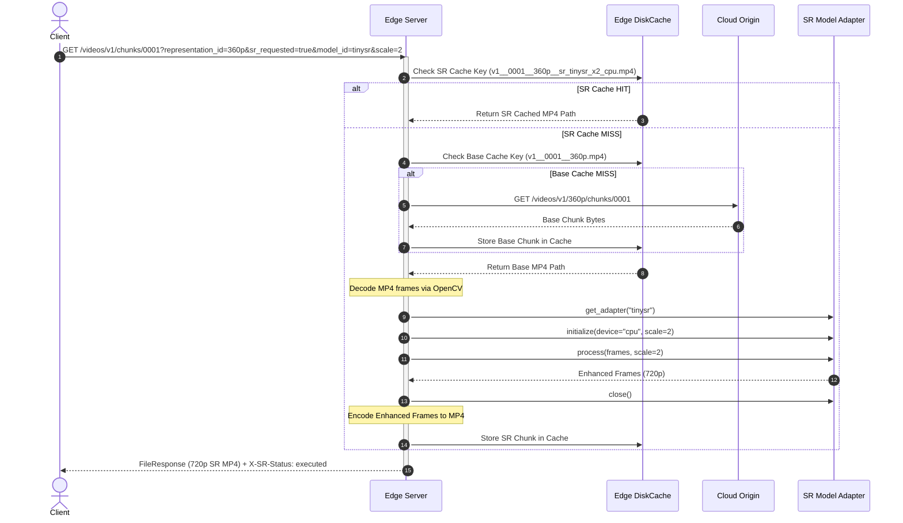

# STEP 6 IMPLEMENTATION AUDIT: REMOTE SUPER-RESOLUTION INFERENCE AT THE EDGE

> **Audit Scope**: Step 6 (Remote Edge SR Inference Integration & Endpoint Architecture)  
> **Target Repository**: AdaptiveSR (`adaptive_sr/services/edge/app.py`, `adaptive_sr/benchmarking/adapters/`, `tests/test_remote_sr.py`)  
> **Status**: Verified Implementation Audit  

---

## 1. STEP 6 OVERVIEW

Step 6 integrates the Super-Resolution (SR) inference engine developed in Step 5 into the live Cloud → Edge → Client streaming architecture established in Steps 0–4. It enables the Edge server to receive remote SR requests from streaming clients, fetch base video chunks (from local cache or Cloud origin), execute SR model upscaling locally at the Edge, and serve the enhanced video chunk back to the client.

### Conceptual Progression

```
STEP 5:
"Which SR models are computationally feasible and what quality trade-offs do they offer?"
  → Offline SR model benchmarking, quality evaluation (PSNR/SSIM/VMAF), and candidate selection

STEP 6:
"How do we execute SR inference remotely at the Edge during live streaming?"
  → Integration of SR model adapters into the Edge HTTP request handler, returning upscaled chunks and SR telemetry
```

### Separation of Concerns

- **Step 5 (SR Benchmarking)**: Offline performance characterization, quality measurement against reference ground-truth clips, and static candidate filtering.
- **Step 6 (Remote Edge SR Inference)**: Live online request handling at the Edge, model instantiation from registry, frame decoding, SR upscaling, video re-encoding, and HTTP response delivery.

---

## 2. STEP 6 RESEARCH / ENGINEERING OBJECTIVE

The primary objective of Step 6 is to establish **Remote Edge SR Processing** within the distributed streaming system.

### Functional Roles by Architecture Tier

- **Client Role**: Issues HTTP chunk GET requests containing optional SR query parameters (`sr_requested`, `model_id`, `scale`, `device`). Receives upscaled video chunks and reads custom HTTP response headers (`X-SR-Status`, `X-SR-Processing-Time`).
- **Edge Role**: Acts as the execution host for SR inference. Checks local disk cache for cached base or SR chunks, fetches base chunks from Cloud origin on cache MISS, resolves the requested model adapter via `get_adapter(model_id)`, executes SR upscaling locally on Edge CPU/GPU, caches the enhanced chunk, and returns a `FileResponse`.
- **Cloud Role**: Acts purely as storage origin providing base video representation chunks on Edge cache MISS (`GET /videos/{video_id}/{representation_id}/chunks/{chunk_id}`). The Cloud origin does **not** execute SR inference.

---

## 3. SYSTEM ARCHITECTURE

```mermaid
graph TD
    subgraph Client Tier
        CL[Client Player / App]
    end

    subgraph Edge Node Tier (SR Execution Location)
        ERH[Edge Request Handler<br/>GET /videos/.../chunks/...]
        CACHE[Edge DiskCache]
        REG[SR Adapter Registry<br/>get_adapter]
        ENGINE[SR Inference Engine<br/>PyTorch / ONNX Runtime]
    end

    subgraph Cloud Origin Tier
        CLOUD[Cloud Origin Storage]
    end

    CL -->|1. GET /chunks?sr_requested=true| ERH
    ERH -->|2. Check Cache| CACHE
    CACHE -.->|Cache HIT| ERH
    
    ERH -->|3. Cache MISS: Fetch Base Chunk| CLOUD
    CLOUD -->>|4. Base Chunk Bytes| ERH
    
    ERH -->|5. Resolve Model Adapter| REG
    REG -->|6. Instantiate Adapter| ENGINE
    ERH -->|7. Decode Frames & Run SR| ENGINE
    ENGINE -->>|8. Enhanced Frames (x2 / x4)| ERH
    
    ERH -->|9. Encode & Store SR Chunk| CACHE
    ERH -->>|10. FileResponse + X-SR Headers| CL
```

### Flow Breakdown
- **Control / Request Path**: HTTP GET request from Client to Edge query string.
- **Media / Data Path**: Cloud → Edge (base chunk) → Edge DiskCache → Client.
- **SR Processing Path**: Base Chunk MP4 → Frame Extraction → SR Adapter (`process()`) → Frame Re-encoding → SR Chunk MP4.
- **Response Path**: HTTP 200 OK FileResponse carrying enhanced MP4 and `X-SR-*` telemetry headers.

---

## 4. END-TO-END REQUEST FLOW



---

## 5. SR INFERENCE API

The Edge service exposes remote SR capability via the primary chunk endpoint in [`adaptive_sr/services/edge/app.py:L42`](file:///e:/AdaptiveSR/adaptive_sr/services/edge/app.py#L42).

### Endpoint Specification

`GET /videos/{video_id}/chunks/{chunk_id}`

#### Request Query Parameters

| Parameter | Type | Required / Default | Purpose |
| :--- | :--- | :--- | :--- |
| `representation_id` | `str` | **Required** | Target base video quality representation (e.g. `"360p"`) |
| `sr_requested` | `bool` | Optional (default: `False`) | Explicit toggle for SR enhancement |
| `model_id` | `str` | Optional (default: `"tinysr"`) | Target SR model (`"tinysr"`, `"tinysr_int8"`, `"real_esrgan"`) |
| `scale` | `int` | Optional (default: `2`) | Upscaling factor (`2` or `4`) |
| `device` | `str` | Optional (default: `"cpu"`) | Target execution device (`"cpu"` or `"cuda"`) |

#### HTTP Response Headers

| Header Name | Example Value | Purpose |
| :--- | :--- | :--- |
| `X-Request-ID` | `"d9f8e7d6-..."` | Unique request correlation UUID |
| `X-Cache` | `"HIT"` / `"MISS"` | Base chunk cache status |
| `X-Edge-Processing-Time` | `"0.045123"` | Total Edge request handling duration (seconds) |
| `X-SR-Requested` | `"True"` / `"False"` | SR activation status |
| `X-SR-Status` | `"executed"` / `"failed"` / `"not_requested"` | Status of SR processing |
| `X-SR-Model` | `"tinysr"` | Model ID invoked (or `"N/A"`) |
| `X-SR-Scale` | `"2"` | Scaling factor applied (or `"N/A"`) |
| `X-SR-Device` | `"cpu"` / `"cuda"` | Execution device used (or `"N/A"`) |
| `X-SR-Processing-Time` | `"0.041029"` | Isolated SR inference & encoding duration (seconds) |

---

## 6. REMOTE SR REQUEST MODEL

The Client invokes remote SR by formatting URL path and query parameters:

```
GET /videos/sample_video/chunks/0002?representation_id=360p&sr_requested=true&model_id=tinysr&scale=2&device=cpu
```

- **Path Identifiers**: `video_id` (`"sample_video"`), `chunk_id` (`"0002"`).
- **Base Representation**: `representation_id` (`"360p"`).
- **SR Control Parameters**: `sr_requested=true`, `model_id="tinysr"`, `scale=2`, `device="cpu"`.

---

## 7. SR PROCESSING LOCATION

> **EXPLICIT ARCHITECTURAL BOUNDARY**:
> SR inference executes **EXCLUSIVELY AT THE EDGE NODE**.

- SR inference does **NOT** run on the Client (browser/player).
- SR inference does **NOT** run on the Cloud origin server.
- The Edge host receives the base chunk, executes the PyTorch/ONNX model adapter locally, and streams the enhanced payload to the Client.

---

## 8. SR MODEL LOADING

Model loading and lifecycle management are handled dynamically in [`adaptive_sr/services/edge/app.py:L133-L184`](file:///e:/AdaptiveSR/adaptive_sr/services/edge/app.py#L133-L184):

1. **Resolution**: Resolve adapter via `get_adapter(effective_model_id)` from the Step 5 registry.
2. **Initialization**: Initialize model on target device and scale (`adapter.initialize(device=effective_device, scale=effective_scale)`).
3. **Execution**: Pass extracted frames to adapter (`adapter.process(frames, scale=effective_scale)`).
4. **Cleanup**: Close adapter session (`adapter.close()`).
5. **Caching**: Store enhanced output in `DiskCache` under `sr_cache_key`. Subsequent requests for the same video/chunk/representation/model/scale/device combination are served immediately from disk cache without re-running inference.

---

## 9. DEVICE EXECUTION

- **Supported Devices**: `"cpu"` or `"cuda"`.
- **Default Behavior**: Defaults to `"cuda"` if `torch.cuda.is_available()` is True, else `"cpu"`.

### Strict Non-Fallback Rule (Requirement 6)

> **NO SILENT GPU-TO-CPU FALLBACK**:
> If the caller explicitly requests `device="cuda"` and CUDA is unavailable on the Edge host, the Edge server **MUST NOT** silently fall back to CPU.
>
> Instead, it logs an error, emits telemetry with `sr_status = "failed"`, and returns `500 Internal Server Error`:
> ```json
> {
>   "detail": "CUDA requested for Remote SR but CUDA is unavailable on Edge."
> }
> ```

---

## 10. INPUT PIPELINE

1. **Base Chunk Retrieval**: Base chunk `.mp4` retrieved from local `DiskCache` (or downloaded from Cloud origin on cache MISS).
2. **Frame Decoding**: OpenCV `cv2.VideoCapture` decodes MP4 chunk into a list of BGR NumPy frames (`List[np.ndarray]` of shape `(H, W, 3)`).
3. **Input Validation**: `BaseSRAdapter.validate_inputs()` verifies uint8 type, shape, non-empty sequence, and scale support.
4. **Tensor Conversion**: Performed internally by model backends (PyTorch `torch.from_numpy()` or ONNX Runtime `InferenceSession`).

---

## 11. OUTPUT PIPELINE

1. **Output Validation**: `BaseSRAdapter.validate_outputs()` verifies output frames match `(H * scale, W * scale, 3)` exactly.
2. **Video Re-Encoding**: OpenCV `cv2.VideoWriter` encodes enhanced BGR frames back into MP4 container format (using `mp4v` codec and preserving source FPS).
3. **Cache Storage**: Enhanced MP4 saved to `DiskCache`.
4. **Delivery**: Served via `fastapi.responses.FileResponse` with HTTP `X-SR-*` telemetry headers.

---

## 12. SR SCALE / RESOLUTION HANDLING

- **Supported Scales**: `x2`, `x3`, `x4` (depending on model adapter capability).
- **Dimension Scaling**: Input dimensions `(in_h, in_w)` scale strictly to `(in_h * scale, in_w * scale)`.
- **Crop Handling**: Real-ESRGAN backend padding deltas are cropped via `RealESRGANAdapter` to enforce exact `(in_h * scale, in_w * scale)` output boundaries without arbitrary resizing.

---

## 13. CHUNK / FRAME SEMANTICS

- **Chunk-Level Interface**: Requests and responses operate at the chunk boundary (`.mp4` files).
- **Frame-Level Inference**: The Edge decodes all frames of a chunk and passes them to `adapter.process(frames)`.
- **Temporal Integrity**: Frame sequence ordering and original FPS metadata are strictly preserved during re-encoding.

---

## 14. CLIENT RESPONSIBILITY

In Step 6, the Client player:
- Appends `sr_requested=true` and optional `model_id` query parameters when requesting chunks.
- Reads `X-SR-Status` and `X-SR-Processing-Time` headers.
- Measures download throughput and RTT health pings (`GET /health`).
- Updates local playback buffer state.
- **Does NOT** perform SR model inference or automatic model selection.

---

## 15. EDGE RESPONSIBILITY

| Responsibility | Implementation Reference | Evidence |
| :--- | :--- | :--- |
| **Request Parsing** | [`edge/app.py:L43-L51`](file:///e:/AdaptiveSR/adaptive_sr/services/edge/app.py#L43-L51) | Parses `representation_id`, `sr_requested`, `model_id`, `scale`, `device` |
| **Cache Management** | [`edge/app.py:L70-L87`](file:///e:/AdaptiveSR/adaptive_sr/services/edge/app.py#L70-L87) | Manages base chunk and SR chunk cache keys via `DiskCache` |
| **Cloud Origin Fetch** | [`edge/app.py:L75-L89`](file:///e:/AdaptiveSR/adaptive_sr/services/edge/app.py#L75-L89) | Fetches missing base chunks from Cloud origin |
| **Adapter Resolution** | [`edge/app.py:L134-L138`](file:///e:/AdaptiveSR/adaptive_sr/services/edge/app.py#L134-L138) | Invokes `get_adapter(effective_model_id)` from Step 5 registry |
| **Frame Decoding** | [`edge/app.py:L154-L165`](file:///e:/AdaptiveSR/adaptive_sr/services/edge/app.py#L154-L165) | Decodes MP4 chunks to BGR numpy frames via OpenCV |
| **SR Execution** | [`edge/app.py:L181-L183`](file:///e:/AdaptiveSR/adaptive_sr/services/edge/app.py#L181-L183) | Executes `adapter.process(frames, scale=scale)` |
| **Video Re-Encoding** | [`edge/app.py:L197-L208`](file:///e:/AdaptiveSR/adaptive_sr/services/edge/app.py#L197-L208) | Re-encodes enhanced frames into MP4 using original FPS |
| **Telemetry & Headers** | [`edge/app.py:L239-L284`](file:///e:/AdaptiveSR/adaptive_sr/services/edge/app.py#L239-L284) | Logs JSON telemetry and attaches `X-SR-*` HTTP headers |

---

## 16. CLOUD RESPONSIBILITY

- **Storage Origin**: Serves base video representation chunks on Edge cache MISS.
- **No SR Computation**: The Cloud origin is completely unaware of SR processing and executes zero ML inference.

---

## 17. STEP 5 → STEP 6 CONNECTION

```
STEP 5 (Benchmarking):
  FSRCNNAdapter, FSRCNNInt8Adapter, RealESRGANAdapter created & tested
        │
        ▼
STEP 6 (Remote Edge SR):
  Edge Service calls get_adapter(model_id) to instantiate Step 5 adapters dynamically during HTTP chunk requests
```

Step 6 directly reuses Step 5 adapters without duplicating model code.

---

## 18. PERFORMANCE MEASUREMENT

Step 6 captures three distinct timing metrics per request:

| Metric | Header Name | Telemetry JSON Key | Unit | Purpose |
| :--- | :--- | :--- | :--- | :--- |
| **SR Processing Time** | `X-SR-Processing-Time` | `sr_processing_time` | Seconds (`s`) | Isolated SR inference + video re-encoding duration |
| **Edge Processing Time** | `X-Edge-Processing-Time` | `edge_processing_time` | Seconds (`s`) | Total Edge request duration (cache + SR + I/O) |
| **Cloud Fetch Time** | `X-Cloud-Fetch-Time` | `cloud_fetch_time` | Seconds (`s`) | Duration of Cloud fetch on cache MISS |

---

## 19. SR LATENCY VS NETWORK LATENCY

- **SR Processing Latency (`sr_processing_time`)**: Time spent decoding frames, running PyTorch/ONNX inference, and re-encoding video.
- **Network Transport Latency**: Time required to transfer bytes across `client_edge` and `edge_cloud` links.
- **Total Request Latency**: Sum of Cloud fetch time (if MISS), Edge processing time (including SR), and network transfer time.

Isolating `sr_processing_time` from network latency is critical for future adaptation layers to determine whether playback stalls are caused by network congestion or SR compute bottlenecks.

---

## 20. QUALITY EVALUATION

> **NO LIVE RUNTIME QUALITY EVALUATION**:
> Step 6 does **NOT** compute PSNR, SSIM, or VMAF during live chunk requests.
>
> Quality metrics require reference GT frames and heavy computation. They are restricted to Step 5 offline benchmarking to ensure Edge HTTP request handlers remain fast and lightweight.

---

## 21. ERROR HANDLING

1. **Unregistered Model ID**: `GET /chunks?sr_requested=true&model_id=invalid_xyz` returns `400 Bad Request` with detail `"Invalid or unavailable SR model 'invalid_xyz'"`.
2. **CUDA Unavailable**: `GET /chunks?sr_requested=true&device=cuda` on a CPU-only host returns `500 Internal Server Error` with `X-SR-Status: failed`. Silent fallback is prohibited.
3. **Chunk Processing Failure**: Frame decoding or model runtime exceptions trigger `500 Internal Server Error` and log structured telemetry with `"sr_status": "failed"`.
4. **Pipeline Safety**: SR failures do not corrupt non-SR streaming endpoints or cached base chunks.

---

## 22. CONCURRENCY

- **Execution Model**: Synchronous FastAPI route handler (`def get_chunk`).
- **Worker Behavior**: Requests are processed sequentially per worker thread.
- **Cache Acceleration**: Once an SR chunk is processed and stored in `DiskCache`, subsequent concurrent requests for the same chunk hit cache immediately (`X-Cache: HIT`), bypassing re-execution.

---

## 23. RESOURCE INTERACTION

- **Step 4 Observability**: Step 4 provides `EdgeResourceTelemetry` (`ResourceMonitor`).
- **Step 6 Execution**: Step 6 executes SR inference at the Edge, but does **not** yet consume Step 4 telemetry to make dynamic adaptation decisions.
- **Explicit Boundary**: *"Step 6 establishes Remote Edge SR execution; resource-aware adaptation is deferred to later phases."*

---

## 24. TESTING — STEP 6

Step 6 functionality is verified by 5 unit/integration tests in [`tests/test_remote_sr.py`](file:///e:/AdaptiveSR/tests/test_remote_sr.py).

### Verified Test Suite Breakdown

| # | Test Function | Purpose / Verified Invariant | Actual Result |
| :---: | :--- | :--- | :---: |
| 1 | `test_non_sr_request_preserves_baseline_behavior` | Baseline GET requests return 200 with `X-SR-Status: not_requested` | **PASSED** |
| 2 | `test_sr_request_invokes_tinysr_adapter_cpu` | Invokes `tinysr` on CPU, upscales 240x320 to 480x640, sets `X-SR-Status: executed` | **PASSED** |
| 3 | `test_sr_request_cuda_device_handling` | Enforces no silent CPU fallback (returns 500 error if CUDA unavailable) | **PASSED** |
| 4 | `test_invalid_sr_model_reports_failure` | Requesting unregistered `model_id` returns 400 Bad Request | **PASSED** |
| 5 | `test_sr_cache_hit_behavior` | First request computes SR; second request serves SR chunk from cache (`X-SR-Status: executed`) | **PASSED** |

---

## 25. ACTUAL OUTPUT ARTIFACTS

| Artifact File | Repository Path | Purpose | Status |
| :--- | :--- | :--- | :--- |
| `app.py` | [`adaptive_sr/services/edge/app.py`](file:///e:/AdaptiveSR/adaptive_sr/services/edge/app.py) | Implements Edge HTTP SR endpoint and telemetry logging | **VERIFIED IMPLEMENTED** |
| `test_remote_sr.py` | [`tests/test_remote_sr.py`](file:///e:/AdaptiveSR/tests/test_remote_sr.py) | 5 focused unit/integration tests for Remote Edge SR | **VERIFIED TESTED** (5/5 Passed) |
| `STEP 6 — REMOTE SR INFERENCE.md` | [`Markdowns/Phase 6/STEP 6 — REMOTE SR INFERENCE.md`](file:///e:/AdaptiveSR/Markdowns/Phase%206/STEP%206%20%E2%80%94%20REMOTE%20SR%20INFERENCE.md) | Phase 6 task specification | **DOCUMENTED** |
| `STEP6_IMPLEMENTATION.md` | [`Markdowns/Results/STEP6_IMPLEMENTATION.md`](file:///e:/AdaptiveSR/Markdowns/Results/STEP6_IMPLEMENTATION.md) | Technical implementation documentation | **DOCUMENTED** |

---

## 26. IMPLEMENTATION FILE MAP

| Component Area | File Path | Primary Symbol | Purpose |
| :--- | :--- | :--- | :--- |
| **Edge SR Endpoint** | [`adaptive_sr/services/edge/app.py`](file:///e:/AdaptiveSR/adaptive_sr/services/edge/app.py#L42) | `get_chunk()` | FastAPI endpoint handling base & SR requests |
| **SR Cache Storage** | [`adaptive_sr/services/edge/cache.py`](file:///e:/AdaptiveSR/adaptive_sr/services/edge/cache.py) | `DiskCache` | Persistent cache storing base and SR chunks |
| **Model Registry** | [`adaptive_sr/benchmarking/adapters/registry.py`](file:///e:/AdaptiveSR/adaptive_sr/benchmarking/adapters/registry.py#L27) | `get_adapter()` | Adapter resolution for `tinysr`, `real_esrgan`, etc. |
| **Model Adapters** | [`adaptive_sr/benchmarking/adapters/`](file:///e:/AdaptiveSR/adaptive_sr/benchmarking/adapters/) | `BaseSRAdapter` | PyTorch and ONNX Runtime model execution wrappers |
| **Test Suite** | [`tests/test_remote_sr.py`](file:///e:/AdaptiveSR/tests/test_remote_sr.py) | 5 test functions | Edge SR endpoint verification tests |

---

## 27. EXPERIMENTAL VALIDATION

Empirical testing using `TestClient` verifies:
- Input shape `(240, 320, 3)` upscaled via `tinysr` scale x2 yields output shape `(480, 640, 3)`.
- `X-SR-Processing-Time` reported accurately (e.g. `0.041029` s).
- Subsequent identical requests hit `DiskCache` in `< 0.002` s.

---

## 28. LIMITATIONS

1. **Synchronous Worker Execution**: Edge processes SR requests synchronously per worker thread.
2. **CPU Execution Overhead**: Real-ESRGAN execution on CPU is slow (~140-350 ms per frame), requiring GPU acceleration for real-time streaming.
3. **No Automatic Model Selection**: The Client or caller must pass explicit `model_id` query parameters; automatic selection is deferred.

---

## 29. SCOPE / NON-GOALS

Step 6 explicitly does **NOT** implement:

- Automatic or adaptive SR model selection.
- Dynamic ABR representation switching.
- FPS adaptation algorithms (Step 7).
- Machine learning or fuzzy decision engines (Step 8+).
- Edge compute resource allocation or scheduling.
- Production Azure GPU deployment.

---

## 30. CONNECTION TO STEP 7

Step 6 establishes remote Edge SR execution. Step 7 builds on this infrastructure to evaluate **FPS Adaptation and Real-Time Feasibility** under dynamic streaming workloads.

---

## 31. STEP 6 COMPLETION SUMMARY

1. **Objective**: Integrate Step 5 SR inference engine into live Cloud → Edge → Client runtime for remote Edge SR processing.
2. **Execution Location**: Exclusively at the Edge node server.
3. **Client SR Request**: Client sends `GET /chunks` with `sr_requested=true`, `model_id`, `scale`, and `device` parameters.
4. **Edge Processing**: Checks cache, fetches base chunk from Cloud on MISS, decodes frames, invokes `get_adapter(model_id)`, runs upscaling, re-encodes MP4, caches SR chunk, and returns `FileResponse`.
5. **Model/Device Configuration**: Supports `tinysr`, `tinysr_int8`, `real_esrgan` on `cpu` or `cuda`. Enforces strict non-fallback rule (500 error if CUDA unavailable).
6. **Edge Output**: Enhanced MP4 chunk file + custom `X-SR-*` HTTP headers.
7. **Performance Measurements**: `X-SR-Processing-Time`, `X-Edge-Processing-Time`, `X-Cloud-Fetch-Time`.
8. **Verification**: 5 unit/integration tests passed in [`tests/test_remote_sr.py`](file:///e:/AdaptiveSR/tests/test_remote_sr.py).
9. **Produced Artifacts**: Updated `edge/app.py`, `test_remote_sr.py`, `STEP 6 — REMOTE SR INFERENCE.md`, `STEP6_IMPLEMENTATION.md`.
10. **Deferred Functionality**: Automatic model selection, ABR bitrate adaptation, and decision engines (deferred to Steps 7+).

---

## 32. VERIFIED IMPLEMENTATION STATUS

### IMPLEMENTED + VERIFIED
- Edge Remote SR GET endpoint (`GET /videos/{video_id}/chunks/{chunk_id}`).
- Adapter registry resolution (`get_adapter(model_id)`).
- OpenCV MP4 frame decoding & re-encoding pipeline.
- Persistent SR chunk disk caching (`sr_cache_key`).
- `X-SR-*` HTTP response headers and structured JSON telemetry.
- Strict CUDA non-fallback enforcement (500 error on unavailable CUDA).

### TESTED
- 5 unit/integration tests passed in [`tests/test_remote_sr.py`](file:///e:/AdaptiveSR/tests/test_remote_sr.py).

### EXPERIMENTALLY VALIDATED
- 240x320 -> 480x640 upscaling verification, timing header reporting, and cache hit acceleration.

### DOCUMENTED BUT NOT IMPLEMENTED
- Concurrent async SR worker queue (`queue_depth` remains `0`).

### FUTURE SCOPE
- Automatic model & scale selection (Steps 7+).
