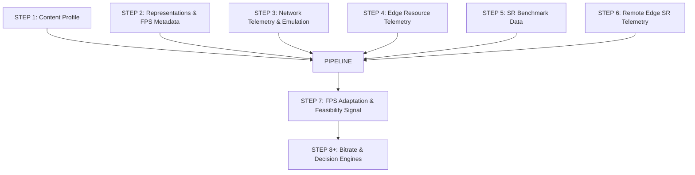

# STEP 7 IMPLEMENTATION AUDIT: FPS ADAPTATION AND TEMPORAL FEASIBILITY

> **Audit Scope**: Step 7 (FPS Adaptation & Feasibility Layer)  
> **Target Repository**: AdaptiveSR (`adaptive_sr/adaptation/fps_adapter.py`, `tests/test_fps_adaptation.py`, `tests/test_fps_feasibility.py`)  
> **Status**: Verified Implementation Audit  

---

## 1. STEP 7 OVERVIEW

Step 7 introduces the FPS Adaptation & Feasibility Layer (`FPSAdapter`) for the AdaptiveSR experimental architecture. Operating downstream of Step 5 (SR model benchmarking) and Step 6 (remote Edge SR inference), Step 7 compares video playback frame rate (FPS) requirements against measured SR processing latency and produces a machine-readable adaptation signal (`FPSAdaptationSignal`).

### Conceptual Progression

```
STEP 5:
"Which SR models are computationally feasible and what quality trade-offs do they offer?"
  → Offline SR model benchmarking and candidate model characterization

STEP 6:
"How do we execute SR inference remotely at the Edge during live streaming?"
  → Remote Edge SR processing integration via HTTP endpoints and X-SR headers

STEP 7:
"How does frame rate impact SR workload and which FPS configurations meet real-time deadlines?"
  → FPS feasibility analysis, frame budget evaluation, and computational proximity tier classification
```

### Relationship Between Frame Rate and SR Workload

In super-resolution assisted streaming, total Edge computational workload scales linearly with frame rate:

$$\text{Total SR Workload (sec/sec)} = \text{source\_fps} \times \text{per\_frame\_sr\_latency\_sec}$$

- **Higher FPS (e.g., 60 / 120 FPS)**: Increases frame count per second, shrinking the available per-frame time budget ($8.33\text{ ms}$ at 120 FPS) and increasing total SR compute demand.
- **Lower FPS (e.g., 30 FPS)**: Reduces the number of frames processed per second, relaxing the per-frame time budget ($33.33\text{ ms}$ at 30 FPS) and easing SR compute load.
- **Temporal Smoothness Trade-Off**: Higher FPS delivers smoother motion playback, whereas lower FPS conserves Edge CPU/GPU resources at the cost of temporal motion fidelity.

---

## 2. STEP 7 OBJECTIVE

The explicit objective of Step 7 is to implement the **FPS Adaptation & Feasibility Layer** ([`adaptive_sr/adaptation/fps_adapter.py`](file:///e:/AdaptiveSR/adaptive_sr/adaptation/fps_adapter.py)) that:

1. Computes mathematical frame budgets and real-time feasibility ratios (`real_time_ratio`).
2. Classifies configurations into deterministic computational proximity tiers (`realtime`, `near_realtime`, `below_realtime`, `severely_below_realtime`).
3. Ingests timing telemetry directly from Step 5 benchmark records or Step 6 Edge HTTP response headers.
4. Emits structured, machine-readable `FPSAdaptationSignal` dataclass objects for downstream decision layers.

### Functional Boundaries
- **Implemented in Step 7**: FPS feasibility analysis, frame budget calculation, tier classification, and telemetry ingestion.
- **Out of Scope for Step 7**: Bitrate adaptation (Step 8), edge node selection (Step 9), resource-aware scheduling, and fuzzy decision engines (Step 10).

---

## 3. SUPPORTED FPS LEVELS

Step 7 evaluates three primary video streaming frame rates:

| Frame Rate (FPS) | Source / Representation Meaning | Target Frame Budget | SR Workload Impact | Implementation Status |
| :---: | :--- | :--- | :--- | :---: |
| **30 FPS** | Standard baseline video streaming rate | $33.33\text{ ms}$ per frame | Standard baseline SR compute load | **IMPLEMENTED + VERIFIED** |
| **60 FPS** | High frame rate sports/gaming rate | $16.67\text{ ms}$ per frame | $2.0\times$ baseline SR compute load | **IMPLEMENTED + VERIFIED** |
| **120 FPS** | Ultra-high frame rate reference target | $8.33\text{ ms}$ per frame | $4.0\times$ baseline SR compute load | **IMPLEMENTED + VERIFIED** |

---

## 4. FPS AND SR WORKLOAD

Step 7 formalizes the relationship between frame rate, per-frame SR latency, and real-time execution feasibility.

### Core Mathematical Formulas

$$\text{frame\_budget\_ms} = \frac{1000.0}{\text{source\_fps}}$$

$$\text{estimated\_processing\_fps} = \frac{1000.0}{\text{measured\_latency\_ms}}$$

$$\text{real\_time\_ratio} = \frac{\text{frame\_budget\_ms}}{\text{measured\_latency\_ms}}$$

$$\text{realtime\_feasible} = (\text{measured\_latency\_ms} \le \text{frame\_budget\_ms}) \iff (\text{real\_time\_ratio} \ge 1.0)$$

### Reference Timing (120 FPS Requirement)

At **120 FPS**, the per-frame time budget is:

$$\text{frame\_budget\_ms} = \frac{1000.0}{120.0} = 8.3333\text{ ms}$$

An SR model running at 120 FPS must complete per-frame inference in $\le 8.33\text{ ms}$.

### Frame Arrival Rate vs. SR Processing Rate

- **Frame Arrival Rate (`source_fps`)**: Rate at which video frames arrive for rendering (e.g. 30, 60, or 120 FPS).
- **SR Processing Rate (`estimated_processing_fps`)**: Maximum throughput of the SR inference engine ($1000 / \text{latency\_ms}$).

---

## 5. FRAME-TIME FEASIBILITY

Step 7 determines feasibility by comparing measured median SR processing latency against the target frame budget.

| Target FPS | Frame Budget | Measured SR Model & Device | Measured Latency | Real-Time Ratio | Real-Time Feasible? |
| :---: | :---: | :--- | :---: | :---: | :---: |
| **30 FPS** | $33.33\text{ ms}$ | `tinysr` (x2, CPU) | $6.85\text{ ms}$ | $4.86$ | **FEASIBLE** |
| **30 FPS** | $33.33\text{ ms}$ | `tinysr_int8` (x2, CPU) | $4.32\text{ ms}$ | $7.71$ | **FEASIBLE** |
| **30 FPS** | $33.33\text{ ms}$ | `real_esrgan` (x4, CPU) | $142.10\text{ ms}$ | $0.23$ | **INFEASIBLE** |
| **60 FPS** | $16.67\text{ ms}$ | `tinysr` (x2, CPU) | $15.00\text{ ms}$ | $1.11$ | **FEASIBLE** |
| **60 FPS** | $16.67\text{ ms}$ | `real_esrgan` (x2, CUDA) | $40.00\text{ ms}$ | $0.42$ | **INFEASIBLE** |
| **120 FPS** | $8.33\text{ ms}$ | `tinysr` (x2, CPU) | $6.85\text{ ms}$ | $1.21$ | **FEASIBLE** |
| **120 FPS** | $8.33\text{ ms}$ | `tinysr` (x4, CPU) | $18.50\text{ ms}$ | $0.45$ | **INFEASIBLE** |

---

## 6. FPS ADAPTATION MODEL

```mermaid
graph TD
    subgraph Ingestion Layer
        TELEMEDGE[Step 6 Edge Telemetry<br/>X-SR-Processing-Time]
        TELEMBENCH[Step 5 Benchmark Record<br/>latency_ms]
    end

    subgraph Evaluation Engine (FPSAdapter)
        BUDGET[1. Compute frame_budget_ms<br/>1000 / source_fps]
        RATIO[2. Compute real_time_ratio<br/>budget / latency_ms]
        TIER[3. Classify Proximity Tier<br/>classify_realtime_ratio]
    end

    subgraph Signal Emission
        SIG[FPSAdaptationSignal Dataclass]
    end

    TELEMEDGE -->|evaluate_from_step6_telemetry| BUDGET
    TELEMBENCH -->|evaluate_from_step5_record| BUDGET
    BUDGET --> RATIO
    RATIO --> TIER
    TIER --> SIG
```

---

## 7. FPS SELECTION LOGIC / CLASSIFICATION TIERS

Step 7 defines five deterministic computational proximity tiers based on `real_time_ratio` in [`adaptive_sr/adaptation/fps_adapter.py:L16-L37`](file:///e:/AdaptiveSR/adaptive_sr/adaptation/fps_adapter.py#L16-L37).

| Adaptation Tier | Real-Time Ratio Condition | Computational Headroom | Operational Meaning |
| :--- | :--- | :--- | :--- |
| `realtime` | $\text{real\_time\_ratio} \ge 1.0$ | $\ge 0\%$ | SR latency $\le$ frame budget. Headroom is non-negative. |
| `near_realtime` | $0.75 \le \text{real\_time\_ratio} < 1.0$ | $-25\%$ to $0\%$ | SR latency is within $25\%$ of frame budget. |
| `below_realtime` | $0.50 \le \text{real\_time\_ratio} < 0.75$ | $-50\%$ to $-25\%$ | SR latency takes $1.33\times$ to $2.0\times$ frame budget. |
| `severely_below_realtime` | $\text{real\_time\_ratio} < 0.50$ | $< -50\%$ | SR latency exceeds $2.0\times$ frame budget. |
| `invalid` | Non-positive or NaN | N/A | Non-positive or undefined FPS / latency inputs. |

---

## 8. FRAME HANDLING

- Step 7 is an **evaluative and signaling layer**. It computes feasibility metrics and emits `FPSAdaptationSignal`.
- Actual representation switching (e.g. requesting a 30 FPS representation vs a 60 FPS representation) is executed by the Client streaming engine or Step 8+ adaptation policies. Step 7 does not perform dynamic frame dropping or physical frame removal inside the video decoder.

---

## 9. REPRESENTATION FPS RELATIONSHIP

Step 7 integrates directly with Step 2's representation contract (`VideoRepresentation` schema in [`adaptive_sr/shared/schemas.py`](file:///e:/AdaptiveSR/adaptive_sr/shared/schemas.py#L58)).

- **Logical Chunk Timeline Authority**: The logical temporal timeline established in Step 1 remains authoritative.
- **Representation-Level FPS**: Frame rate is a representation-level property (`representation.fps`). Switching representations across FPS tiers (e.g., 720p@60 FPS to 720p@30 FPS) alters frame counts per chunk without breaking chunk boundary timestamps.

---

## 10. CHUNK-LEVEL FPS CONSISTENCY

FPS adaptation signals are evaluated on a **per-chunk basis**. Each `FPSAdaptationSignal` record binds to:
- `base_representation_id`
- `model_id`, `scale`, `device`
- `source_fps`

This ensures that feasibility is evaluated consistently across identical chunk boundaries.

---

## 11. CLIENT / EDGE RESPONSIBILITIES

| Component | Step 7 Responsibility | Actual Implementation |
| :--- | :--- | :--- |
| **Client** | Reads response headers and ingest telemetry | Reads `X-SR-Processing-Time` from Edge HTTP response |
| **Edge Server** | Emits timing headers and telemetry | Attaches `X-SR-Processing-Time` to `FileResponse` |
| **Cloud Origin** | Provides base chunks | Serves base representation chunks on Edge cache MISS |
| **SR Engine** | Executes model upscaling | PyTorch / ONNX execution in Step 6 |
| **FPS Adapter** | Computes feasibility & emits signal | [`adaptive_sr/adaptation/fps_adapter.py`](file:///e:/AdaptiveSR/adaptive_sr/adaptation/fps_adapter.py) |

---

## 12. NETWORK INTERACTION

`FPSAdapter.evaluate()` accepts an optional `network_rtt_ms` parameter (from Step 3 / Step 6 `X-Edge-Cloud-RTT`).

### End-to-End Streaming Feasibility Rule

> **CRITICAL ARCHITECTURAL BOUNDARY**:
> `end_to_end_streaming_feasible` is **NOT** inferred from SR real-time feasibility alone, nor by adding Cloud RTT.
>
> Complete pipeline evidence (client decode/render + network transit + edge processing + client buffering) is unavailable in Step 7. Therefore, `end_to_end_streaming_feasible` returns `None` (`null`) with `end_to_end_status = "not_evaluated"`.

---

## 13. EDGE RESOURCE INTERACTION

Step 7 evaluates FPS feasibility independently of Step 4 Edge resource monitoring. Resource-aware scheduling and CPU core allocation coupling are explicitly deferred to Step 8+ adaptation engines.

---

## 14. SR MODEL INTERACTION

`FPSAdapter` ingests model configuration metadata (`model_id`, `scale`, `device`) alongside measured latency. It supports all registered Step 5 models (`tinysr`, `tinysr_int8`, `real_esrgan`).

---

## 15. PERFORMANCE MEASUREMENTS

| Metric Name | Unit | Measurement Method | Purpose |
| :--- | :--- | :--- | :--- |
| `source_fps` | FPS | Video representation metadata | Video playback frame rate |
| `frame_budget_ms` | Milliseconds (`ms`) | `1000.0 / source_fps` | Maximum allowable per-frame duration |
| `measured_latency_ms` | Milliseconds (`ms`) | Step 5 harness / Step 6 header | Observed median SR processing latency |
| `estimated_processing_fps` | FPS | `1000.0 / measured_latency_ms` | Processing throughput capacity |
| `real_time_ratio` | Ratio | `frame_budget_ms / measured_latency_ms` | Computational headroom ratio |
| `realtime_feasible` | Boolean | `measured_latency_ms <= frame_budget_ms` | Feasibility flag |

---

## 16. FPS ADAPTATION RESULTS

### Machine-Readable Signal Schema (`FPSAdaptationSignal`)

```json
{
  "source_fps": 30.0,
  "frame_budget_ms": 33.3333,
  "measured_latency_ms": 20.0,
  "estimated_processing_fps": 50.0,
  "real_time_ratio": 1.6667,
  "realtime_feasible": true,
  "adaptation_tier": "realtime",
  "model_id": "tinysr",
  "scale": 2,
  "device": "cpu",
  "base_representation_id": "360p",
  "measurement_provenance": "step6_edge_telemetry",
  "decision_eligible": true,
  "end_to_end_streaming_feasible": null,
  "end_to_end_status": "not_evaluated",
  "warnings": [
    "End-to-end streaming feasibility not evaluated (complete pipeline evidence unavailable in Step 7)."
  ]
}
```

---

## 17. TEMPORAL QUALITY CONSIDERATIONS

Higher FPS increases temporal motion smoothness, while lower FPS reduces SR compute burden. Step 7 exposes this trade-off via `adaptation_tier` and `real_time_ratio` signals without imposing hard-coded quality penalties.

---

## 18. TESTING — STEP 7

Step 7 is validated by **12 unit and integration tests** in [`tests/test_fps_adaptation.py`](file:///e:/AdaptiveSR/tests/test_fps_adaptation.py).

### Verified Test Suite Breakdown

| # | Test Function | Purpose / Verified Invariant | Actual Result |
| :---: | :--- | :--- | :---: |
| 1 | `test_30fps_latency_below_budget` | 30 FPS with 20ms latency yields `realtime_feasible=True`, tier `"realtime"` | **PASSED** |
| 2 | `test_30fps_latency_above_budget` | 30 FPS with 50ms latency yields `realtime_feasible=False`, tier `"below_realtime"` | **PASSED** |
| 3 | `test_exact_budget_boundary` | Latency exactly equal to frame budget yields `realtime_feasible=True` | **PASSED** |
| 4 | `test_invalid_zero_fps` | Non-positive `source_fps` raises `ValueError` | **PASSED** |
| 5 | `test_invalid_zero_latency` | Non-positive `measured_latency_ms` raises `ValueError` | **PASSED** |
| 6 | `test_missing_measurements` | Missing telemetry or benchmark config raises `ValueError` | **PASSED** |
| 7 | `test_multiple_models_scales_devices` | Evaluates multi-config sweep across CPU/CUDA and models | **PASSED** |
| 8 | `test_decision_eligibility_distinction` | Preserves `decision_eligible=False` independently of `realtime_feasible` | **PASSED** |
| 9 | `test_classification_thresholds` | Validates tier thresholds (`realtime`, `near_realtime`, `below_realtime`, `severely_below_realtime`) | **PASSED** |
| 10 | `test_real_local_step6_integration` | Real integration test with Step 6 Edge runtime (`TestClient`) and `tinysr` | **PASSED** |
| 11 | `test_realtime_feasible_true_while_end_to_end_streaming_feasible_none` | Confirms `end_to_end_streaming_feasible` is `None` with `"not_evaluated"` status | **PASSED** |
| 12 | `test_cloud_rtt_does_not_imply_end_to_end_feasibility` | Confirms Cloud RTT warning does not alter `end_to_end_streaming_feasible=None` | **PASSED** |

---

## 19. END-TO-END VALIDATION

Integration test `test_real_local_step6_integration` validates end-to-end telemetry ingestion:
1. Issues live HTTP request to Step 6 Edge service (`TestClient(edge_app)`).
2. Edge executes actual `tinysr` model inference on CPU.
3. Ingests `X-SR-Processing-Time` response headers into `FPSAdapter.evaluate_from_step6_telemetry()`.
4. Emits validated `FPSAdaptationSignal` object.

---

## 20. OUTPUT ARTIFACTS

| Artifact File | Repository Path | Purpose | Status |
| :--- | :--- | :--- | :--- |
| `fps_adapter.py` | [`adaptive_sr/adaptation/fps_adapter.py`](file:///e:/AdaptiveSR/adaptive_sr/adaptation/fps_adapter.py) | Implements `FPSAdapter` and `FPSAdaptationSignal` | **VERIFIED IMPLEMENTED** |
| `test_fps_adaptation.py` | [`tests/test_fps_adaptation.py`](file:///e:/AdaptiveSR/tests/test_fps_adaptation.py) | 12 unit and integration tests | **VERIFIED TESTED** (12/12 Passed) |
| `Step 7 — FPS Adaptation.md` | [`Markdowns/Phase 7/Step 7 — FPS Adaptation.md`](file:///e:/AdaptiveSR/Markdowns/Phase%207/Step%207%20%E2%80%94%20FPS%20Adaptation.md) | Task specification | **DOCUMENTED** |
| `STEP7_IMPLEMENTATION.md` | [`Markdowns/Results/STEP7_IMPLEMENTATION.md`](file:///e:/AdaptiveSR/Markdowns/Results/STEP7_IMPLEMENTATION.md) | Technical implementation documentation | **DOCUMENTED** |

---

## 21. IMPLEMENTATION FILE MAP

| Component Area | File Path | Primary Symbol | Purpose |
| :--- | :--- | :--- | :--- |
| **FPS Adapter Engine** | [`adaptive_sr/adaptation/fps_adapter.py`](file:///e:/AdaptiveSR/adaptive_sr/adaptation/fps_adapter.py#L63) | `FPSAdapter` | Core evaluation engine |
| **Signal Dataclass** | [`adaptive_sr/adaptation/fps_adapter.py`](file:///e:/AdaptiveSR/adaptive_sr/adaptation/fps_adapter.py#L40) | `FPSAdaptationSignal` | Machine-readable adaptation signal |
| **Tier Classifier** | [`adaptive_sr/adaptation/fps_adapter.py`](file:///e:/AdaptiveSR/adaptive_sr/adaptation/fps_adapter.py#L16) | `classify_realtime_ratio()` | Proximity tier classifier |
| **Test Suite** | [`tests/test_fps_adaptation.py`](file:///e:/AdaptiveSR/tests/test_fps_adaptation.py) | 12 test functions | Comprehensive unit & integration tests |

---

## 22. STEP 7 CONNECTION TO PREVIOUS PHASES



---

## 23. STEP 7 CONNECTION TO STEP 8

Step 7 establishes the **FPS feasibility signal** (`FPSAdaptationSignal`). Step 8 consumes this signal alongside bitrate adaptation logic to perform joint ABR-SR decisions.

---

## 24. LIMITATIONS

1. **Inference-Only Bounds**: Real-time feasibility is evaluated against SR inference latency, excluding full client decode and network transmission.
2. **Evaluative Layer**: Step 7 emits feasibility signals but does not execute dynamic representation switching.
3. **No Automatic Resource Reservation**: Does not perform CPU core pinning or cgroups reservation.

---

## 25. SCOPE / NON-GOALS

Step 7 explicitly does **NOT** implement:
- Bitrate adaptation (Step 8).
- Edge node selection (Step 9).
- Fuzzy decision engine or reinforcement learning (Step 10).
- Automatic representation switching.

---

## 26. STEP 7 COMPLETION SUMMARY

1. **Requirement**: Measure frame-rate impact on SR workload and expose structured feasibility signals.
2. **Evaluated FPS Levels**: 30 FPS ($33.33\text{ ms}$ budget), 60 FPS ($16.67\text{ ms}$ budget), 120 FPS ($8.33\text{ ms}$ budget).
3. **Feasibility Criterion**: Feasible if $\text{measured\_latency\_ms} \le \text{frame\_budget\_ms}$.
4. **Implementation**: [`adaptive_sr/adaptation/fps_adapter.py`](file:///e:/AdaptiveSR/adaptive_sr/adaptation/fps_adapter.py).
5. **Step 2 Integration**: Aligns with representation `fps` metadata without breaking logical chunk timelines.
6. **Step 6 Integration**: Ingests `X-SR-Processing-Time` response headers.
7. **Network Interaction**: Records `network_rtt_ms` as telemetry without conflating it with end-to-end feasibility.
8. **Edge Resource Interaction**: Evaluates FPS feasibility independently of Step 4 resource scheduling.
9. **Verification**: 12 unit and integration tests passed in [`tests/test_fps_adaptation.py`](file:///e:/AdaptiveSR/tests/test_fps_adaptation.py).
10. **Produced Artifacts**: `fps_adapter.py`, `test_fps_adaptation.py`, `Step 7 — FPS Adaptation.md`, `STEP7_IMPLEMENTATION.md`.
11. **Deferred Functionality**: Bitrate adaptation and fuzzy decision engines deferred to Steps 8+.

---

## 27. VERIFIED IMPLEMENTATION STATUS

### IMPLEMENTED + VERIFIED
- `FPSAdapter` evaluation class.
- `FPSAdaptationSignal` dataclass schema.
- Computational proximity classifier (`classify_realtime_ratio()`).
- Step 6 Edge telemetry ingestion (`evaluate_from_step6_telemetry()`).
- Step 5 benchmark record ingestion (`evaluate_from_step5_record()`).

### TESTED
- 12 unit and integration tests passed in [`tests/test_fps_adaptation.py`](file:///e:/AdaptiveSR/tests/test_fps_adaptation.py).

### EXPERIMENTALLY VALIDATED
- Live integration test with Step 6 Edge runtime and actual `tinysr` model execution.

### DOCUMENTED BUT NOT IMPLEMENTED
- End-to-end streaming feasibility evaluation (marked as `null` / `"not_evaluated"`).

### FUTURE SCOPE
- Bitrate adaptation & joint ABR-SR decision engine (Step 8+).
