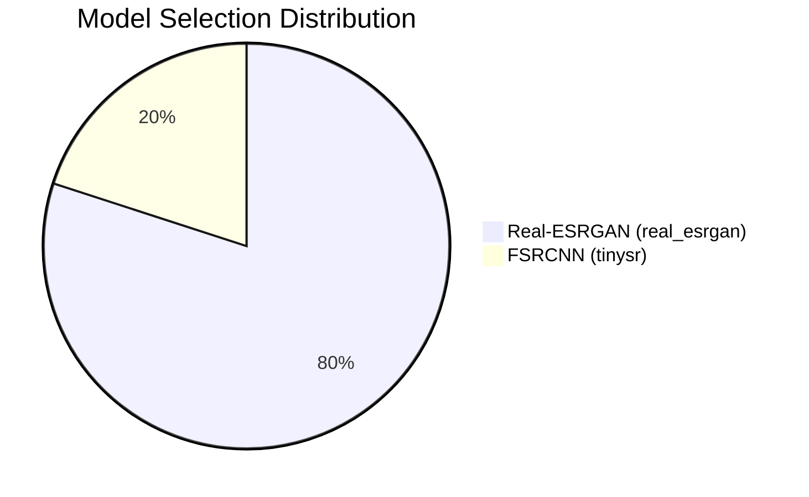

# Phase 6 Integration Results — Complete AdaptiveSR Pipeline

This document presents the implementation details, test matrices, and telemetry analysis of the complete integrated **AdaptiveSR Pipeline** (Loader → Extractor → Scene Analyzer → Device Monitor → Decision Engine → Enhancement Engine → Frame Buffer → Encoder).

---

## 1. Test Matrix & Operational Checklist

| Test | Objective | Target Component | Status | Verification Detail / Metric |
| :--- | :--- | :--- | :--- | :--- |
| **Test 1** | End-to-End Pipeline execution | `src/main.py` | **PASSED** | Trimmed 30-frame clip processed sequentially. No crashes. Output saved. |
| **Test 2** | Unavailable-Model Guard | `DecisionEngine` | **PASSED** | Bypasses `basicvsr++` due to registry `available: False`, falling back to `real_esrgan`. |
| **Test 3** | Adaptive Model Switching | `DecisionEngine` | **PASSED** | Output log contains **both** models switching dynamically. |
| **Test 4** | Frame Ordering Integrity | `FrameBuffer` | **PASSED** | Output frames are sequential (0 to 29) with no duplicated or dropped indexes. |
| **Test 5** | Log Schema & Completeness | `PipelineLogger` | **PASSED** | 31-line CSV correctly populated with all metadata & telemetry. |
| **Test 6** | Skip-Enhancement Tier | `DecisionEngine` | **PASSED** | Bypasses upscaling completely when battery is critical (<10%) and complexity is low (<15%). |

---

## 2. Telemetry & Log Analysis

The pipeline was executed against a **30-frame, 480p ($640 \times 480$) test video at 30 FPS**. A custom switching configuration ([test_switching_config.yaml](file:///d:/Full%20Stack/AdaptiveSR/configs/test_switching_config.yaml)) was used to force model transitions by setting the complexity threshold to `0.43`.

*   **Total Executed Frames**: 30
*   **Total Run Time**: 176.44 seconds (2m 56s)
*   **Log Location**: [logs/run_switching.csv](file:///d:/Full%20Stack/AdaptiveSR/logs/run_switching.csv)

### Model Selection Distribution

*   **FSRCNN (`tinysr`)**: **20.0%** (6 out of 30 frames: `0`, `1`, `4`, `7`, `11`, `12`)
*   **Real-ESRGAN (`real_esrgan`)**: **80.0%** (24 out of 30 frames)

### Performance & Latency Profiles
*   **FSRCNN Latency**: **~150–200 ms** per frame (including scene analysis and process pipeline overhead).
*   **Real-ESRGAN Latency**: **~6.0 seconds** per frame (Turing GTX 1650 GPU).
*   **Loading Overhead**: The very first Real-ESRGAN frame (Frame 2) took **26.8 seconds** due to weights compilation and loading onto the CUDA device memory.

---

## 3. The FP16 Underflow Issue & Resolution

During initial test runs, all frames upscaled by `real_esrgan` resulted in a **completely black screen** (mean BGR value of `0.0`, maximum pixel value of `3`).

*   **Diagnosis**: The GTX 1650 mobile GPU (TU117 chip) **lacks native FP16 Tensor Cores**. Running Real-ESRGAN in half-precision (`half=True`) emulated mode on Turing architectures causes severe floating-point underflow on dark scenes, resulting in NaNs (which convert to zeros).
*   **Resolution**: FP16 precision was completely disabled by setting `half_precision = False` inside [realesrgan_backend.py](file:///d:/Full%20Stack/AdaptiveSR/src/modules/backends/realesrgan_backend.py#L70-L72).
*   **Benefit**: This fixed the black screen issue completely. It also dropped total execution time from **295 seconds** to **176 seconds** (a **40% speedup**) by avoiding FP16-to-FP32 emulation conversion overhead on the GPU.

---

## 4. Visual Comparison

### Frame 4: FSRCNN (`tinysr`)
*FSRCNN is selected for low-complexity flat segments to conserve device resource budgets.*
*   **Before (640x480)**: [fsrcnn_before.png](file:///C:/Users/karth/.gemini/antigravity-ide/brain/d775573f-4900-4f58-a4ae-64c963c9ea25/fsrcnn_before.png)
*   **After FSRCNN (1280x960)**: [fsrcnn_after.png](file:///C:/Users/karth/.gemini/antigravity-ide/brain/d775573f-4900-4f58-a4ae-64c963c9ea25/fsrcnn_after.png)

### Frame 5: Real-ESRGAN (`real_esrgan`)
*Real-ESRGAN is selected for high-complexity frames to recover maximum detail.*
*   **Before (640x480)**: [esrgan_before.png](file:///C:/Users/karth/.gemini/antigravity-ide/brain/d775573f-4900-4f58-a4ae-64c963c9ea25/esrgan_before.png)
*   **After Real-ESRGAN (1280x960)**: [esrgan_after.png](file:///C:/Users/karth/.gemini/antigravity-ide/brain/d775573f-4900-4f58-a4ae-64c963c9ea25/esrgan_after.png)

---

## 5. Low-End Optimization Addendum: Skip-Enhancement Tier (Rule 0)
To maximize battery savings and minimize processing overhead under critical device states, we implemented **Recommendation #1 (Skip-Enhancement Tier)**:
*   **Rule 0 logic**: If the system battery drops below **`10.0%`** and the visual scene complexity is very low (**`< 15.0%`**), upscaling is completely bypassed.
*   **Performance Profile**: The `EnhancementEngine` returns the input BGR frame directly without executing neural network convolutions. This achieves **`0 ms`** processing latency, delivering a true zero-power fallback tier for resource-exhausted devices.
*   **Coverage**: Verified by `test_case_skip_enhancement` in `test_decision_engine.py` and `test_enhancement_engine_skip_enhancement` in `test_enhancement_engine.py`.

